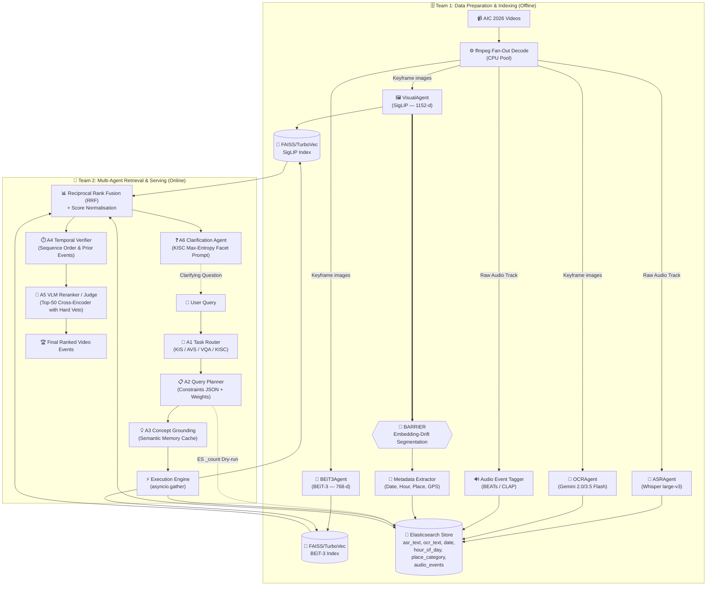
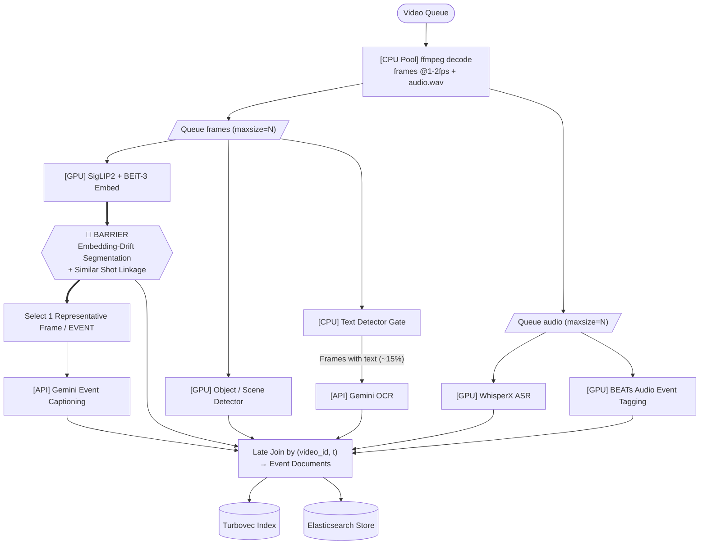
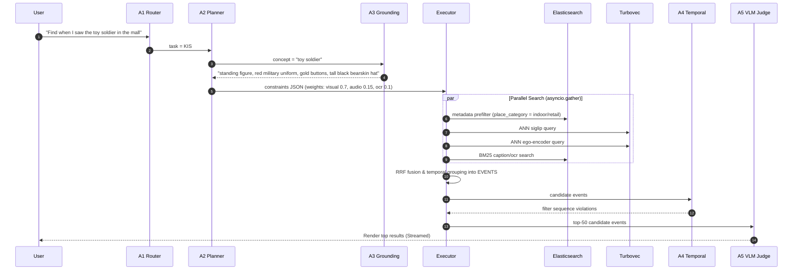
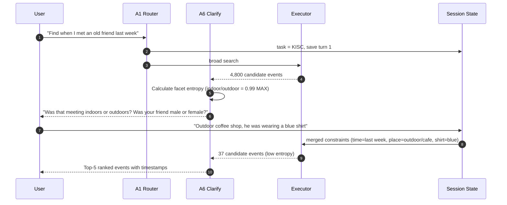
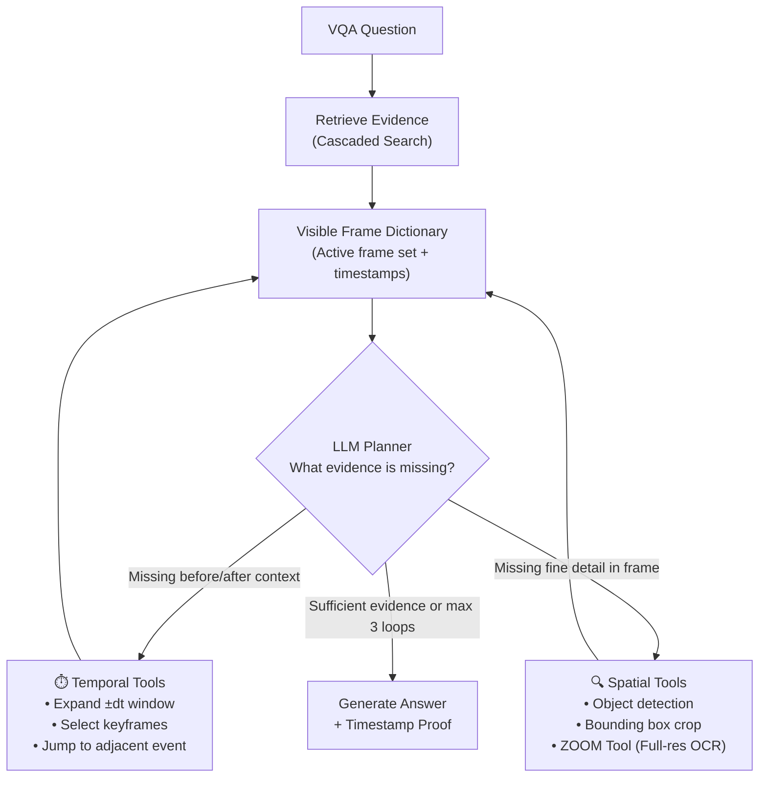

# System Architecture — AIC 2026

This document defines the Multimodal Retrieval Architecture for the AI Challenge 2026, based on the U-CESE evolution ("Cascaded Embedding-Reranking and Temporal-Aware Score Fusion") and official competition guidelines.

---

## 1. Competition Snapshot & The Data Shift

The AIC 2026 dataset represents a massive shift from **Surveillance** (fixed CCTV, clean broadcast TV) to **Sousveillance** (wearable, first-person, egocentric POV cameras like smart glasses or action cams).

**Practical Implications:**
- **Shaky & Variable Video:** We cannot rely on clean, static frames. Visual embeddings must be robust.
- **Noisy Audio:** Unlike TV news anchors, egocentric audio has wind noise, cross-talk, and silence.
- **The "Big Three" Challenges:**
  1. **Semantic Gap:** Human queries are abstract; pixels are raw data.
  2. **Data Sparsity & Scale:** Finding a 2-second clip in hundreds of hours of video requires an extremely fast initial filter (embedding search).
  3. **Temporal Logic Constraints:** The order of events matters ("entering a room, then taking off a hat"). Standard search ignores this.

**New Task - KISC (Conversational KIS):** 
The 2026 dataset introduces Conversational Known-Item Search, which mandates the use of conversational agents. Teams must build systems capable of refining queries through back-and-forth dialogue, rather than just returning a static list of results.

---

## 2. Functional Areas (GitNexus Clusters)

The codebase has **3 functional clusters** identified by static analysis:

| Cluster | Role |
|:---|:---|
| **Agents (A1-A6)** | Multi-agent coordination for reasoning, memory, and planning. |
| **Retrieval** | Video indexing pipeline, TurboVec store, Elasticsearch store. |
| **UI & Feedback** | Relevance feedback, diversity caps, and concept exploration. |

### 🧩 A. The 6-Agent System (Team 2)
The online retrieval system is driven by six specialized agents:
- **A1 (Task Router):** Classifies the query (KIS, AVS, VQA, KISC) and routes execution.
- **A2 (Query Planner):** Generates a typed constraint object (modality weights, temporal order). Executes ES `_count` dry-runs to prevent over-constrained queries (0 results).
- **A3 (Concept Grounding):** Semantic memory cache. Expands concepts to visual descriptions.
- **A4 (Temporal Verifier):** Checks temporal constraints ("entering a room, then taking off a hat").
- **A5 (VLM Judge):** Cross-encoder reranker on the top-50 candidates with a hard veto.
- **A6 (Clarification Agent):** For KISC. Calculates entropy on the candidate set to ask the user a single, optimal clarifying question.

### 🗄️ B. Retrieval & Storage (Team 1)
- **VideoIndexer:** The offline pipeline orchestrator (Decoupled CPU/GPU/API pools).
- **Vector Store (FAISS/Turbovec):** Holds visual embeddings.
- **Elasticsearch Store:** Holds metadata, OCR/ASR, **time, place, and audio events**.

### 💻 C. UI & Relevance Feedback
- **Diversity Cap:** Restricts results to ≤2 events per video on the front page.
- **"More Like This":** Image queries using existing vectors (zero model cost).
- **Rocchio Feedback:** Relevance feedback to update query vectors without LLM latency.

---

## 3. The Agentic Architecture Pipeline

We have implemented a modern **Agent-guided Multimodal Pipeline** with **Temporal Event Reasoning** and a **Spatiotemporal Reasoning (STAR)** framework for VQA.

### Master Architecture Pipeline Diagram



### 3.1 Offline Indexing Workflow (Team 1)
1. **Fan-Out Decoding:** `ffmpeg` decodes frames (CPU pool) and audio track once.
2. **Audio Event Tagging:** `BEATs` or `CLAP` extracts audio events (e.g., "traffic", "cooking") to provide strong prior location/activity cues where ASR fails on egocentric video.
3. **Embedding-Drift Segmentation:** Replaces traditional shot boundary detection. We segment unedited scenes by measuring drift between pre-computed visual embeddings (Similar Shot Linkage).
4. **Metadata Indexing:** Each event is stored in Elasticsearch with critical pruning filters: `date`, `hour_of_day`, `place_category`, and `audio_events`.

#### Offline Asynchronous Pipeline DAG


---

### 3.2 Online Retrieval & Execution Flows (Team 2)

#### Sequence Diagram: Full KIS Query Execution


#### Sequence Diagram: KISC Conversational Multi-Turn Search


---

### 3.3 Video QA (VQA) STAR Framework
For Video QA, the LLM Planner coordinates temporal and spatial tools in a loop:



---

### 3.4 Online Latency Budget

```mermaid
gantt
    title Online Single-Turn Query Latency Budget
    dateFormat  X
    axisFormat  %L ms

    section Agent Orchestration
    A1+A2+A3 single LLM call (cached A3)   :a1, 0, 600

    section Parallel Retrieval
    ES metadata prefilter                   :b1, 600, 90
    ANN SigLIP search                       :b2, 600, 120
    ANN BEiT-3 search                       :b3, 600, 130
    BM25 text search                        :b4, 600, 145

    section Fusion & Verify
    RRF + Temporal Grouping                 :c1, 750, 100
    A4 Temporal Verify                      :d1, 850, 200

    section Fine Rerank
    A5 VLM Judge top-50 (Streamed)          :e1, 1050, 1500
```



---

## 4. Key Execution Flows

The most important call flows through the codebase:

### Offline Indexing
```
_build_and_run (video_indexer.py)
  └─ index_directory
       └─ index_video
            ├─ _sample_frame_indices — fixed-FPS sampling via decord
            ├─ _transcribe       — Whisper on full video audio, joined to frames afterward
            └─ _extract_text     — OCRAgent.process(keyframe_path) per keyframe
```

### Online Query
```
evaluate (eval.py)
  └─ search (inference.py)
       └─ _search_async
            ├─ rule_based_classify (classifier.py)
            ├─ dispatch (dispatcher.py)
            └─ _hybrid_rerank    — fuses TurboVec cosine scores with BM25 text scores
```

### Index Verification
```
_check_frame (verify_index.py)
  └─ process (base_agent.py)
       └─ _run                   — validates Team 1 → Team 2 index handoff
```

---

## 5. Core Tech Stack

### Primary Key: `frame_id`
```
frame_id = "{video_id}_{frame_index:06d}"
Example:   L01_V001_000145
```
Used as the key in **both** TurboVec (via JSON sidecar) and Elasticsearch (as `_id`), and as the filename stem on disk. All cross-store joins are O(1) dict lookups on this string.

### The Two Databases

| | TurboVec (×2 instances) | Elasticsearch |
|:---|:---|:---|
| **Stores** | Float vectors (images) | Text (ASR + OCR) + metadata |
| **Index type** | 4-bit quantised ANN (TurboQuant) | Inverted index (BM25) |
| **Files on disk** | `*.tvim` + `*.sidecar.json` | Docker volume `es_data` |
| **Query returns** | `[(frame_id, cosine_score)]` | `[(frame_id, BM25_score)]` |
| **Why two TurboVec?** | SigLIP (1152-d) and BEiT-3 (768-d) have different dims; one index per encoder |

### Full Library Reference

| Purpose | Library / Model |
|:---|:---|
| Frame decode / sampling | `decord` or `ffmpeg` (CPU pool) |
| Visual embedding | `open-clip-torch`, SigLIP `ViT-SO400M-14-384` |
| Vision-only embedding | `timm`, BEiT-3 `beit3_base_patch16_224.in22k_ft_in1k` |
| Audio Event Tagging | `BEATs` or `CLAP` (GPU) |
| ASR | `openai-whisper`, `large-v3` |
| OCR | `google-genai`, Gemini 2.0/3.5 Flash |
| Text & Metadata store | `elasticsearch>=8.13` (Time, Place, Audio Events) |
| Vector store | `turbovec` (Rust, 4-bit TurboQuant) |
| VLM Reranking / Judge | Gemini 2.5 Flash / Qwen3-VL (Top-50 only) |
| Web UI | `streamlit` |

---

## 6. File Ownership

```
Team 1 (Data & Indexing)          Team 2 (NLP & Retrieval)
─────────────────────────         ────────────────────────────
Owns:                             Owns:
  src/agents/         ← shared →    src/agents/ (text mode)
  src/retrieval/                    src/routing/
  scripts/                          src/inference.py
  configs/config.yaml               src/eval.py
                                     src/ui/app.py

Delivers:                         Consumes:
  data/index/turbovec/siglip.*      TurboVec stores (read)
  data/index/turbovec/beit3.*       Elasticsearch index (read)
  Elasticsearch index               data/keyframes/**/*.jpg
  data/keyframes/**/*.jpg
```
