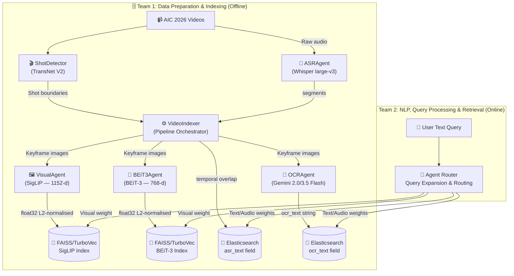

# System Architecture — AIC 2026

This document defines the Multimodal Retrieval Architecture for the AI Challenge 2026, based on the U-CESE evolution ("Cascaded Embedding-Reranking and Temporal-Aware Score Fusion") and official competition guidelines.

---

## 1. Competition Snapshot & The Data Shift

The AIC 2026 dataset represents a massive shift from **Surveillance** (fixed CCTV, clean broadcast TV) to **Sousveillance** (wearable, first-person, egocentric POV cameras like smart glasses or action cams).

**Practical Implications:**
- **Shaky & Variable Video:** We cannot rely on clean, static frames. Visual embeddings must be robust.
- **Noisy Audio:** Unlike TV news anchors, egocentric audio has wind noise, cross-talk, and silence.
- **The "Big Three" Challenges:**
  1. **Semantic Gap:** Human queries are abstract; pixels are raw data.
  2. **Data Sparsity & Scale:** Finding a 2-second clip in hundreds of hours of video requires an extremely fast initial filter (embedding search).
  3. **Temporal Logic Constraints:** The order of events matters ("entering a room, then taking off a hat"). Standard search ignores this.

**New Task - KISC (Conversational KIS):** 
The 2026 dataset introduces Conversational Known-Item Search, which mandates the use of conversational agents. Teams must build systems capable of refining queries through back-and-forth dialogue, rather than just returning a static list of results.

---

## 2. Functional Areas (GitNexus Clusters)

The codebase has **3 functional clusters** identified by static analysis:

| Cluster | Role |
|:---|:---|
| **Agents** | All model wrappers (SigLIP, BEiT-3, Whisper, Gemini, BaseAgent) |
| **Retrieval** | Shot detection, video indexing, TurboVec/FAISS store, Elasticsearch store |
| **Routing** | Query classifier, rule-based classify, dynamic dispatcher |

### 🧩 A. Agents
- **BaseAgent:** Abstract base with concurrency control and latency tracking.
- **VisualAgent:** Encodes images **and** text into a shared 1152-d embedding space via **SigLIP ViT-SO400M-14-384**. This shared space is what makes text queries find visual frames.
- **BEiT3Agent:** Vision-only 768-d encoder using **BEiT-3 base_patch16_224**.
- **ASRAgent:** Runs **Whisper large-v3** locally; extracts audio transcriptions.
- **OCRAgent:** Calls **Gemini 2.0/3.5 Flash API**; extracts text from frames.

### 🗄️ B. Retrieval & Storage
- **ShotDetector:** Wraps **TransNet V2** to detect visual shot boundaries.
- **VideoIndexer:** The offline pipeline orchestrator.
- **Vector Store (FAISS/Turbovec):** Holds visual embeddings.
- **Elasticsearch Store:** Inverted-index text store for OCR/ASR texts.

### 🧠 C. Routing & Classification
- **rule_based_classify:** Phase 1 keyword-regex classifier.
- **QueryClassifier:** Phase 2 MLP classifier for query types.
- **DynamicDispatcher:** Maps queries to specific agents and runs them concurrently.

---

## 3. The Agentic Architecture Pipeline

We have implemented a modern **Agent-guided Multimodal Pipeline** with **Temporal Event Reasoning**.

### What is an Agentic Pipeline? (vs Ad-hoc or Zero-shot)
- **Zero-shot / Ad-hoc Systems:** Typically rely on a single, rigid sequence (e.g., "Take query $\rightarrow$ convert to vector $\rightarrow$ search database $\rightarrow$ return results"). They cannot self-correct, decompose complex queries, or ask clarifying questions.
- **Agentic Pipeline:** Operates dynamically. When a query is received, an orchestrator (LLM) decides *which* specialized sub-agents to invoke (Visual, ASR, OCR). It can expand the query, fuse multiple modalities based on context, and crucially, for the new KISC task, it can measure entropy in the candidate set and **ask the user clarifying questions** before returning a final answer.

