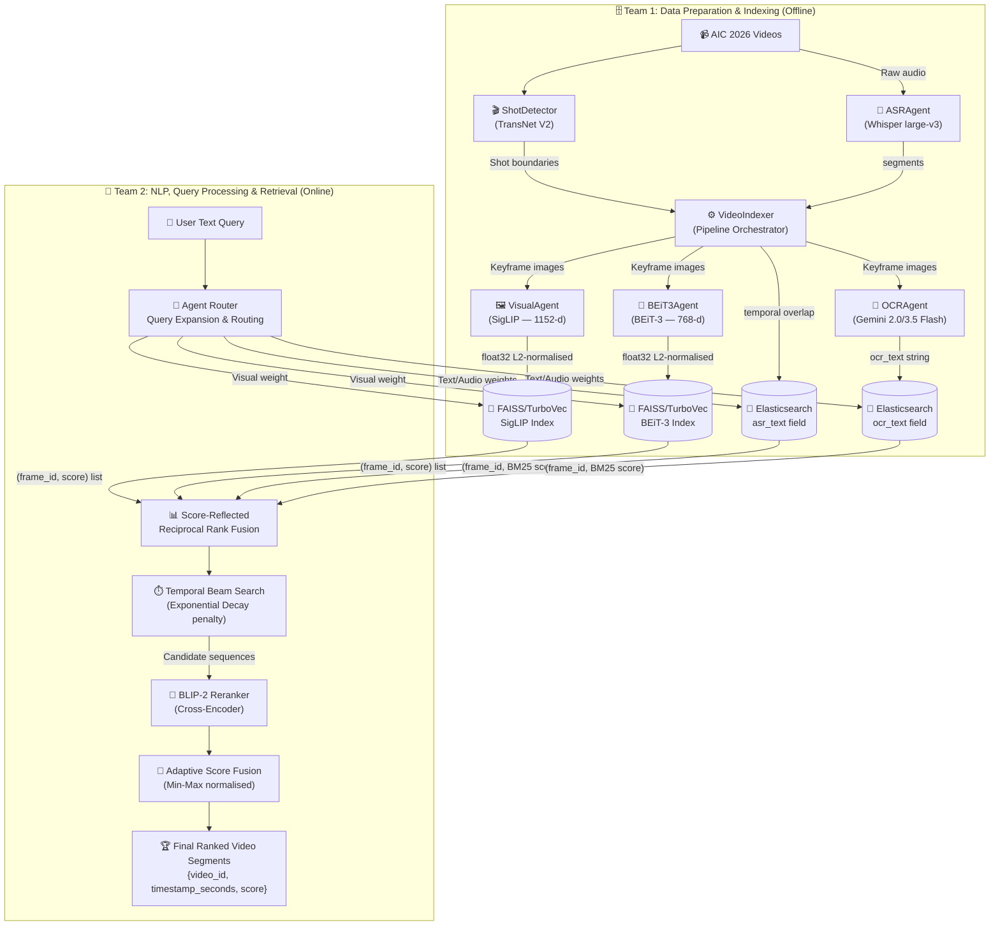

# System Architecture — AIC 2026

This document defines the Multimodal Retrieval Architecture for the AI Challenge 2026, based on the U-CESE evolution ("Cascaded Embedding-Reranking and Temporal-Aware Score Fusion") and official competition guidelines.

---

## 1. Competition Snapshot & The Data Shift

The AIC 2026 dataset represents a massive shift from **Surveillance** (fixed CCTV, clean broadcast TV) to **Sousveillance** (wearable, first-person, egocentric POV cameras like smart glasses or action cams).

**Practical Implications:**
- **Shaky & Variable Video:** We cannot rely on clean, static frames. Visual embeddings must be robust.
- **Noisy Audio:** Unlike TV news anchors, egocentric audio has wind noise, cross-talk, and silence.
- **The "Big Three" Challenges:**
  1. **Semantic Gap:** Human queries are abstract; pixels are raw data.
  2. **Data Sparsity & Scale:** Finding a 2-second clip in hundreds of hours of video requires an extremely fast initial filter (embedding search).
  3. **Temporal Logic Constraints:** The order of events matters ("entering a room, then taking off a hat"). Standard search ignores this.

**New Task - KISC (Conversational KIS):** 
The 2026 dataset introduces Conversational Known-Item Search, which mandates the use of conversational agents. Teams must build systems capable of refining queries through back-and-forth dialogue, rather than just returning a static list of results.

---

## 2. Functional Areas (GitNexus Clusters)

The codebase has **3 functional clusters** identified by static analysis:

| Cluster | Role |
|:---|:---|
| **Agents** | All model wrappers (SigLIP, BEiT-3, Whisper, Gemini, BaseAgent) |
| **Retrieval** | Shot detection, video indexing, TurboVec/FAISS store, Elasticsearch store |
| **Routing** | Query classifier, rule-based classify, dynamic dispatcher |

### 🧩 A. Agents
- **BaseAgent:** Abstract base with concurrency control and latency tracking.
- **VisualAgent:** Encodes images **and** text into a shared 1152-d embedding space via **SigLIP ViT-SO400M-14-384**. This shared space is what makes text queries find visual frames.
- **BEiT3Agent:** Vision-only 768-d encoder using **BEiT-3 base_patch16_224**.
- **ASRAgent:** Runs **Whisper large-v3** locally; extracts audio transcriptions.
- **OCRAgent:** Calls **Gemini 2.0/3.5 Flash API**; extracts text from frames.

### 🗄️ B. Retrieval & Storage
- **ShotDetector:** Wraps **TransNet V2** to detect visual shot boundaries.
- **VideoIndexer:** The offline pipeline orchestrator.
- **Vector Store (FAISS/Turbovec):** Holds visual embeddings.
- **Elasticsearch Store:** Inverted-index text store for OCR/ASR texts.

### 🧠 C. Routing & Classification
- **rule_based_classify:** Phase 1 keyword-regex classifier.
- **QueryClassifier:** Phase 2 MLP classifier for query types.
- **DynamicDispatcher:** Maps queries to specific agents and runs them concurrently.

---

## 3. The Agentic Architecture Pipeline

We have implemented a modern **Agent-guided Multimodal Pipeline** with **Temporal Event Reasoning**.

### What is an Agentic Pipeline? (vs Ad-hoc or Zero-shot)
- **Zero-shot / Ad-hoc Systems:** Typically rely on a single, rigid sequence (e.g., "Take query $\rightarrow$ convert to vector $\rightarrow$ search database $\rightarrow$ return results"). They cannot self-correct, decompose complex queries, or ask clarifying questions.
- **Agentic Pipeline:** Operates dynamically. When a query is received, an orchestrator (LLM) decides *which* specialized sub-agents to invoke (Visual, ASR, OCR). It can expand the query, fuse multiple modalities based on context, and crucially, for the new KISC task, it can measure entropy in the candidate set and **ask the user clarifying questions** before returning a final answer.



### Phase 1: Offline Indexing (Team 1)
1. **Shot Boundary Detection:** `ShotDetector` runs **TransNet V2** (visual only) to locate scene cuts, producing `Shot` objects with frame numbers and timestamps in seconds.
2. **Keyframe Extraction:** `VideoIndexer` grabs the middle frame of each shot via a single sequential `cv2.VideoCapture` decode pass.
3. **ASR — Full Video Audio:** `ASRAgent` (Whisper large-v3) transcribes the entire raw video's audio track once per video. The resulting timed segments are then mapped to each shot via `_join_asr_to_shot()` using temporal overlap logic.
4. **Vision Encoding (Dual):** Each keyframe image is embedded by **VisualAgent** (SigLIP, 1152-d) and **BEiT3Agent** (BEiT-3, 768-d). Both vectors are L2-normalised before storage.
5. **OCR:** Each keyframe image is sent to **Gemini OCR** for on-screen text extraction.
6. **Storage:** SigLIP + BEiT-3 vectors → two `TurbovecStore` indices. ASR + OCR text + timestamp → `ElasticsearchStore` with `frame_id` as the document `_id`.

### Phase 2: Online Retrieval (Team 2)
1. **Agentic Query Decomposition:** A user submits a complex query. The Agent Router expands it and dynamically routes importance weights between Visual, OCR, and ASR modalities.
2. **Parallel Search:** The system queries Elasticsearch and both TurboVec stores simultaneously.
3. **Temporal Beam Search:** Solves the Temporal Logic Constraint. A Beam Search algorithm with an Exponential Decay penalty `exp(-alpha * dt)` stitches isolated frames into coherent event sequences, penalising frames that are chronologically far apart.
4. **Fine-grained Reranking:** The top candidate sequences are passed through a **BLIP-2** cross-encoder for precise image-text matching.
5. **Adaptive Score Fusion:** Final scores are Min-Max normalised and fused based on the router's assigned weights.

---

## 4. Key Execution Flows

The most important call flows through the codebase:

### Offline Indexing
```
_build_and_run (video_indexer.py)
  └─ index_directory
       └─ index_video
            ├─ _get_fps (shot_detector.py)
            ├─ _grab_frames      — sequential cv2.VideoCapture decode over shot midpoints
            ├─ _transcribe       — Whisper on full video audio, joined to shots afterward
            └─ _extract_text     — OCRAgent.process(keyframe_path) per keyframe
```

### Online Query
```
evaluate (eval.py)
  └─ search (inference.py)
       └─ _search_async
            ├─ rule_based_classify (classifier.py)
            ├─ dispatch (dispatcher.py)
            └─ _hybrid_rerank    — fuses TurboVec cosine scores with BM25 text scores
```

### Index Verification
```
_check_frame (verify_index.py)
  └─ process (base_agent.py)
       └─ _run                   — validates Team 1 → Team 2 index handoff
```

---

## 5. Core Tech Stack

### The Primary Key: `frame_id`
```
frame_id = "{video_id}_{frame_index:06d}"
Example:   L01_V001_000145
```
Used as the key in **both** TurboVec (via JSON sidecar) and Elasticsearch (as `_id`), and as the filename stem on disk. All cross-store joins are O(1) dict lookups on this string.

### The Two Databases

| | TurboVec (×2 instances) | Elasticsearch |
|:---|:---|:---|
| **Stores** | Float vectors (images) | Text (ASR + OCR) + metadata |
| **Index type** | 4-bit quantised ANN (TurboQuant) | Inverted index (BM25) |
| **Files on disk** | `*.tvim` + `*.sidecar.json` | Docker volume `es_data` |
| **Query returns** | `[(frame_id, cosine_score)]` | `[(frame_id, BM25_score)]` |
| **Why two TurboVec?** | SigLIP (1152-d) and BEiT-3 (768-d) have different dims; one index per encoder |

### Full Library Reference

| Purpose | Library / Model |
|:---|:---|
| Shot boundary detection | `transnetv2`, `tensorflow` (CPU-forced) |
| Frame decode | `opencv-python` (`cv2.VideoCapture`) |
| Visual embedding | `open-clip-torch`, SigLIP `ViT-SO400M-14-384` |
| Vision-only embedding | `timm`, BEiT-3 `beit3_base_patch16_224.in22k_ft_in1k` |
| ASR | `openai-whisper`, `large-v3` |
| OCR | `google-genai`, Gemini 2.0/3.5 Flash |
| Vector store | `turbovec` (Rust, 4-bit TurboQuant) |
| Text store | `elasticsearch>=8.13` |
| Reranking (Phase 2) | `transformers`, BLIP-2 |
| Web UI | `streamlit` |

---

## 6. File Ownership

```
Team 1 (Data & Indexing)          Team 2 (NLP & Retrieval)
─────────────────────────         ────────────────────────────
Owns:                             Owns:
  src/agents/         ← shared →    src/agents/ (text mode)
  src/retrieval/                    src/routing/
  scripts/                          src/inference.py
  configs/config.yaml               src/eval.py
                                    src/ui/app.py

Delivers:                         Consumes:
  data/index/turbovec/siglip.*      TurboVec stores (read)
  data/index/turbovec/beit3.*       Elasticsearch index (read)
  Elasticsearch index               data/keyframes/**/*.jpg
  data/keyframes/**/*.jpg
```
