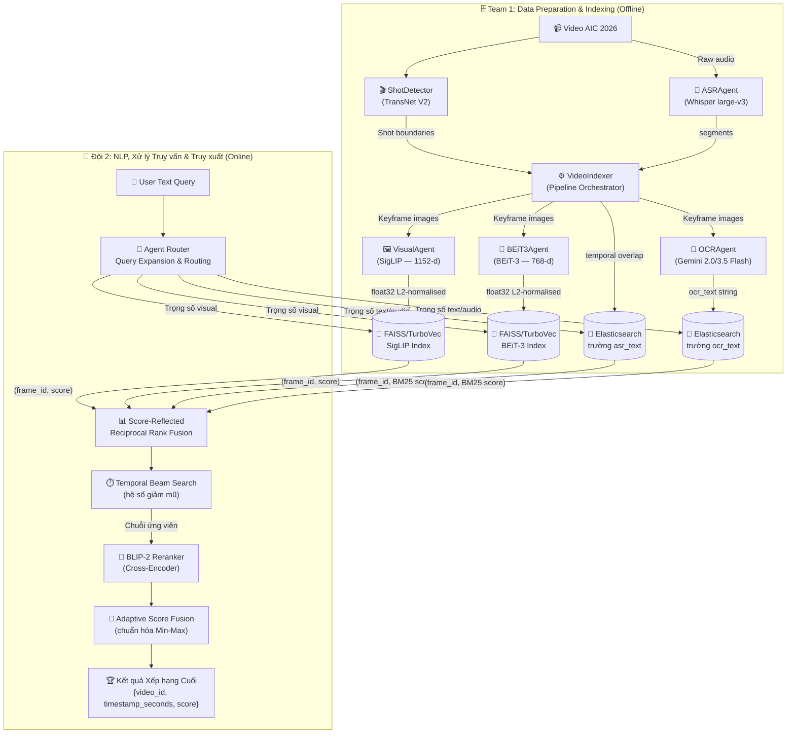

# Kiến trúc Hệ thống — AIC 2026

Tài liệu này định nghĩa Kiến trúc Truy xuất Đa phương thức (Multimodal Retrieval Architecture) cho cuộc thi AI Challenge 2026, dựa trên hệ thống tham chiếu ("Cascaded Embedding-Reranking and Temporal-Aware Score Fusion") và các hướng dẫn chính thức từ Ban tổ chức.

---

## 1. Tổng quan Cuộc thi & Sự thay đổi Dữ liệu

Dữ liệu AIC 2026 thể hiện một sự dịch chuyển lớn từ **Surveillance** (camera an ninh cố định, tin tức truyền hình) sang **Sousveillance** (góc nhìn thứ nhất / Ego-centric từ thiết bị cá nhân như kính thông minh, camera hành trình).

**Hệ quả thực tế:**
- **Video rung lắc & Biến động:** Không thể dựa vào các khung hình tĩnh, sạch sẽ. Visual embeddings phải thật sự mạnh mẽ (robust).
- **Âm thanh nhiều tiếng ồn (Noisy Audio):** Khác với giọng MC truyền hình, âm thanh ego-centric lẫn tiếng gió, tiếng ồn môi trường và nhiều khoảng im lặng.
- **Ba Thách thức Cốt lõi:**
  1. **Semantic Gap:** Truy vấn của con người mang tính trừu tượng; pixel chỉ là dữ liệu thô.
  2. **Data Sparsity & Scale:** Tìm một đoạn clip 2 giây trong hàng trăm giờ video đòi hỏi một bộ lọc ban đầu cực kỳ nhanh.
  3. **Temporal Logic Constraints:** Thứ tự thời gian của các hành động rất quan trọng ("bước vào phòng rồi mới cởi mũ"). Tìm kiếm thông thường bỏ qua yếu tố này.

**Nhiệm vụ mới - KISC (Conversational KIS):** 
Dữ liệu 2026 giới thiệu bài toán Conversational Known-Item Search, bắt buộc phải sử dụng các Agent hội thoại. Các đội phải xây dựng hệ thống có khả năng tinh chỉnh truy vấn qua các cuộc hội thoại hỏi - đáp, thay vì chỉ trả về một danh sách kết quả tĩnh.

---

## 2. Các Nhóm Chức năng (GitNexus Clusters)

Codebase được tổ chức thành **3 functional clusters**:

| Cluster | Vai trò |
|:---|:---|
| **Agents** | Tất cả model wrappers (SigLIP, BEiT-3, Whisper, Gemini, BaseAgent) |
| **Retrieval** | Shot boundary detection, video indexing pipeline, FAISS/TurboVec store, Elasticsearch store |
| **Routing** | Query classifier, rule-based classify, dynamic dispatcher |

### 🧩 A. Agents
- **BaseAgent:** Base class cung cấp cơ chế kiểm soát đồng thời và đo lường độ trễ (latency).
- **VisualAgent:** Mã hóa cả **hình ảnh lẫn văn bản** vào chung một không gian embedding 1152-d thông qua **SigLIP ViT-SO400M-14-384**.
- **BEiT3Agent:** Bộ mã hóa chỉ dành cho hình ảnh 768-d sử dụng **BEiT-3 base_patch16_224**.
- **ASRAgent:** Chạy **Whisper large-v3** cục bộ; trích xuất văn bản từ âm thanh.
- **OCRAgent:** Gọi **API Gemini 2.0/3.5 Flash**; trích xuất văn bản từ hình ảnh.

### 🗄️ B. Retrieval & Storage
- **ShotDetector:** Bọc mô hình **TransNet V2** để phát hiện ranh giới cảnh quay (shot boundaries).
- **VideoIndexer:** Bộ điều phối offline pipeline.
- **Vector Store (FAISS/Turbovec):** Lưu trữ các embedding hình ảnh.
- **Elasticsearch Store:** Kho lưu trữ văn bản dạng chỉ mục đảo ngược (inverted-index) cho văn bản OCR/ASR.

### 🧠 C. Routing & Classification
- **rule_based_classify:** Bộ phân loại truy vấn theo từ khóa ở Giai đoạn 1.
- **QueryClassifier:** Bộ phân loại MLP cho Giai đoạn 2.
- **DynamicDispatcher:** Ánh xạ truy vấn tới các agent cụ thể và chạy chúng song song.

---

## 3. Đường ống Kiến trúc Agentic (Agentic Pipeline)

Hệ thống đã triển khai một **Agent-guided Multimodal Pipeline** (Đường ống Đa phương thức điều hướng bởi Agent) kết hợp với **Temporal Event Reasoning** (Suy luận Sự kiện theo thời gian).

### Agentic Pipeline khác gì so với Ad-hoc hoặc Zero-shot?
- **Hệ thống Zero-shot / Ad-hoc:** Thường hoạt động theo một chuỗi cứng nhắc duy nhất (VD: "Nhận câu truy vấn $\rightarrow$ biến thành vector $\rightarrow$ tìm trong database $\rightarrow$ trả về kết quả"). Chúng không thể tự sửa lỗi, không thể chia nhỏ các truy vấn phức tạp, và không biết đặt câu hỏi làm rõ.
- **Agentic Pipeline (Đường ống hướng Agent):** Hoạt động một cách linh hoạt. Khi nhận một truy vấn, bộ điều phối (thường là LLM) sẽ quyết định gọi *những sub-agent chuyên biệt nào* (Visual, ASR, OCR). Nó có thể mở rộng câu truy vấn, kết hợp nhiều loại hình dữ liệu (modalities) tùy theo ngữ cảnh. Quan trọng nhất, đối với bài toán KISC mới, nó có thể đo lường độ nhiễu (entropy) trong tập kết quả dự tuyển và **đặt câu hỏi ngược lại cho người dùng** để làm rõ thông tin trước khi đưa ra câu trả lời cuối cùng.



### Giai đoạn 1: Lập chỉ mục Offline (Đội 1)
1. **Phát hiện ranh giới cảnh quay:** `ShotDetector` chạy **TransNet V2** (chỉ dùng hình ảnh) để định vị các điểm cắt cảnh, tạo ra các đối tượng `Shot` chứa số frame và thời điểm tính bằng giây.
2. **Trích xuất Keyframe:** `VideoIndexer` lấy frame giữa mỗi cảnh quay thông qua một lần đọc tuần tự bằng `cv2.VideoCapture`.
3. **ASR — Toàn bộ âm thanh Video:** `ASRAgent` (Whisper large-v3) phiên âm toàn bộ audio của video một lần duy nhất. Các đoạn văn bản có mốc thời gian sau đó được ánh xạ vào từng cảnh quay thông qua hàm `_join_asr_to_shot()`.
4. **Mã hóa hình ảnh kép:** Mỗi keyframe được mã hóa bởi **VisualAgent** (SigLIP, 1152-d) và **BEiT3Agent** (BEiT-3, 768-d). Cả hai vector đều được chuẩn hóa L2 trước khi lưu trữ.
5. **OCR:** Mỗi keyframe được gửi đến **Gemini OCR** để trích xuất văn bản hiển thị trên màn hình.
6. **Lưu trữ:** Vector SigLIP + BEiT-3 → hai `TurbovecStore`. Văn bản ASR + OCR + timestamp → `ElasticsearchStore` với `frame_id` làm document `_id`.

### Giai đoạn 2: Truy xuất Online (Đội 2)
1. **Phân tách truy vấn bằng Agent:** Người dùng gửi một câu truy vấn phức tạp. Agent Router mở rộng và phân bổ trọng số cho từng nguồn dữ liệu (Visual, OCR, ASR).
2. **Tìm kiếm song song:** Hệ thống truy vấn đồng thời Elasticsearch và cả hai kho TurboVec.
3. **Temporal Beam Search:** Giải quyết bài toán Temporal Logic. Thuật toán Beam Search với hệ số giảm mũ `exp(-alpha * dt)` ghép nối các frame rời rạc thành các chuỗi sự kiện liền mạch, phạt những frame cách nhau quá xa về thời gian.
4. **Xếp hạng lại chi tiết:** Các chuỗi ứng viên hàng đầu được đưa qua bộ cross-encoder **BLIP-2** để đối chiếu hình ảnh-văn bản chính xác.
5. **Adaptive Score Fusion:** Điểm số cuối được chuẩn hóa Min-Max và tổng hợp theo trọng số của router.

---

## 4. Các Luồng Thực thi Chính

Các luồng gọi hàm quan trọng nhất trong codebase:

### Lập chỉ mục Offline
```
_build_and_run (video_indexer.py)
  └─ index_directory
       └─ index_video
            ├─ _get_fps (shot_detector.py)
            ├─ _grab_frames      — đọc frame tuần tự qua cv2.VideoCapture
            ├─ _transcribe       — Whisper chạy trên toàn bộ audio, rồi ghép vào cảnh
            └─ _extract_text     — OCRAgent.process(keyframe_path) cho từng keyframe
```

### Truy vấn Online
```
evaluate (eval.py)
  └─ search (inference.py)
       └─ _search_async
            ├─ rule_based_classify (classifier.py)
            ├─ dispatch (dispatcher.py)
            └─ _hybrid_rerank    — kết hợp điểm cosine TurboVec với điểm BM25 text
```

### Xác minh Chỉ mục
```
_check_frame (verify_index.py)
  └─ process (base_agent.py)
       └─ _run                   — xác nhận handoff chỉ mục từ Đội 1 sang Đội 2
```

---

## 5. Ngăn xếp Công nghệ Cốt lõi

### Khóa chính: `frame_id`
```
frame_id = "{video_id}_{frame_index:06d}"
Ví dụ:     L01_V001_000145
```
Dùng làm khóa trong **cả hai** TurboVec (qua file JSON sidecar) và Elasticsearch (là `_id`), đồng thời là tên file trên đĩa. Mọi thao tác join giữa các kho đều là tra cứu O(1) trên chuỗi này.

### Hai Cơ sở Dữ liệu

| | TurboVec (×2 instance) | Elasticsearch |
|:---|:---|:---|
| **Lưu trữ** | Vector thực (hình ảnh) | Văn bản (ASR + OCR) + metadata |
| **Kiểu chỉ mục** | ANN nén 4-bit (TurboQuant) | Chỉ mục đảo ngược (BM25) |
| **File trên đĩa** | `*.tvim` + `*.sidecar.json` | Docker volume `es_data` |
| **Kết quả trả về** | `[(frame_id, cosine_score)]` | `[(frame_id, BM25_score)]` |
| **Tại sao 2 TurboVec?** | SigLIP (1152-d) và BEiT-3 (768-d) có số chiều khác nhau; mỗi encoder một chỉ mục riêng |

### Bảng Thư viện Đầy đủ

| Mục đích | Thư viện / Model |
|:---|:---|
| Phát hiện ranh giới cảnh quay | `transnetv2`, `tensorflow` (buộc chạy CPU) |
| Đọc frame | `opencv-python` (`cv2.VideoCapture`) |
| Visual embedding | `open-clip-torch`, SigLIP `ViT-SO400M-14-384` |
| Vision-only embedding | `timm`, BEiT-3 `beit3_base_patch16_224.in22k_ft_in1k` |
| ASR | `openai-whisper`, `large-v3` |
| OCR | `google-genai`, Gemini 2.0/3.5 Flash |
| Kho vector | `turbovec` (Rust, 4-bit TurboQuant) |
| Kho văn bản | `elasticsearch>=8.13` |
| Xếp hạng lại (Giai đoạn 2) | `transformers`, BLIP-2 |
| Web UI | `streamlit` |

---

## 6. Phân chia File theo Đội

```
Đội 1 (Data & Indexing)           Đội 2 (NLP & Retrieval)
─────────────────────────         ────────────────────────────
Sở hữu:                           Sở hữu:
  src/agents/       ← dùng chung→   src/agents/ (chế độ text)
  src/retrieval/                    src/routing/
  scripts/                          src/inference.py
  configs/config.yaml               src/eval.py
                                    src/ui/app.py

Bàn giao:                         Tiêu thụ:
  data/index/turbovec/siglip.*      Kho TurboVec (đọc)
  data/index/turbovec/beit3.*       Chỉ mục Elasticsearch (đọc)
  Chỉ mục Elasticsearch             data/keyframes/**/*.jpg
  data/keyframes/**/*.jpg
```
