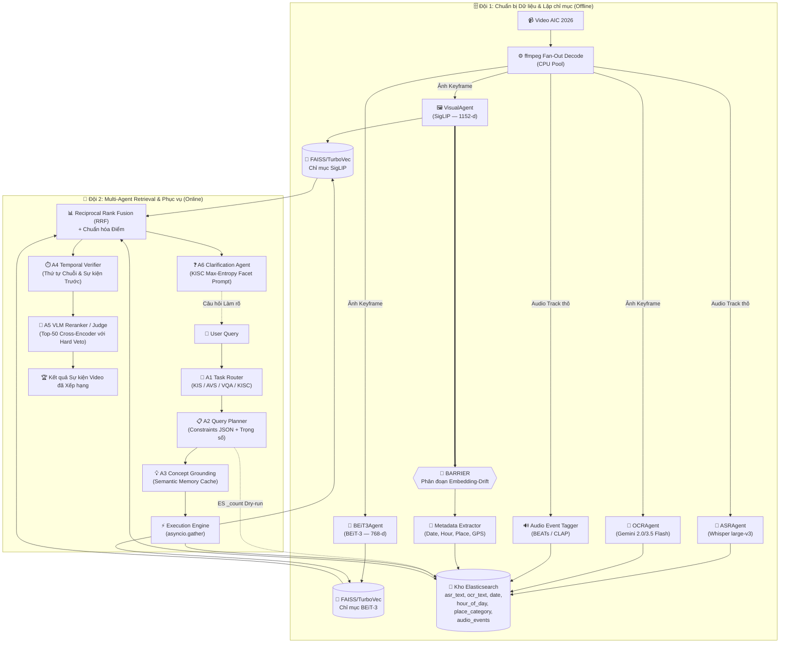
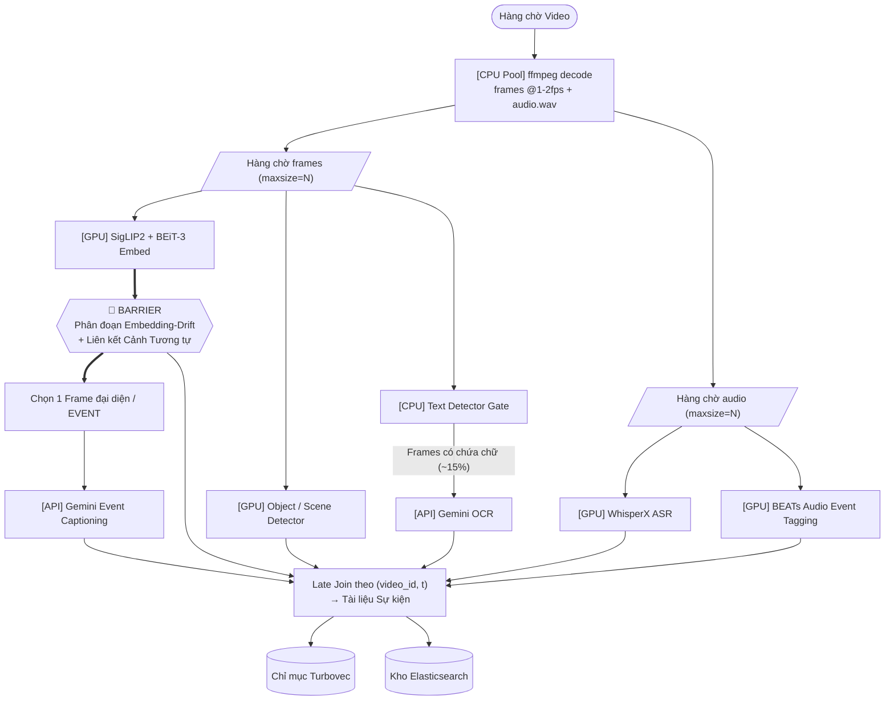
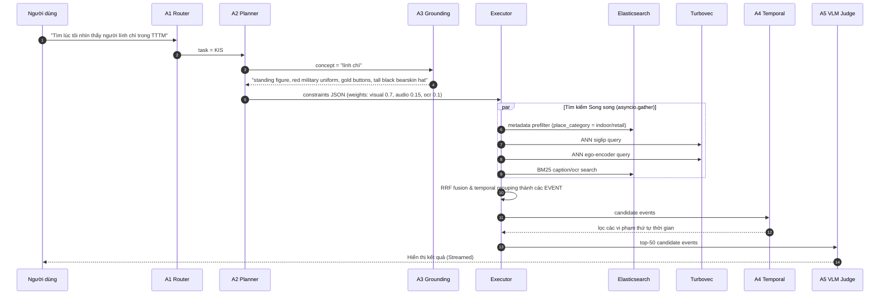
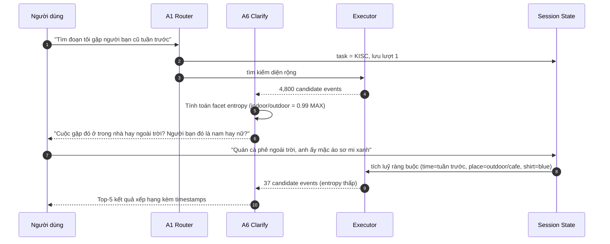
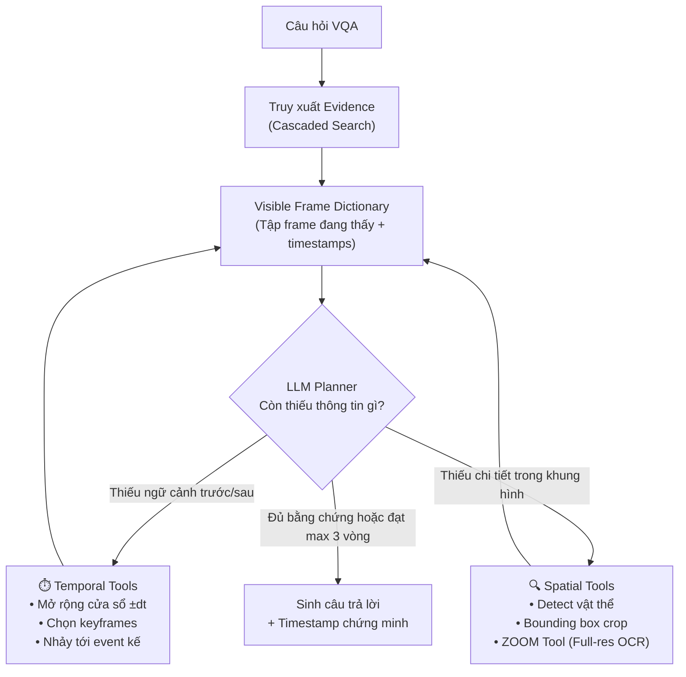

# Kiến trúc Hệ thống — AIC 2026

Tài liệu này định nghĩa Kiến trúc Truy xuất Đa phương thức (Multimodal Retrieval Architecture) cho cuộc thi AI Challenge 2026, dựa trên hệ thống tham chiếu ("Cascaded Embedding-Reranking and Temporal-Aware Score Fusion") và các hướng dẫn chính thức từ Ban tổ chức.

---

## 1. Tổng quan Cuộc thi & Sự thay đổi Dữ liệu

Dữ liệu AIC 2026 thể hiện một sự dịch chuyển lớn từ **Surveillance** (camera an ninh cố định, tin tức truyền hình) sang **Sousveillance** (góc nhìn thứ nhất / Ego-centric từ thiết bị cá nhân như kính thông minh, camera hành trình).

**Hệ quả thực tế:**
- **Video rung lắc & Biến động:** Không thể dựa vào các khung hình tĩnh, sạch sẽ. Visual embeddings phải thật sự robust.
- **Noisy Audio:** Khác với giọng MC truyền hình, âm thanh ego-centric lẫn tiếng gió, tiếng ồn môi trường và nhiều khoảng im lặng.
- **Ba Thách thức Cốt lõi (The "Big Three"):**
  1. **Semantic Gap:** Truy vấn của con người mang tính trừu tượng; pixel chỉ là dữ liệu thô.
  2. **Data Sparsity & Scale:** Tìm một đoạn clip 2 giây trong hàng trăm giờ video đòi hỏi một bộ lọc ban đầu cực kỳ nhanh.
  3. **Temporal Logic Constraints:** Thứ tự thời gian của các hành động rất quan trọng ("bước vào phòng rồi mới cởi mũ"). Tìm kiếm thông thường bỏ qua yếu tố này.

**Nhiệm vụ mới - KISC (Conversational KIS):** 
Dữ liệu 2026 giới thiệu bài toán Conversational Known-Item Search, bắt buộc phải sử dụng các Agent hội thoại. Các đội phải xây dựng hệ thống có khả năng tinh chỉnh truy vấn qua các cuộc hội thoại hỏi - đáp, thay vì chỉ trả về một danh sách kết quả tĩnh.

---

## 2. Các Khu vực Chức năng (GitNexus Clusters)

Cơ sở mã có **3 cụm chức năng chính** được xác định bằng phân tích tĩnh:

| Cụm | Vai trò |
|:---|:---|
| **Agents (A1-A6)** | Hệ thống multi-agent điều phối reasoning, memory và planning. |
| **Retrieval** | Video indexing pipeline, TurboVec store, Elasticsearch store. |
| **UI & Feedback** | Relevance feedback, diversity caps, và concept exploration. |

### 🧩 A. Hệ thống 6-Agent (Đội 2)
Hệ thống truy xuất online được điều khiển bởi 6 agent chuyên biệt:
- **A1 (Task Router):** Classify truy vấn (KIS, AVS, VQA, KISC) và route luồng thực thi.
- **A2 (Query Planner):** Sinh typed constraint object (modality weights, temporal order). Thực thi World Model Dry-run bằng ES `_count` để tránh over-constrained queries (0 kết quả).
- **A3 (Concept Grounding):** Semantic memory cache. Expand concept thành các mô tả visual chi tiết.
- **A4 (Temporal Verifier):** Verify các ràng buộc thời gian ("bước vào phòng, rồi cởi mũ").
- **A5 (VLM Judge):** Cross-encoder reranker trên top-50 ứng viên với quyền hard veto.
- **A6 (Clarification Agent):** Dành cho KISC. Tính toán entropy trên tập ứng viên để đưa ra câu hỏi clarify tối ưu nhất.

### 🗄️ B. Retrieval & Storage (Đội 1)
- **VideoIndexer:** Pipeline orchestrator offline (decouple CPU/GPU/API pools).
- **Vector Store (FAISS/Turbovec):** Lưu trữ visual embeddings.
- **Elasticsearch Store:** Lưu trữ metadata, OCR/ASR, **time, place, và audio events**.

### 💻 C. UI & Relevance Feedback
- **Diversity Cap:** Giới hạn kết quả trả về ≤2 events per video ở trang đầu.
- **"More Like This" (Image Query):** Truy vấn bằng hình ảnh sử dụng vector có sẵn (0 model cost).
- **Rocchio Feedback:** Relevance feedback để update vector truy vấn mà không chịu độ trễ của LLM.

---

## 3. Pipeline Kiến trúc Agentic

Hệ thống triển khai **Agent-guided Multimodal Pipeline** kết hợp **Temporal Event Reasoning** và khung **Spatiotemporal Reasoning (STAR)** dành cho VQA.

### Sơ đồ Tổng quan Kiến trúc Pipeline



### 3.1 Quy trình Lập chỉ mục Offline (Đội 1)
1. **Fan-Out Decoding:** `ffmpeg` decode frames (trên CPU pool) và audio track một lần duy nhất.
2. **Audio Event Tagging:** `BEATs` hoặc `CLAP` trích xuất audio events (ví dụ: "traffic", "cooking") để cung cấp location/activity priors mạnh mẽ khi ASR thất bại trên egocentric video.
3. **Embedding-Drift Segmentation:** Thay thế shot boundary detection truyền thống. Phân đoạn cảnh quay bằng cách đo drift giữa các visual embeddings pre-computed (Similar Shot Linkage).
4. **Metadata Indexing:** Mỗi event được index vào Elasticsearch cùng với các pruning filters quan trọng: `date`, `hour_of_day`, `place_category`, và `audio_events`.

#### Sơ đồ DAG Pipeline Offline Bất đồng bộ


---

### 3.2 Luồng Truy xuất & Thực thi Online (Đội 2)

#### Sequence Diagram: Luồng Truy vấn KIS Đầy đủ


#### Sequence Diagram: KISC Hội thoại Nhiều lượt


---

### 3.3 Khung Video QA (VQA) STAR Framework
Đối với Video QA, LLM Planner điều phối các công cụ thời gian và không gian trong một vòng lặp:



---

### 3.4 Ngân sách Latency Online

```mermaid
gantt
    title Ngân sách Latency Truy vấn Online 1 Lượt
    dateFormat  X
    axisFormat  %L ms

    section Agent Orchestration
    A1+A2+A3 gộp 1 LLM call (cached A3)   :a1, 0, 600

    section Parallel Retrieval
    ES metadata prefilter                   :b1, 600, 90
    ANN SigLIP search                       :b2, 600, 120
    ANN BEiT-3 search                       :b3, 600, 130
    BM25 text search                        :b4, 600, 145

    section Fusion & Verify
    RRF + Temporal Grouping                 :c1, 750, 100
    A4 Temporal Verify                      :d1, 850, 200

    section Fine Rerank
    A5 VLM Judge top-50 (Streamed)          :e1, 1050, 1500
```



---

## 4. Các Luồng Thực thi Chính

Các luồng gọi hàm quan trọng nhất trong codebase:

### Offline Indexing
```
_build_and_run (video_indexer.py)
  └─ index_directory
       └─ index_video
            ├─ _sample_frame_indices — fixed-FPS sampling qua decord
            ├─ _transcribe       — Whisper chạy trên toàn bộ audio, rồi ghép vào frame
            └─ _extract_text     — OCRAgent.process(keyframe_path) cho từng keyframe
```

### Online Query
```
evaluate (eval.py)
  └─ search (inference.py)
       └─ _search_async
            ├─ rule_based_classify (classifier.py)
            ├─ dispatch (dispatcher.py)
            └─ _hybrid_rerank    — kết hợp điểm cosine TurboVec với điểm BM25 text
```

### Index Verification
```
_check_frame (verify_index.py)
  └─ process (base_agent.py)
       └─ _run                   — xác nhận handoff chỉ mục từ Đội 1 sang Đội 2
```

---

## 5. Ngăn xếp Công nghệ Cốt lõi

### Primary Key: `frame_id`
```
frame_id = "{video_id}_{frame_index:06d}"
Ví dụ:     L01_V001_000145
```
Dùng làm khóa trong **cả hai** TurboVec (qua file JSON sidecar) và Elasticsearch (là `_id`), đồng thời là tên file trên đĩa. Mọi thao tác join giữa các kho đều là tra cứu O(1) trên chuỗi này.

### Hai Cơ sở Dữ liệu

| | TurboVec (×2 instances) | Elasticsearch |
|:---|:---|:---|
| **Storage** | Float vectors (images) | Text (ASR + OCR) + metadata |
| **Index type** | 4-bit quantised ANN (TurboQuant) | Inverted index (BM25) |
| **Files on disk** | `*.tvim` + `*.sidecar.json` | Docker volume `es_data` |
| **Query returns** | `[(frame_id, cosine_score)]` | `[(frame_id, BM25_score)]` |
| **Tại sao 2 TurboVec?** | SigLIP (1152-d) và BEiT-3 (768-d) có số chiều khác nhau; mỗi encoder một index riêng |

### Bảng Thư viện Đầy đủ

| Mục đích | Thư viện / Model |
|:---|:---|
| Frame decode / sampling | `decord` hoặc `ffmpeg` (CPU pool) |
| Visual embedding | `open-clip-torch`, SigLIP `ViT-SO400M-14-384` |
| Vision-only embedding | `timm`, BEiT-3 `beit3_base_patch16_224.in22k_ft_in1k` |
| Audio Event Tagging | `BEATs` hoặc `CLAP` (GPU) |
| ASR | `openai-whisper`, `large-v3` |
| OCR | `google-genai`, Gemini 2.0/3.5 Flash |
| Metadata & Text Store | `elasticsearch>=8.13` (Gồm Time, Place, Audio Events) |
| Vector Store | `turbovec` (Rust, 4-bit TurboQuant) |
| VLM Reranking / Judge | Gemini 2.5 Flash / Qwen3-VL (Top-50 only) |
| Web UI | `streamlit` |

---

## 6. Phân chia File theo Đội

```
Đội 1 (Data & Indexing)           Đội 2 (NLP & Retrieval)
─────────────────────────         ────────────────────────────
Sở hữu:                           Sở hữu:
  src/agents/       ← dùng chung→   src/agents/ (chế độ text)
  src/retrieval/                    src/routing/
  scripts/                          src/inference.py
  configs/config.yaml               src/eval.py
                                     src/ui/app.py

Bàn giao:                         Tiêu thụ:
  data/index/turbovec/siglip.*      Kho TurboVec (đọc)
  data/index/turbovec/beit3.*       Chỉ mục Elasticsearch (đọc)
  Chỉ mục Elasticsearch             data/keyframes/**/*.jpg
  data/keyframes/**/*.jpg
```
