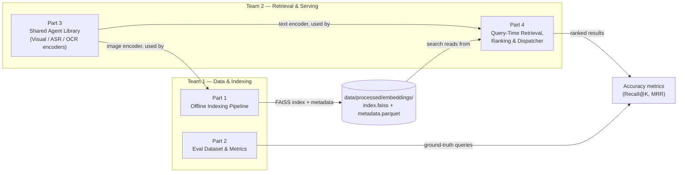

# Implementation & Integration Plan — Preliminary Round

This document outlines the implementation strategy, team responsibilities, and API contracts necessary to build the system without integration failures. It serves as a companion to `ARCHITECTURE.md`.

**Governing Principle:** The preliminary round is graded on **accuracy**, not latency. Every part has a **Phase 1 (baseline)** scope (the simplest correct solution) and a **Phase 2 (refine)** scope (optimizations for latency/scale). Do not start Phase 2 work until Phase 1 is fully functional end-to-end.

---

## 1. Team Responsibilities

The work is split into four parts across two teams:

| Team | Responsibilities |
|---|---|
| **Team 1 — Data & Indexing** | Part 1 (Offline Indexing), Part 2 (Eval Dataset & Metrics) |
| **Team 2 — Retrieval & Serving** | Part 3 (Shared Agent Library), Part 4 (Retrieval, Ranking, Dispatcher) |



> **IMPORTANT**
> **Part 3 (Shared Agent Library)** is a dependency for both Part 1 and Part 4. Its interface must be frozen and built first (even as a stub) before other development begins.

---

## 2. API Contract (Team 1 🤝 Team 2)

Because Team 1 prepares the database offline and Team 2 queries it online, both teams **MUST** agree on the following rules.

### 2.1 Embedding Contract
- **Model:** SigLIP `ViT-SO400M-14-384`, pretrained tag `webli`, loaded via `open_clip` (`open-clip-torch`) — pinned in `configs/config.yaml`.
- **Output:** `numpy.ndarray`, shape `(1152,)`, dtype `float32`.
- **Must be L2-normalized** before storage/search — this makes inner-product search equivalent to cosine similarity, which is what `IndexFlatIP` expects.
- Image and text queries **must go through the same model instance/weights** so they land in the same joint embedding space. This is the single most important shared fact between Team 1 (embeds keyframes) and Team 2 (embeds query text).

### 2.2 The Core ID (Primary Key)
Every extracted keyframe must have a universal identifier. Both vector stores (Turbovec/FAISS) and text stores (Elasticsearch) must use this exact format.
- **Format:** `{video_id}_{frame_index}`
- **Example:** `L01_V001_0145` (Video L01_V001, Frame 145)

### 2.3 Agent Output Contract

| Agent | `output` type | Exact shape/fields |
|---|---|---|
| `VisualAgent` | `np.ndarray` | `(1152,)` float32, L2-normalized |
| `ASRAgent` | `dict` | `{"text": str, "segments": [{"start": float, "end": float, "text": str}]}` |
| `OCRAgent` | `str` | extracted text, `""` if none found — never `None` |

### 2.4 Retrieval Function Signature (do not change)
```python
# src/inference.py
def search(query: str, config: dict, top_k: int = 10) -> list[dict]:
    # returns: [{"video_id": str, "frame_idx": int, "timestamp_sec": float, "score": float}, ...]
```
This is what both the eval harness (Part 2) and any UI call. Team 2 owns the implementation; Team 1 only needs to know this shape to write the eval harness without waiting for Part 4.

### 2.5 Elasticsearch Document Schema
When Team 1 inserts text (ASR/OCR) into Elasticsearch:
```json
{
  "frame_id": "L01_V001_0145",
  "video_id": "L01_V001",
  "timestamp_seconds": 14.5,
  "ocr_text": "Trường Đại học Bách Khoa",
  "asr_text": "Xin chào các bạn sinh viên"
}
```

### 2.6 Turbovec / Vector Storage Agreement
Team 1 must attach the `frame_id` alongside the vector during insertion. For FAISS, `embedding_id` (integer) must map to the `frame_id` in the metadata store.

### 2.7 File System Paths (For the UI)
- **Path:** `data/keyframes/{video_id}/{frame_id}.jpg`
- **Example:** `data/keyframes/L01_V001/L01_V001_0145.jpg`

### 2.8 Two Separate Query Datasets — Don't Conflate Them
1. **Classifier training data** (`data/raw/queries/queries.json`, consumed by `src/data_loader.py`) — labeled examples to train `QueryClassifier`:
   ```json
   [{"query": "find the moment...", "embedding": [0.01, ...], "query_type": 0, "complexity": 1}]
   ```
2. **Retrieval ground truth** (`data/raw/queries/eval_ground_truth.json`, owned by Part 2, **no stub exists yet — Team 1 must create it**) — the answer key used to measure accuracy:
   ```json
   [{"query_id": "q001", "query_text": "...", "query_type": "KIS", "video_id": "L21_V001", "timestamp_sec": 142.5, "tolerance_sec": 2.0}]
   ```

---

## 3. Implementation Details by Part

### Part 1: Offline Indexing Pipeline (Team 1)
**Files:** `src/retrieval/video_indexer.py`, `src/retrieval/vector_store.py`

**Goal:** Every provided video becomes a set of embedded, searchable keyframes with correct metadata.

| Step | Library / Model | Phase 1 (baseline) | Phase 2 (refine) |
|---|---|---|---|
| Video ingestion | `pathlib` | List `data/raw/videos/*.mp4` | — |
| Frame sampling | `decord.VideoReader` | Fixed FPS (`frame_fps: 1` per config) — fast, predictable | **DAKE**: re-encode frames as JPEG via Pillow, score motion by size deltas, keep top-ρ frames |
| Visual embedding | `open_clip` — SigLIP `ViT-SO400M-14-384` | One embedding per keyframe, per §2.1 | — |
| ASR | `openai-whisper` `large-v3`, `language="vi"` | Run once per video; join each keyframe's `timestamp_sec` to the Whisper segment whose `[start, end]` contains it | — |
| OCR | `google-generativeai` Gemini `gemini-1.5-flash` | **Optional for Phase 1** — skip if time-constrained; visual embeddings drive most of KIS/AVS accuracy | Add once baseline works |
| Vector index | `faiss-cpu` | `faiss.IndexIDMap(faiss.IndexFlatIP(1152))` — brute-force exact, no `train()` step, removes a whole class of bugs | `faiss.IndexIVFFlat` (nlist=256, nprobe=32) once corpus size makes brute-force too slow |
| Metadata store | `pandas` | Single Parquet file — `df.to_parquet()` | Migrate to Milvus/Elasticsearch only if file-based approach becomes a real constraint |

**Output:** `data/processed/embeddings/index.faiss` + `data/processed/embeddings/metadata.parquet`

---

### Part 2: Evaluation Dataset & Metrics (Team 1)
**Files:** `src/eval.py` + `data/raw/queries/eval_ground_truth.json` (new, no stub yet)

**Goal:** Answer the question "is our system actually accurate?" — both teams need this to know if their changes help or hurt.

| Step | Library | Phase 1 |
|---|---|---|
| Ground-truth authoring | `json` | Hand-label ~30–50 KIS-style queries against the indexed corpus (per §2.8 schema). A hit counts if `abs(returned.timestamp_sec - ground_truth.timestamp_sec) <= tolerance_sec` AND `video_id` matches. |
| Metrics | `numpy` | **Recall@K** (K = 1, 5, 10) and **Mean Reciprocal Rank (MRR)** |
| Harness | Python | `python -m src.eval --ground-truth data/raw/queries/eval_ground_truth.json` → calls `src.inference.search()` per query, prints a metrics table |

**Output:** `eval_ground_truth.json` + a metrics report — the thing that tells both teams whether Phase 1 is "done."

---

### Part 3: Shared Agent Library (Team 2)
**Files:** `src/agents/base_agent.py`, `visual_agent.py`, `asr_agent.py`, `ocr_agent.py`

**Build this first**, even as a thin stub — Part 1 and Part 4 both depend on it.

| Step | Library / Model | Phase 1 (baseline) | Phase 2 (refine) |
|---|---|---|---|
| `VisualAgent` | `open_clip` — SigLIP `ViT-SO400M-14-384` | Load model once in `__init__`; `_run({"image": path})` → embedding; `_run({"text": str})` → embedding. Both paths through the **same** loaded model (§2.1). | — |
| `ASRAgent` | `openai-whisper`, `large-v3` | Load model once; `_run(audio_path)` → `{"text": ..., "segments": [...]}` per §2.3 | — |
| `OCRAgent` | `google-generativeai` Gemini `gemini-1.5-flash` | `_run(image)` → extracted text string, `""` if none | — |
| Concurrency | `asyncio.Semaphore(max_concurrent)` | Can be skipped in Phase 1 if agents are called sequentially | Required once real concurrency is needed |
| Latency tracking | `time.perf_counter()` in `BaseAgent.process()` | Optional in Phase 1 | Required in Phase 2 |

**Output:** Three agent classes whose `process()` returns `AgentResult` per §2.3.

---

### Part 4: Query-Time Retrieval & Ranking (Team 2)
**Files:** `src/inference.py`, `src/routing/classifier.py`, `src/routing/dispatcher.py`, `src/retrieval/vector_store.py`

**Goal:** Correct top-k retrieval for a text query.

| Step | Library / Model | Phase 1 (baseline) | Phase 2 (refine) |
|---|---|---|---|
| Query classification | plain Python | Use the already-implemented `rule_based_classify()` — routing decision doesn't affect *which results are correct* | Train `QueryClassifier` (MLP in `model.py`) once Part 2's labeled data exists |
| Query embedding | Part 3's `VisualAgent`, text mode | Embed the query string directly | — |
| Vector search | `faiss-cpu` | `VectorStore.search(query_vec, top_k)` against Part 1's index | — |
| Hybrid text matching | `rank_bm25` (no server needed) | Only for queries referencing speech/on-screen text: `final = 0.7*visual + 0.3*text` | Elasticsearch, if BM25-in-process becomes a bottleneck |
| Ranking | plain Python | Sort by `final` score, return top_k | **Unified Clipping Algorithm** — group per-video hits into clip suggestions, meaningfully helps AVS |
| Dispatcher | `src/routing/dispatcher.py` | Dispatch synchronously — `asyncio.gather()` directly, no wait-time estimation | Async concurrency controls once throughput becomes a concern |

---

## 4. Exact Database Schema (The Merge Point)

Both files live under `data/processed/embeddings/`.

### 4.1 `index.faiss`
- Type: `faiss.IndexIDMap(faiss.IndexFlatIP(1152))` (Phase 1).
- Populated via `index.add_with_ids(embeddings, ids)` where `ids` are the `embedding_id` values from the metadata table.
- **Never rely on FAISS's implicit sequential ids** — always assign explicitly via `IndexIDMap` so the join with metadata stays correct even if rows are added out of order.

### 4.2 `metadata.parquet`

| Column | Type | Notes |
|---|---|---|
| `embedding_id` | `int64` | Primary key; matches the FAISS id exactly |
| `video_id` | `string` | e.g. `L21_V001` |
| `frame_idx` | `int64` | Frame number in source video |
| `timestamp_sec` | `float64` | **This is what gets graded against** |
| `keyframe_path` | `string` | Path to the extracted `.jpg` |
| `asr_text` | `string` (nullable) | From Whisper, joined by timestamp overlap |
| `ocr_text` | `string` (nullable) | From Gemini, per-keyframe |
| `source_type` | `string` | `"surveillance"` / `"sousveillance"` |

### 4.3 What Part 4 (Team 2) reads and returns
- Reads: `index.faiss` + `metadata.parquet`, joined on `embedding_id`.
- Returns (per §2.4 search signature): `{"video_id", "frame_idx", "timestamp_sec", "score"}` — a deliberate subset. The eval harness and UI only ever see this shape, never the raw Parquet columns.

---

## 5. Integration Strategy

**Build a Golden Mini-set:** Do not wait for the entire corpus to be indexed.
1. Team 1 indexes 10–20 videos and publishes `index.faiss` + `metadata.parquet` for just that subset.
2. Team 2 builds and tests Part 4 against this mini-set while Team 1 continues indexing in parallel.
3. Team 1's ground-truth file only needs to cover the mini-set initially — extend it once the full corpus is indexed.

This means the two teams' schedules aren't serialised on "Part 1 fully done, then Part 4 can start" — they converge on the shared contract (§2) and validate it early.

---

## 6. Consolidated Library & Model Reference

| Purpose | Library / Model | Phase |
|---|---|---|
| Frame sampling | `decord` | 1 |
| Adaptive keyframing | DAKE (JPEG-size based, no model needed) | 2 |
| Visual embedding | `open-clip-torch`, SigLIP `ViT-SO400M-14-384` | 1 |
| ASR | `openai-whisper`, `large-v3` | 1 |
| OCR | `google-generativeai`, Gemini `gemini-1.5-flash` | 1 (optional) |
| Vector index | `faiss-cpu` (`IndexFlatIP` → `IndexIVFFlat`) | 1 → 2 |
| Metadata store | `pandas` (Parquet) → Milvus/Elasticsearch | 1 → 2 |
| Hybrid text scoring | `rank_bm25` → Elasticsearch | 1 → 2 |
| Captioning | *(none)* → ReCap-style Gemini recurrent captioning | 2 |
| Query classification | rule-based (existing) → trained MLP | 1 → 2 |
| Clip ranking | top-k by score → Unified Clipping Algorithm | 1 → 2 |
