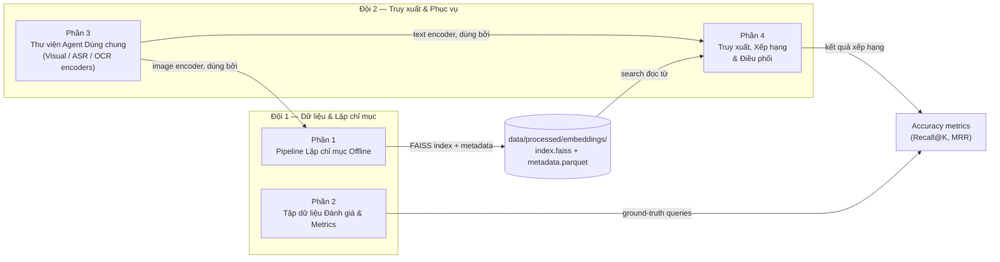

# Kế hoạch Triển khai & Tích hợp — Vòng Sơ khảo

Tài liệu này vạch ra chiến lược triển khai, trách nhiệm của các đội và hợp đồng API (API contract) cần thiết để xây dựng hệ thống mà không gặp lỗi tích hợp. Tài liệu này đi kèm với `ARCHITECTURE_VI.md`.

**Nguyên tắc chỉ đạo:** Vòng sơ khảo chấm điểm dựa trên **độ chính xác (accuracy)**, không phải độ trễ (latency). Mỗi thành phần đều có phạm vi **Giai đoạn 1 (baseline)** (giải pháp đơn giản và đúng nhất) và **Giai đoạn 2 (refine)** (tối ưu hóa cho độ trễ/mở rộng). Không bắt đầu làm Giai đoạn 2 cho đến khi Giai đoạn 1 đã hoạt động trơn tru từ đầu đến cuối.

---

## 1. Trách nhiệm của các đội

Công việc được chia thành 4 phần cho 2 đội:

| Đội | Trách nhiệm |
|---|---|
| **Đội 1 — Dữ liệu & Lập chỉ mục** | Phần 1 (Lập chỉ mục Offline), Phần 2 (Tập dữ liệu Đánh giá & Metrics) |
| **Đội 2 — Truy xuất & Phục vụ** | Phần 3 (Thư viện Agent Dùng chung), Phần 4 (Truy xuất, Xếp hạng, Điều phối) |



> **QUAN TRỌNG**
> **Phần 3 (Thư viện Agent Dùng chung)** là phụ thuộc của cả Phần 1 và Phần 4. Giao diện (interface) của nó phải được chốt và xây dựng đầu tiên (dù chỉ là bản stub/mock) trước khi các phần khác bắt đầu phát triển.

---

## 2. Hợp đồng API (Đội 1 🤝 Đội 2)

Vì Đội 1 chuẩn bị cơ sở dữ liệu offline và Đội 2 truy vấn online, cả hai đội **BẮT BUỘC** phải thống nhất các quy tắc sau.

### 2.1 Hợp đồng Embedding
- **Model:** SigLIP `ViT-SO400M-14-384`, tag `webli`, load qua `open_clip` (`open-clip-torch`) — đã được chốt trong `configs/config.yaml`.
- **Output:** `numpy.ndarray`, shape `(1152,)`, dtype `float32`.
- **Bắt buộc chuẩn hóa L2** trước khi lưu/tìm kiếm — giúp inner-product search tương đương cosine similarity, đúng với yêu cầu của `IndexFlatIP`.
- Cả query hình ảnh lẫn văn bản **đều phải đi qua cùng một instance của model** để đảm bảo chung không gian embedding. Đây là điều quan trọng nhất cần đồng thuận giữa Đội 1 (mã hóa keyframe) và Đội 2 (mã hóa query).

### 2.2 Core ID (Khóa chính)
Mỗi keyframe được trích xuất phải có một định danh thống nhất. Cả cơ sở dữ liệu vector (Turbovec/FAISS) và văn bản (Elasticsearch) đều phải dùng chính xác định dạng này.
- **Định dạng:** `{video_id}_{frame_index}`
- **Ví dụ:** `L01_V001_0145` (Video L01_V001, Frame 145)

### 2.3 Hợp đồng Output của Agent

| Agent | Kiểu `output` | Shape/các trường cụ thể |
|---|---|---|
| `VisualAgent` | `np.ndarray` | `(1152,)` float32, đã chuẩn hóa L2 |
| `ASRAgent` | `dict` | `{"text": str, "segments": [{"start": float, "end": float, "text": str}]}` |
| `OCRAgent` | `str` | văn bản trích xuất, `""` nếu không có — không bao giờ trả `None` |

### 2.4 Chữ ký hàm Truy xuất (không được thay đổi)
```python
# src/inference.py
def search(query: str, config: dict, top_k: int = 10) -> list[dict]:
    # trả về: [{"video_id": str, "frame_idx": int, "timestamp_sec": float, "score": float}, ...]
```
Đây là hàm mà cả harness đánh giá (Phần 2) và UI đều gọi. Đội 2 chịu trách nhiệm triển khai; Đội 1 chỉ cần biết định dạng này để viết harness mà không phải chờ Phần 4 hoàn thành.

### 2.5 Schema của Elasticsearch Document
Khi Đội 1 chèn văn bản và metadata vào Elasticsearch, họ phải bao gồm các trường sau để hỗ trợ tính năng Lọc chạy thử Mô hình Thế giới (World Model Dry-run) của A2 (lọc với chi phí bằng 0):
```json
{
  "frame_id": "L01_V001_0145",
  "video_id": "L01_V001",
  "timestamp_seconds": 14.5,
  "ocr_text": "Trường Đại học Bách Khoa",
  "asr_text": "Xin chào các bạn sinh viên",
  "date": "2026-10-01",
  "hour_of_day": 14,
  "place_category": "indoor/retail",
  "gps": {"lat": 10.7725, "lon": 106.698},
  "audio_events": ["indoor crowd", "background music"]
}
```

### 2.6 Thỏa thuận Lưu trữ Vector (Turbovec / FAISS)
Đội 1 phải đính kèm `frame_id` cùng với vector khi thêm vào cơ sở dữ liệu. Với FAISS, `embedding_id` (số nguyên) phải ánh xạ tới `frame_id` trong kho metadata.

### 2.7 Đường dẫn Tệp tin (Dành cho UI)
- **Đường dẫn:** `data/keyframes/{video_id}/{frame_id}.jpg`
- **Ví dụ:** `data/keyframes/L01_V001/L01_V001_0145.jpg`

### 2.8 Hai Tập dữ liệu Truy vấn riêng biệt — Không nhầm lẫn
1. **Dữ liệu huấn luyện bộ phân loại** (`data/raw/queries/queries.json`, dùng bởi `src/data_loader.py`) — các mẫu có nhãn để train `QueryClassifier`:
   ```json
   [{"query": "tìm khoảnh khắc...", "embedding": [0.01, ...], "query_type": 0, "complexity": 1}]
   ```
2. **Ground truth Truy xuất** (`data/raw/queries/eval_ground_truth.json`, do Phần 2 sở hữu, **chưa có stub — Đội 1 phải tạo**) — đáp án dùng để đo độ chính xác:
   ```json
   [{"query_id": "q001", "query_text": "...", "query_type": "KIS", "video_id": "L21_V001", "timestamp_sec": 142.5, "tolerance_sec": 2.0}]
   ```

---

## 3. Chi tiết Triển khai theo từng Phần

### Phần 1: Pipeline Lập chỉ mục Offline (Đội 1)
**Files:** `src/retrieval/video_indexer.py`, `src/retrieval/vector_store.py`

**Mục tiêu:** Mọi video được cung cấp đều trở thành một tập keyframe có thể tìm kiếm và đi kèm đầy đủ metadata.

| Bước | Thư viện / Model | Giai đoạn 1 (baseline) | Giai đoạn 2 (tinh chỉnh) |
|---|---|---|---|
| Đọc video | `pathlib` | Liệt kê `data/raw/videos/*.mp4` | — |
| Lấy mẫu frame | `decord.VideoReader` | Fixed FPS (`frame_fps: 1` theo config) — nhanh, dự đoán | **Embedding-Drift Segmentation**: Phân đoạn các cảnh không qua chỉnh sửa bằng cách đo độ lệch giữa các visual embedding đã tính toán sẵn, không cần thư viện shot-detector bên ngoài. |
| Visual embedding | `open_clip` — SigLIP `ViT-SO400M-14-384` | Một embedding mỗi keyframe, theo §2.1 | — |
| ASR | `openai-whisper` `large-v3`, `language="vi"` | Chạy một lần dợ video; gán mỗi keyframe vào segment Whisper phù hợp theo `timestamp_sec` | — |
| OCR | `google-generativeai` Gemini `gemini-1.5-flash` | **Tùy chọn ở Giai đoạn 1** — bỏ qua nếu bị giới hạn thời gian; visual embeddings động lực chính cho kết quả KIS/AVS | Thêm vào sau khi baseline hoạt động |
| Chỉ mục vector | `faiss-cpu` | `faiss.IndexIDMap(faiss.IndexFlatIP(1152))` — tìm kiếm chính xác, không cần bước `train()`, tránh một loại lỗi rất phổ biến | `faiss.IndexIVFFlat` (nlist=256, nprobe=32) khi corpus quá lớn |
| Kho metadata | `pandas` | Một file Parquet duy nhất — `df.to_parquet()` | Chuyển sang Milvus/Elasticsearch chỉ khi approach file-based không đáp ứng được |

**Output:** `data/processed/embeddings/index.faiss` + `data/processed/embeddings/metadata.parquet`

### Phần 2: Tập dữ liệu Đánh giá & Metrics (Đội 1)
**Files:** `src/eval.py` + `data/raw/queries/eval_ground_truth.json` (mới, chưa có stub)

**Mục tiêu:** Trả lời câu hỏi "độ chính xác của hệ thống là bao nhiêu?" — cả hai đội đều cần điều này để biết liệu thay đổi của họ có giúp ích hay không.

| Bước | Thư viện | Giai đoạn 1 |
|---|---|---|
| Tạo ground truth | `json` | Nhãn tay ~30–50 câu KIS theo schema §2.8. Một kết quả được tính đúng nếu `abs(timestamp_trả_về - timestamp_gt) <= tolerance_sec` VÀ `video_id` khớp. |
| Metrics | `numpy` | **Recall@K** (K = 1, 5, 10) và **Mean Reciprocal Rank (MRR)** |
| Harness | Python | `python -m src.eval --ground-truth data/raw/queries/eval_ground_truth.json` → gọi `src.inference.search()` mỗi query, in bảng kết quả metrics |

**Output:** `eval_ground_truth.json` + báo cáo metrics — thứ giúp cả hai đội biết khi nào Giai đoạn 1 là "xong".

---

### Phần 3: Thư viện Agent Dùng chung (Đội 2)
**Files:** `src/agents/base_agent.py`, `visual_agent.py`, `asr_agent.py`, `ocr_agent.py`

**Xây dựng cái này trước tiên**, dù chỉ là một stub mỏng — Phần 1 và Phần 4 đều phụ thuộc vào nó.

| Bước | Thư viện / Model | Giai đoạn 1 (baseline) | Giai đoạn 2 (tinh chỉnh) |
|---|---|---|---|
| `VisualAgent` | `open_clip` — SigLIP `ViT-SO400M-14-384` | Load model một lần trong `__init__`; `_run({"image": path})` → embedding; `_run({"text": str})` → embedding. Cả hai đi qua **cùng** model (§2.1). | — |
| `ASRAgent` | `openai-whisper`, `large-v3` | Load model một lần; `_run(audio_path)` → `{"text": ..., "segments": [...]}` theo §2.3 | — |
| `OCRAgent` | `google-generativeai` Gemini `gemini-1.5-flash` | `_run(image)` → chuỗi văn bản, `""` nếu không có | — |
| Đồng thời hóa | `asyncio.Semaphore(max_concurrent)` | Có thể bỏ qua ở Giai đoạn 1 nếu agent chạy tuần tự | Cần thiết khi có concurrency thực sự |
| Đo độ trễ | `time.perf_counter()` trong `BaseAgent.process()` | Tùy chọn ở Giai đoạn 1 | Bắt buộc ở Giai đoạn 2 |

**Output:** Ba lớp agent mà `process()` trả về `AgentResult` theo §2.3.

---

### Phần 4: Truy xuất & Xếp hạng tại thời điểm Truy vấn (Đội 2)
**Files:** `src/inference.py`, `src/routing/classifier.py`, `src/routing/dispatcher.py`, `src/retrieval/vector_store.py`

**Mục tiêu:** Truy xuất top-k chính xác cho câu truy vấn văn bản.

| Bước | Thư viện / Model | Giai đoạn 1 (baseline) | Giai đoạn 2 (tinh chỉnh) |
|---|---|---|---|
| Phân loại truy vấn | plain Python | Dùng `rule_based_classify()` hiện có — quyết định routing không ảnh hưởng *kết quả nào là đúng* | Train `QueryClassifier` (MLP) khi có dữ liệu từ Phần 2 |
| Mã hóa query | `VisualAgent` chế độ text (Phần 3) | Nhúng trực tiếp chuỗi query | — |
| Tìm kiếm vector | `faiss-cpu` | `VectorStore.search(query_vec, top_k)` trên chỉ mục của Phần 1 | — |
| Tìm kiếm văn bản hybrid | `rank_bm25` (không cần server) | Chỉ cho query rõ ràng liên quan đến giọi nói/text: `final = 0.7*visual + 0.3*text` | Elasticsearch nếu BM25-in-process trở nên cồng kềnh |
| Xếp hạng | plain Python | Sắp xếp theo điểm `final`, trả top_k | **Unified Clipping Algorithm** — nhóm các frame cùng video thành đề xuất clip, giúp rất nhiều cho bài toán AVS |
| Điều phối | `src/routing/dispatcher.py` | Gọi đồng bộ trực tiếp — `asyncio.gather()`, không ước tính thời gian chờ | Kiểm soát concurrency async khi throughput trở nên quan trọng |

---

## 4. Schema Cơ sở Dữ liệu Chính xác (Điểm Hội tụ)

Cả hai file đều nằm trong `data/processed/embeddings/`.

### 4.1 `index.faiss`
- Kiểu: `faiss.IndexIDMap(faiss.IndexFlatIP(1152))` (Giai đoạn 1).
- Thêm dữ liệu bằng `index.add_with_ids(embeddings, ids)` với `ids` là các giá trị `embedding_id` từ bảng metadata.
- **Không bao giờ dùng ID tuần tự ngầm định của FAISS** — luôn gán tường minh qua `IndexIDMap` để join với metadata luôn chính xác dù các dòng được thêm không theo thứ tự.

### 4.2 `metadata.parquet`

| Cột | Kiểu dữ liệu | Ghi chú |
|---|---|---|
| `embedding_id` | `int64` | Khóa chính; khớp chính xác với id trong FAISS |
| `video_id` | `string` | VD: `L21_V001` |
| `frame_idx` | `int64` | Số frame trong video gốc |
| `timestamp_sec` | `float64` | **Đây là giá trị được dùng để chấm điểm** |
| `keyframe_path` | `string` | Đường dẫn đến file `.jpg` |
| `asr_text` | `string` (nullable) | Từ Whisper, ghép qua temporal overlap |
| `ocr_text` | `string` (nullable) | Từ Gemini, theo từng keyframe |
| `source_type` | `string` | `"surveillance"` / `"sousveillance"` |

### 4.3 Phần 4 (Đội 2) đọc và trả về gì
- Đọc: `index.faiss` + `metadata.parquet`, join theo `embedding_id`.
- Trả về (theo chữ ký hàm §2.4): `{"video_id", "frame_idx", "timestamp_sec", "score"}` — một tập con có chủ đích. Harness đánh giá và UI chỉ nhìn thấy định dạng này, không bao giờ thấy các cột Parquet thô.

---

## 5. Chiến lược Tích hợp

**Xây dựng Tập con Vàng (Golden Mini-set):** Đừng đợi đến khi toàn bộ dữ liệu được lập chỉ mục xong.
1. Đội 1 lập chỉ mục trước 10–20 video và xuất `index.faiss` + `metadata.parquet` chỉ cho tập con đó.
2. Đội 2 xây dựng và kiểm thử Phần 4 dựa trên tập con này trong khi Đội 1 tiếp tục lập chỉ mục song song.
3. File ground-truth của Đội 1 chỉ cần bao phủ tập con ban đầu — mở rộng sau khi toàn bộ dữ liệu được lập chỉ mục xong.

Điều này có nghĩa là lịch làm việc của hai đội không bị xếp hàng theo kiểu "Phần 1 xong hết rồi Phần 4 mới bắt đầu" — cả hai đội hội tụ tại hợp đồng chung (§2) và xác nhận nó sớm trên một phần nhỏ dữ liệu.

---

## 6. Bảng Thư viện & Model Tổng hợp

| Mục đích | Thư viện / Model | Giai đoạn |
|---|---|---|
| Lấy mẫu frame | `decord` | 1 |
| Tùy biến keyframing | Embedding-Drift Segmentation (chỉ dùng numpy, không cần model) | 2 |
| Visual embedding | `open-clip-torch`, SigLIP `ViT-SO400M-14-384` | 1 |
| ASR | `openai-whisper`, `large-v3` | 1 |
| OCR | `google-generativeai`, Gemini `gemini-1.5-flash` | 1 (tùy chọn) |
| Chỉ mục vector | `faiss-cpu` (`IndexFlatIP` → `IndexIVFFlat`) | 1 → 2 |
| Kho metadata | `pandas` (Parquet) → Milvus/Elasticsearch | 1 → 2 |
| Tìm kiếm văn bản hybrid | `rank_bm25` → Elasticsearch | 1 → 2 |
| Captioning | *(không có)* → ReCap-style Gemini captioning | 2 |
| Phân loại truy vấn | rule-based (hiện có) → trained MLP | 1 → 2 |
| Xếp hạng clip | top-k theo điểm → Unified Clipping Algorithm | 1 → 2 |
