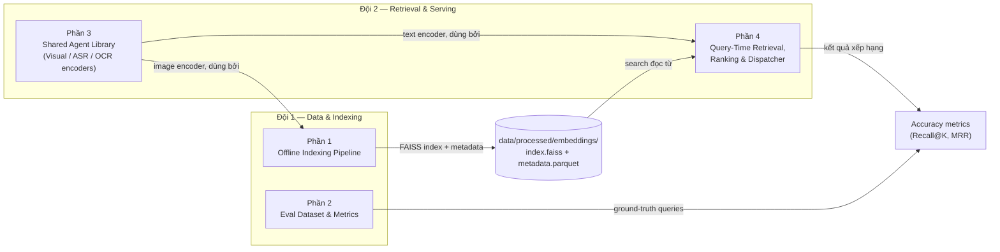

# Kế hoạch Triển khai & Tích hợp — Vòng Sơ khảo

Tài liệu này vạch ra chiến lược triển khai, trách nhiệm của các đội và API contract cần thiết để xây dựng hệ thống mà không gặp lỗi tích hợp. Tài liệu này đi kèm với `ARCHITECTURE_VI.md`.

**Nguyên tắc chỉ đạo:** Vòng sơ khảo chấm điểm dựa trên **accuracy**, không phải latency. Mỗi thành phần đều có phạm vi **Giai đoạn 1 (baseline)** (giải pháp đơn giản và đúng nhất) và **Giai đoạn 2 (refine)** (tối ưu hóa cho độ trễ/mở rộng). Không bắt đầu làm Giai đoạn 2 cho đến khi Giai đoạn 1 đã hoạt động trơn tru từ đầu đến cuối.

---

## 1. Trách nhiệm của các đội

Công việc được chia thành 4 phần cho 2 đội:

| Đội | Trách nhiệm |
|---|---|
| **Đội 1 — Data & Indexing** | Phần 1 (Offline Indexing Pipeline), Phần 2 (Eval Dataset & Metrics) |
| **Đội 2 — Retrieval & Serving** | Phần 3 (Shared Agent Library), Phần 4 (Retrieval, Ranking, Dispatcher) |



> **QUAN TRỌNG**
> **Phần 3 (Shared Agent Library)** là phụ thuộc của cả Phần 1 và Phần 4. Interface của nó phải được chốt và xây dựng đầu tiên (dù chỉ là bản stub/mock) trước khi các phần khác bắt đầu phát triển.

---

## 2. Hợp đồng API (Đội 1 🤝 Đội 2)

Vì Đội 1 chuẩn bị cơ sở dữ liệu offline và Đội 2 truy vấn online, cả hai đội **BẮT BUỘC** phải thống nhất các quy tắc sau.

### 2.1 Embedding Contract
- **Model:** SigLIP `ViT-SO400M-14-384`, tag `webli`, load qua `open_clip` (`open-clip-torch`) — đã được chốt trong `configs/config.yaml`.
- **Output:** `numpy.ndarray`, shape `(1152,)`, dtype `float32`.
- **Bắt buộc L2-normalized** trước khi lưu/tìm kiếm — giúp inner-product search tương đương cosine similarity, đúng với yêu cầu của `IndexFlatIP`.
- Cả image lẫn text query **đều phải đi qua cùng một model instance/weights** để đảm bảo chung không gian embedding. Đây là điều quan trọng nhất cần đồng thuận giữa Đội 1 (embed keyframes) và Đội 2 (embed query text).

### 2.2 Core ID (Primary Key)
Mỗi keyframe được trích xuất phải có một định danh thống nhất. Cả vector stores (Turbovec/FAISS) và text stores (Elasticsearch) đều phải dùng chính xác định dạng này.
- **Định dạng:** `{video_id}_{frame_index}`
- **Ví dụ:** `L01_V001_0145` (Video L01_V001, Frame 145)

### 2.3 Agent Output Contract

| Agent | Kiểu `output` | Shape/các trường cụ thể |
|---|---|---|
| `VisualAgent` | `np.ndarray` | `(1152,)` float32, L2-normalized |
| `ASRAgent` | `dict` | `{"text": str, "segments": [{"start": float, "end": float, "text": str}]}` |
| `OCRAgent` | `str` | văn bản trích xuất, `""` nếu không có — không bao giờ trả `None` |

### 2.4 Retrieval Function Signature (không thay đổi)
```python
# src/inference.py
def search(query: str, config: dict, top_k: int = 10) -> list[dict]:
    # trả về: [{"video_id": str, "frame_idx": int, "timestamp_sec": float, "score": float}, ...]
```
Đây là hàm mà cả eval harness (Phần 2) và UI đều gọi. Đội 2 chịu trách nhiệm triển khai; Đội 1 chỉ cần biết shape này để viết eval harness mà không phải chờ Phần 4 hoàn thành.

### 2.5 Elasticsearch Document Schema
Khi Đội 1 chèn text và metadata vào Elasticsearch, họ phải bao gồm các trường sau để hỗ trợ A2 World Model Dry-run filtering (0-cost pruning):
```json
{
  "frame_id": "L01_V001_0145",
  "video_id": "L01_V001",
  "timestamp_seconds": 14.5,
  "ocr_text": "Trường Đại học Bách Khoa",
  "asr_text": "Xin chào các bạn sinh viên",
  "date": "2026-10-01",
  "hour_of_day": 14,
  "place_category": "indoor/retail",
  "gps": {"lat": 10.7725, "lon": 106.698},
  "audio_events": ["indoor crowd", "background music"]
}
```

### 2.6 Vector Storage Agreement (Turbovec / FAISS)
Đội 1 phải đính kèm `frame_id` cùng với vector khi insert. Với FAISS, `embedding_id` (số nguyên) phải ánh xạ tới `frame_id` trong metadata store.

### 2.7 File System Paths (Cho UI)
- **Đường dẫn:** `data/keyframes/{video_id}/{frame_id}.jpg`
- **Ví dụ:** `data/keyframes/L01_V001/L01_V001_0145.jpg`

### 2.8 Hai Tập Datasets Truy vấn riêng biệt — Không nhầm lẫn
1. **Classifier training data** (`data/raw/queries/queries.json`, consumed bởi `src/data_loader.py`) — labeled examples để train `QueryClassifier`:
   ```json
   [{"query": "tìm khoảnh khắc...", "embedding": [0.01, ...], "query_type": 0, "complexity": 1}]
   ```
2. **Retrieval ground truth** (`data/raw/queries/eval_ground_truth.json`, sở hữu bởi Phần 2, **chưa có stub — Đội 1 phải tạo**) — answer key dùng để đo accuracy:
   ```json
   [{"query_id": "q001", "query_text": "...", "query_type": "KIS", "video_id": "L21_V001", "timestamp_sec": 142.5, "tolerance_sec": 2.0}]
   ```

---

## 3. Chi tiết Triển khai theo từng Phần

### Phần 1: Offline Indexing Pipeline (Đội 1)
**Files:** `src/retrieval/video_indexer.py`, `src/retrieval/vector_store.py`

**Mục tiêu:** Mọi video được cung cấp đều trở thành một tập keyframes có thể tìm kiếm và đi kèm đầy đủ metadata.

| Bước | Thư viện / Model | Giai đoạn 1 (baseline) | Giai đoạn 2 (tinh chỉnh) |
|---|---|---|---|
| Video ingestion | `pathlib` | Liệt kê `data/raw/videos/*.mp4` | — |
| Frame sampling | `decord.VideoReader` | Fixed FPS (`frame_fps: 1` theo config) — nhanh, dự đoán | **Embedding-Drift Segmentation**: Phân đoạn các cảnh không qua chỉnh sửa bằng cách đo drift giữa các visual embeddings pre-computed, không cần shot-detector bên ngoài. |
| Visual embedding | `open_clip` — SigLIP `ViT-SO400M-14-384` | One embedding per keyframe, theo §2.1 | — |
| ASR | `openai-whisper` `large-v3`, `language="vi"` | Run một lần per video; map mỗi keyframe vào segment Whisper phù hợp theo `timestamp_sec` | — |
| OCR | `google-generativeai` Gemini `gemini-1.5-flash` | **Tùy chọn ở Giai đoạn 1** — bỏ qua nếu time-constrained; visual embeddings là động lực chính cho KIS/AVS | Thêm vào sau khi baseline hoạt động |
| Vector index | `faiss-cpu` | `faiss.IndexIDMap(faiss.IndexFlatIP(1152))` — exact search, không cần `train()`, tránh lỗi | `faiss.IndexIVFFlat` (nlist=256, nprobe=32) khi corpus quá lớn |
| Metadata store | `pandas` | Một file Parquet duy nhất — `df.to_parquet()` | Chuyển sang Milvus/Elasticsearch chỉ khi file-based approach gặp bottleneck |

**Output:** `data/processed/embeddings/index.faiss` + `data/processed/embeddings/metadata.parquet`

### Phần 2: Eval Dataset & Metrics (Đội 1)
**Files:** `src/eval.py` + `data/raw/queries/eval_ground_truth.json` (mới, chưa có stub)

**Mục tiêu:** Trả lời câu hỏi "độ chính xác của hệ thống là bao nhiêu?" — cả hai đội đều cần điều này để biết liệu thay đổi có giúp ích hay không.

| Bước | Thư viện | Giai đoạn 1 |
|---|---|---|
| Ground truth authoring | `json` | Hand-label ~30–50 câu KIS theo schema §2.8. Một hit tính đúng nếu `abs(returned.timestamp_sec - ground_truth.timestamp_sec) <= tolerance_sec` VÀ `video_id` khớp. |
| Metrics | `numpy` | **Recall@K** (K = 1, 5, 10) và **Mean Reciprocal Rank (MRR)** |
| Harness | Python | `python -m src.eval --ground-truth data/raw/queries/eval_ground_truth.json` → gọi `src.inference.search()` mỗi query, in bảng kết quả metrics |

**Output:** `eval_ground_truth.json` + báo cáo metrics — thứ giúp cả hai đội biết khi nào Giai đoạn 1 là "done".

---

## 3.3 Phần 3: Shared Agent Library (Đội 2)
**Files:** `src/agents/base_agent.py`, `visual_agent.py`, `asr_agent.py`, `ocr_agent.py`

**Agent Memory (Alignment với BTC Buổi 3):**
- **Semantic Memory:** `A3 (Concept Grounding)` cache mô tả object/concept ra đĩa.
- **Episodic Memory:** Turn logs cho KISC conversational queries (`orchestrator.py` phải persist state qua các lượt).
- **Procedural Memory:** Tools registry được load bởi Execution Engine.

| Bước | Thư viện / Model | Giai đoạn 1 (baseline) | Giai đoạn 2 (refine) |
|---|---|---|---|
| `VisualAgent` | `open_clip` — SigLIP `ViT-SO400M-14-384` | Load model 1 lần trong `__init__`; `_run({"image": path})` → embedding; `_run({"text": str})` → embedding. Cả hai đi qua **cùng** model (§2.1). | — |
| `ASRAgent` | `openai-whisper`, `large-v3` | Load model 1 lần; `_run(audio_path)` → `{"text": ..., "segments": [...]}` theo §2.3 | — |
| `OCRAgent` | `google-generativeai` Gemini `gemini-1.5-flash` | `_run(image)` → chuỗi text, `""` nếu không có | **ZOOM Tool:** Crop-then-OCR ở full resolution. |
| `QueryPlanner (A2)` | LLM | Parse constraints thành typed JSON. | Add **World Model Dry-run**: Gọi ES `_count` kiểm tra plan feasibility trước khi thực thi thực tế (~5ms). |
| Concurrency | `asyncio.Semaphore(max_concurrent)` | Bỏ qua ở Giai đoạn 1 nếu gọi tuần tự | Bắt buộc khi có concurrency thực sự |
| Latency tracking | `time.perf_counter()` trong `BaseAgent.process()` | Tùy chọn ở Giai đoạn 1 | Bắt buộc ở Giai đoạn 2 |

**Output:** Agent classes và A1-A6 orchestration loop trả về `AgentResult`.

---

## 3.4 Phần 4: Query-Time Retrieval & Ranking (Đội 2)
**Files:** `src/inference.py`, `src/routing/classifier.py`, `src/routing/dispatcher.py`, `src/retrieval/vector_store.py`

**Mục tiêu:** Top-k retrieval chính xác cho text query.

| Bước | Thư viện / Model | Giai đoạn 1 (baseline) | Giai đoạn 2 (refine) |
|---|---|---|---|
| Query classification | plain Python | Dùng `rule_based_classify()` hiện có — routing decision không ảnh hưởng *kết quả nào là đúng* | Train `QueryClassifier` (MLP) khi có dữ liệu từ Phần 2 |
| Query embedding | `VisualAgent` text mode (Phần 3) | Embed trực tiếp query string | — |
| Vector search | `faiss-cpu` | `VectorStore.search(query_vec, top_k)` trên index của Phần 1 | — |
| Hybrid text matching | `rank_bm25` (không cần server) | Chỉ cho query liên quan giọng nói/text: `final = 0.7*visual + 0.3*text` | Elasticsearch nếu BM25-in-process thành bottleneck |
| Ranking | plain Python | Sort theo `final` score, trả top_k | **Unified Clipping Algorithm** — nhóm hits per-video thành clip suggestions |
| Dispatcher | `src/routing/dispatcher.py` | Dispatch synchronous — `asyncio.gather()` trực tiếp | Async concurrency controls khi throughput thành concern |

---

## 4. Schema Cơ sở Dữ liệu (Point of Convergence)

Cả hai file nằm trong `data/processed/embeddings/`.

### 4.1 `index.faiss`
- Type: `faiss.IndexIDMap(faiss.IndexFlatIP(1152))` (Giai đoạn 1).
- Populated bằng `index.add_with_ids(embeddings, ids)` với `ids` là các giá trị `embedding_id` từ bảng metadata.
- **Không bao giờ dùng ID tuần tự ngầm định của FAISS** — luôn gán tường minh qua `IndexIDMap` để join với metadata luôn chính xác.

### 4.2 `metadata.parquet`

| Cột | Type | Ghi chú |
|---|---|---|
| `embedding_id` | `int64` | Primary key; khớp chính xác với id trong FAISS |
| `video_id` | `string` | Ví dụ: `L21_V001` |
| `frame_idx` | `int64` | Frame number trong source video |
| `timestamp_sec` | `float64` | **Giá trị dùng để graded** |
| `keyframe_path` | `string` | Đường dẫn file `.jpg` |
| `asr_text` | `string` (nullable) | Từ Whisper, join qua temporal overlap |
| `ocr_text` | `string` (nullable) | Từ Gemini, per-keyframe |
| `source_type` | `string` | `"surveillance"` / `"sousveillance"` |

---

## 5. Integration Strategy

**Golden Mini-set:** Đừng chờ toàn bộ corpus được indexed xong.
1. Đội 1 index 10–20 videos và publish `index.faiss` + `metadata.parquet` cho subset đó.
2. Đội 2 build và test Phần 4 trên mini-set này trong khi Đội 1 index song song.
3. Ground-truth file chỉ cần cover mini-set ban đầu — extend sau khi full corpus được index.

---

## 6. Consolidated Library & Model Reference

| Purpose | Library / Model | Phase |
|---|---|---|
| Frame sampling | `decord` | 1 |
| Adaptive keyframing | Embedding-Drift Segmentation (numpy, no model) | 2 |
| Visual embedding | `open-clip-torch`, SigLIP `ViT-SO400M-14-384` | 1 |
| ASR | `openai-whisper`, `large-v3` | 1 |
| OCR | `google-generativeai`, Gemini `gemini-1.5-flash` | 1 (tùy chọn) |
| Vector index | `faiss-cpu` (`IndexFlatIP` → `IndexIVFFlat`) | 1 → 2 |
| Metadata store | `pandas` (Parquet) → Milvus/Elasticsearch | 1 → 2 |
| Hybrid text scoring | `rank_bm25` → Elasticsearch | 1 → 2 |
| Captioning | *(none)* → ReCap-style Gemini captioning | 2 |
| Query classification | rule-based (existing) → trained MLP | 1 → 2 |
| Clip ranking | top-k by score → Unified Clipping Algorithm | 1 → 2 |
