# Phân tích & Nâng cấp Kiến trúc cho AIC 2026

> **Tài liệu này thay thế phần "Data Shift" và "Agentic Pipeline" trong `ARCHITECTURE.md`.**
> Nguồn đối chiếu: `Tập-huấn-AIC-2026-Buổi-1.pptx.pdf` (tài liệu tập huấn chính thức), `2605.23274v1.pdf` (U-CESE), và ~20 paper/hệ thống 2025–2026 (danh sách nguồn ở §9).
>
> Ngày phân tích: 2026-07-29 · Branch: `feat/team2`

---

## Mục lục

1. [Phát hiện cốt lõi: dữ liệu 2026 đã đổi bản chất](#1-phát-hiện-cốt-lõi-dữ-liệu-2026-đã-đổi-bản-chất)
2. [Tổng hợp nghiên cứu (SOTA 12 tháng gần nhất)](#2-tổng-hợp-nghiên-cứu-sota-12-tháng-gần-nhất)
3. [Phân tích baseline: điểm mạnh & điểm gãy](#3-phân-tích-baseline-điểm-mạnh--điểm-gãy)
4. [Ma trận Độ khó vs Hiệu quả](#4-ma-trận-độ-khó-vs-hiệu-quả)
5. [Kiến trúc mục tiêu AIC 2026](#5-kiến-trúc-mục-tiêu-aic-2026)
6. [Tầng Agentic: 6 agent và lý do tồn tại](#6-tầng-agentic-6-agent-và-lý-do-tồn-tại)
7. [Workflow & Orchestration bất đồng bộ](#7-workflow--orchestration-bất-đồng-bộ)
8. [Lộ trình triển khai](#8-lộ-trình-triển-khai)
9. [Hai điều cần cảnh báo mạnh nhất](#9-hai-điều-cần-cảnh-báo-mạnh-nhất)
10. [Nguồn tham khảo](#10-nguồn-tham-khảo)

---

## 1. Phát hiện cốt lõi: dữ liệu 2026 đã đổi bản chất

**AIC 2026 không còn là news video. Đây là dữ liệu sousveillance — video góc nhìn thứ nhất từ thiết bị đeo (lifelog).**

Bằng chứng từ tài liệu tập huấn chính thức:

| Slide | Nội dung | Hệ quả kỹ thuật |
|---|---|---|
| 4–6 | Dịch chuyển Surveillance → Sousveillance: smart glasses, action cam, dashcam, lifelogging | Không còn khung hình tĩnh, không còn dựng phim |
| 7 | 4 bài toán: KIS, AVS, VQA, **KISC (Conversational KIS — "kỹ thuật mới của năm 2026")** | KISC bắt buộc phải có agent hội thoại |
| 16 | "Góc quay rung lắc", "điều kiện ánh sáng thay đổi liên tục", ví dụ video **5 tiếng liên tục** đi chợ/nấu ăn | Không có shot boundary; audio là tiếng ồn môi trường |
| 17 | Trích dẫn Cathal Gurrin, *"A guide to Creating and Managing Lifelogs"*, ACM MM 2016 | Đây là playbook của **Lifelog Search Challenge (LSC)** |
| 25 | Timeline kỹ thuật: 2024 "Natural description" → 2025 **"AI Agent"** → 2026 "?" | BTC gợi ý rõ: agent là hướng đi |
| 31 | Big Three: Semantic gap · Data sparsity & scale · **Temporal logic constraints** | Cần bộ lọc thô cực nhanh + verify thứ tự sự kiện |
| 33 | UI primitives: **Filter by Date-Time**, **Filter by Location**, Map-based Visualization | Bắt buộc có metadata index |
| 34–35 | `Filtering → Normalization → Grouping`; "Visual Shot Detection → **Similar Shot Linkage**"; "Sequence of contiguous similar images" | **Đây là embedding-drift segmentation, KHÔNG phải shot detection** |
| 37–39 | Case Study 1 (lính chì) · 2 (Hy Lạp + "3 ngày trước") · 3 (túi xách tím vs trắng) | Cần concept expansion, temporal verification, fine-grained rerank |

### 1.1 So sánh trực quan hai thế hệ dữ liệu

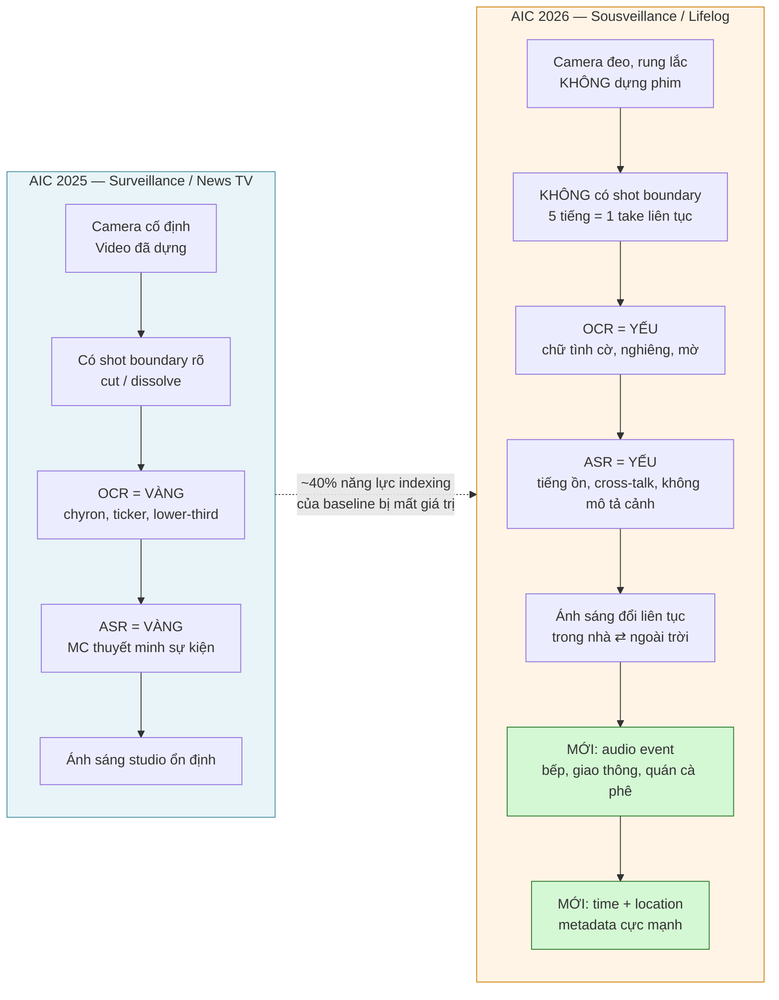

### 1.2 Bản đồ 4 bài toán và yêu cầu kỹ thuật

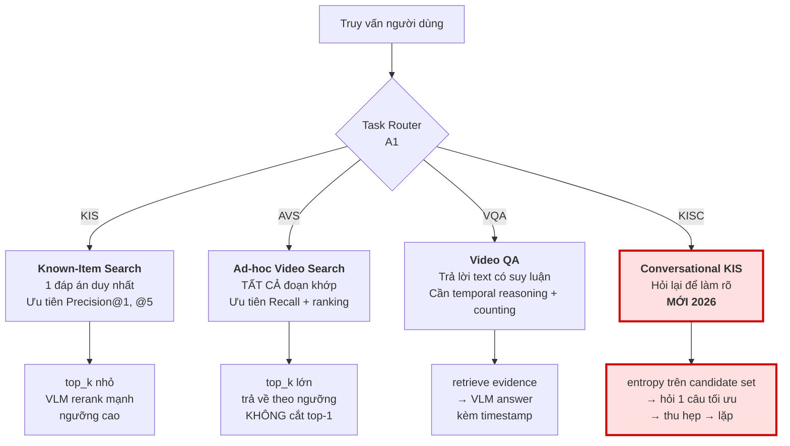

> **Điểm ăn điểm khác biệt:** KISC là bài toán mà chỉ hệ thống có agent hội thoại mới ghi điểm được. Đội nào bỏ qua KISC là tự bỏ một phần tư sân chơi.

---

## 2. Tổng hợp nghiên cứu (SOTA 12 tháng gần nhất)

| Hệ thống | Nguồn | Ý tưởng đáng lấy |
|---|---|---|
| **U-CESE** (Nomial, AIC 2025) | [arXiv 2605.23274](https://arxiv.org/abs/2605.23274) | Unified Clipping: 1 thuật toán clipping cho mọi loại truy vấn. DAKE = keyframe training-free qua biến thiên kích thước file JPEG. |
| **MERVIN** | [arXiv 2605.16120](https://arxiv.org/pdf/2605.16120) | Framework hợp nhất cho multimodal event retrieval tiếng Việt; ASR + LLM clean. |
| **LLandMark** (AI VIETNAM) | [arXiv 2603.02888](https://arxiv.org/html/2603.02888) | **4 agent**: Query Parsing/Planning · *Landmark Knowledge* (tên → mô tả thị giác) · Orchestrator (chạy song song đa modality) · Rerank/Answer. Đạt 77.40/88 vòng loại HCMAIC 2025. |
| **MAVIS** | [arXiv 2606.09641](https://arxiv.org/abs/2606.09641) | Planner tách intent thành sub-task nguyên tử → agent chuyên biệt đề cử độc lập → **debate với strict veto protocol** chỉ trên candidate gây tranh cãi, không quét lại toàn corpus. |
| **V-Agent** | [arXiv 2512.16925](https://arxiv.org/abs/2512.16925) | Tách 3 agent: **routing / search / chat**. Chat agent chính là tương đương KISC. |
| **VideoSearch-R1** | [arXiv 2607.00446](https://arxiv.org/abs/2607.00446) | Agent multi-turn trên search engine; Soft Query Refinement trong latent space, train bằng GRPO. → *Ghi nhận, không khuyến nghị (research-grade).* |
| **SnapMind** (VBS 2026) | [VBS Teams](https://videobrowsershowdown.org/teams/) | **LLM Planner trên registry các retrieval component**, sinh ra *candidate execution plan* cho người dùng chọn/sửa/bỏ. Human-in-the-loop — đúng format thi đấu. |
| **MemoriEase 3.0** (LSC'25) | [ACM DL](https://dl.acm.org/doi/10.1145/3729459.3748689) | RAG-enhanced **conversational** lifelog retrieval. Prior art gần KISC nhất. |
| **LSC 2022–24 Review** | [arXiv 2506.06743](https://arxiv.org/abs/2506.06743) | Cùng bộ 3 task KIS/AD/QA như AIC 2026. **Đọc trước khi thiết kế bất cứ thứ gì.** |
| **Fusion Functions Analysis** | [arXiv 2210.11934](https://arxiv.org/abs/2210.11934) | Convex score fusion có normalization > RRF *khi đã tune*. RRF là default an toàn khi chưa tune. |
| **Mixpeek Benchmark 2026** | [link](https://mixpeek.com/blog/video-embedding-benchmark-2026) | SigLIP2 mean-pool 8 frame ≈ 0.325 NDCG@10, chỉ nhỉnh hơn InternVideo2. **"Video không phải là một túi các frame."** |
| **EgoVLP / EgoVLPv2 / EgoVideo / GroundNLQ** | [EgoVLP](https://github.com/showlab/EgoVLP), [arXiv 2505.04270](https://arxiv.org/pdf/2505.04270) | Encoder pretrain trên egocentric vượt xa CLIP web-image trên footage góc nhìn thứ nhất. |
| **Agentic Hybrid Retrieval Ref. Arch** | [arXiv 2604.16394](https://arxiv.org/html/2604.16394v1) | BM25 + dense + RRF điều phối bởi LLM: *plan → đánh giá đủ/thiếu → rerank*. Template sạch. |

---

## 3. Phân tích baseline: điểm mạnh & điểm gãy

### 3.1 Baseline hiện tại

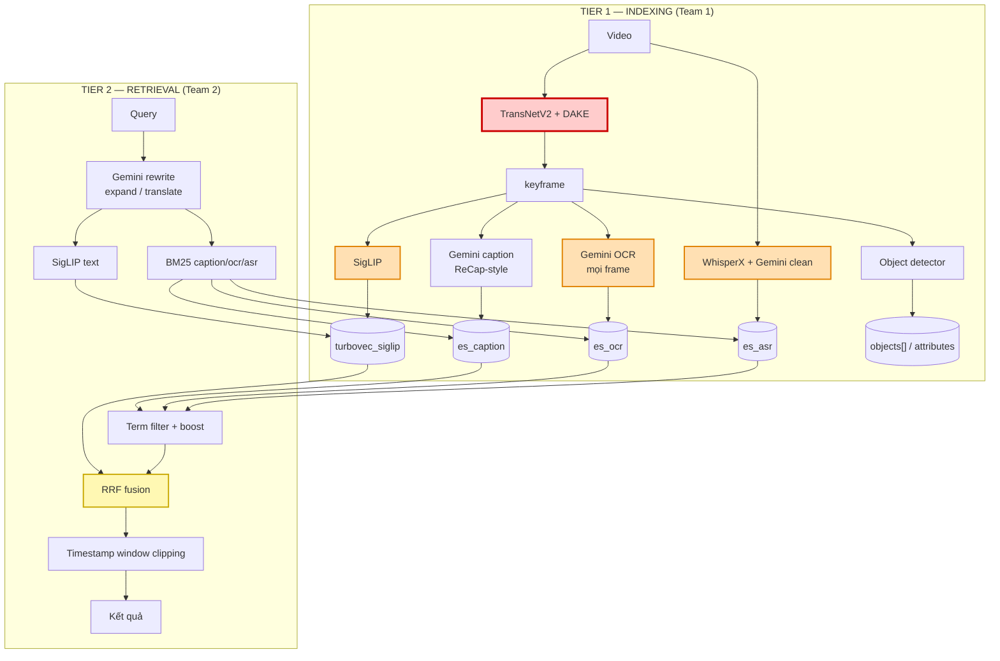

**Chú giải màu:** 🔴 gãy nghiêm trọng trên dữ liệu 2026 · 🟠 suy giảm mạnh, cần hạ trọng số / gate lại · 🟡 chấp nhận được nhưng thiếu tầng trên

### 3.2 Điểm mạnh — GIỮ NGUYÊN

| Thành phần | Vì sao giữ |
|---|---|
| **Turbovec + Elasticsearch (chỉ 2 store)** | Đúng và tiết kiệm. LLandMark chạy Milvus + ES + MongoDB để có cùng độ phủ. **Không thêm store thứ ba.** |
| **RRF fusion** | Sàn đúng: chỉ dùng rank, không dính bệnh normalization, chạy tốt khi chưa tune. |
| **LLM rewrite / expand / translate** | Vi ⇄ En là bắt buộc. Đã có sẵn `src/query_processing/llm_pipeline.py`. |
| **Timestamp window clipping** | Primitive đúng. Trên lifelog còn **quan trọng hơn** vì không có shot boundary. |
| **Team 1 / Team 2 split** | Đúng đường cắt: offline-indexing vs online-retrieval. Cũng chính là đường cắt bất đồng bộ (§7). |

### 3.3 Điểm gãy — xếp theo mức nghiêm trọng

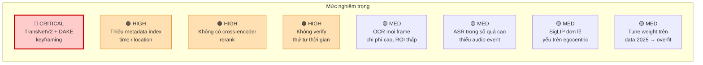

---

#### ① 🔴 CRITICAL — TransNetV2 + DAKE: sai bản chất bài toán

TransNetV2 là **shot-boundary detector**, train trên video đã dựng: cut, dissolve, wipe.

> **Video đeo người không có người dựng, nên không có shot boundary.** Một bản ghi 5 tiếng từ smart glasses là **một take liên tục**.

Hai kịch bản hỏng, cả hai đều tệ:

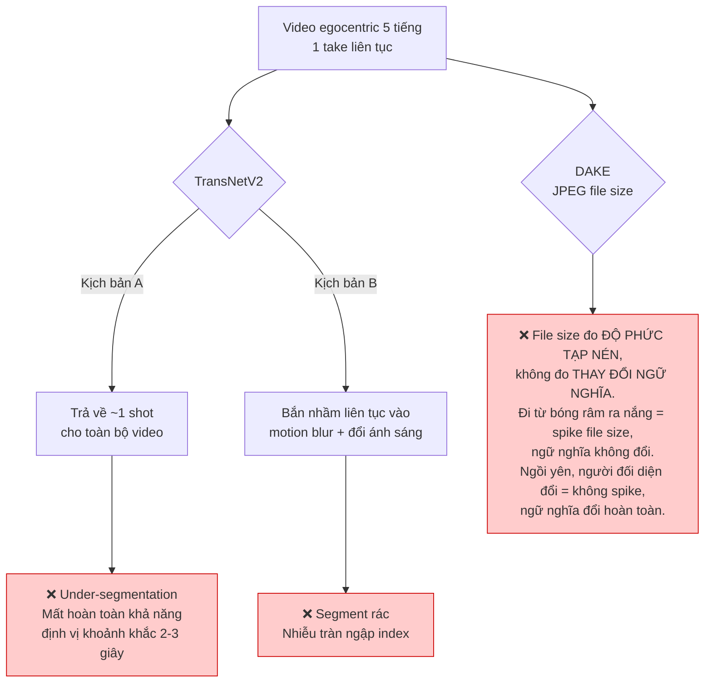

**Giải pháp — chính là thứ slide 34–35 mô tả:**

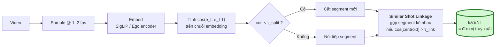

**Chi phí triển khai: ~30 dòng numpy** trên embedding bạn *vốn đã tính rồi*. Và nó **xoá bớt** 2 dependency (TransNetV2 weights, DAKE) — đây là thay đổi làm code *ngắn đi*, không dài ra.

Ánh xạ trực tiếp sang thuật ngữ của BTC:

| Slide 34–35 | Triển khai |
|---|---|
| Filtering | bỏ frame quá mờ / quá tối (Laplacian variance) |
| Normalization | L2-normalize embedding |
| Grouping — *"Sequence of contiguous similar images"* | changepoint trên chuỗi cosine |
| *"Visual Shot Detection → Similar Shot Linkage"* | split theo τ_split, rồi merge theo τ_link |

---

#### ② 🟠 HIGH — Thiếu metadata index (time / location)

Slide 33 liệt kê **Filter by Date-Time** và **Filter by Location** là UI primitive hạng nhất. Case Study 2 (slide 38) được giải **bằng metadata trước tiên**:

```
Filter by location (Hy Lạp) → Query by description → Prior event verification (3 ngày trước)
```

Baseline hiện **không có index thời gian, không có index vị trí**. Trên lifelog, "chiều thứ Ba tuần trước" hoặc "ở Hy Lạp" cắt candidate set đi **100–1000 lần** trước khi bất kỳ model nào chạy — và đó là câu trả lời rẻ nhất cho Big Three #2 (slide 31: *"Phải có bộ lọc thô cực nhanh"*).

Bổ sung vào ES event document:

```json
{
  "video_id": "...", "event_id": "...",
  "start_sec": 0.0, "end_sec": 0.0,
  "timestamp_utc": "2026-03-14T15:04:05Z",
  "date": "2026-03-14", "hour_of_day": 15, "day_of_week": "Sat",
  "gps": {"lat": 0.0, "lon": 0.0}, "place_id": "...",
  "place_category": "indoor/retail",
  "duration_sec": 0.0,
  "caption": "...", "ocr_text": "...", "asr_text": "...",
  "objects": [...], "attributes": {...},
  "audio_events": ["indoor crowd", "background music"]
}
```

> Đây là **thay đổi schema, không phải thêm model.** Chi phí gần bằng 0, lợi ích cao nhất toàn hệ thống.

---

#### ③ 🟠 HIGH — Không có cross-encoder rerank

Bi-encoder + RRF **không thể** giải:

- **Big Three #3** (slide 31): *"cởi mũ trước khi bước vào phòng"* vs *"bước vào phòng rồi mới cởi mũ"* — bag-of-terms cho hai cảnh này điểm y hệt nhau.
- **Case Study 3** (slide 39): túi tím 0.251 vs túi trắng 0.233 — biên **0.018 là nhiễu**, không phải tín hiệu. Đây là bài toán *attribute binding*, bi-encoder không giải được.

`ARCHITECTURE.md` hiện chỉ định **BLIP-2** làm reranker. BLIP-2 là model 2023, yếu ở attribute binding. Dùng VLM judge hiện đại (Gemini 2.5 Flash / Qwen3-VL-Reranker) **chỉ trên top-50**.

---

#### ④ 🟠 HIGH — Không verify thứ tự thời gian

Case Study 2 nguyên văn là: *"Tôi đã bay đến thành phố này cách đây 3 ngày"* → phải **truy vấn lần hai neo vào timestamp của kết quả thứ nhất**. Đây là *prior event verification*, không phải một model mới — là một windowed re-query cộng một phép kiểm tra thứ tự.

---

#### ⑤ 🟡 MED — OCR mọi frame: chi phí cao, ROI thấp

| | News video (2025) | Lifelog (2026) |
|---|---|---|
| Nguồn chữ | Chyron, ticker, lower-third — cố ý đặt để đọc | Biển hiệu nghiêng, nhãn sản phẩm, màn hình điện thoại, mờ do rung |
| Yield/frame | Cao | Sụp đổ |
| Chi phí API/frame | Như nhau | **Như nhau** |

**Gate lại:** chạy text *detector* rẻ (PaddleOCR DB head, CPU, vài ms), chỉ trả tiền Gemini OCR cho frame có diện tích chữ vượt ngưỡng.

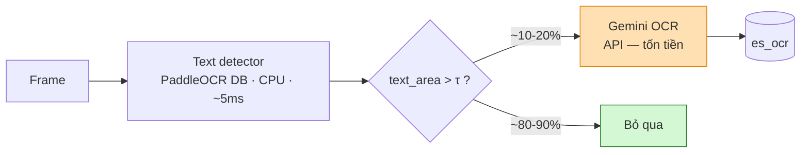

→ Cắt ~85% lời gọi OCR API, gần như không mất recall. **Giữ kênh này** (Case Study 1 diễn ra trong trung tâm thương mại đầy chữ thương hiệu) nhưng hạ từ hạng nhất xuống *entity boost*.

---

#### ⑥ 🟡 MED — ASR quá nặng, thiếu kênh thay thế

Trong news, MC **thuyết minh chính sự kiện** → ASR thường là kênh mạnh nhất.
Trong lifelog, ASR thưa, chồng tiếng, ồn gió, và **hiếm khi mô tả thứ camera đang thấy**. Ví dụ slide 16 ("đi chợ, nấu ăn, giao tiếp") là hội thoại vãng lai, không phải narration.

**Kênh thay thế: Audio Event Tagging** (BEATs / CLAP / AST) — một model, một pass trên đúng audio track bạn đã decode cho WhisperX.

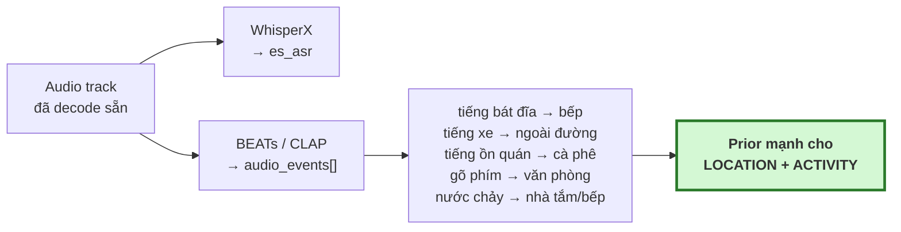

> Đây là **kênh mới có ROI cao nhất cho 2026**: tín hiệu cực mạnh trên lifelog, gần như vô dụng trên news — nên đây chính xác là thứ baseline 2025 không có lý do gì để có.

---

#### ⑦ 🟡 MED — SigLIP đơn lẻ yếu trên ảnh egocentric

SigLIP train trên cặp web-caption: góc nhìn thứ ba, bố cục đẹp, đủ sáng. Frame egocentric thì có tay trong khung, lệch trục, nhoè do chuyển động. Thêm nữa, benchmark Mixpeek 2026 cho thấy mean-pooling frame yếu với mọi thứ phụ thuộc chuyển động.

Hai mức khắc phục, theo thứ tự chi phí:
- **(a)** Giữ SigLIP làm bộ lọc recall nhanh, thêm **encoder pretrain egocentric** (họ EgoVLP/EgoVideo) làm kênh ANN thứ hai, fuse bằng RRF.
- **(b)** Với action, embed **clip ngắn** thay vì frame đơn.

---

#### ⑧ 🟡 MED — Tune trọng số trên dữ liệu 2025 sẽ overfit

`docs/ARCHITECTURE.md:100` khuyến nghị bootstrap trên video AIC 2025. **Ổn cho việc thông đường ống, có hại cho việc tune trọng số fusion** — weight tune trên news sẽ over-weight OCR/ASR và under-weight visual/audio-event.

| Mục đích | Dữ liệu dùng |
|---|---|
| Bootstrap *pipeline* (chạy thông, không lỗi) | AIC 2025 subset ✅ |
| Tune *trọng số fusion & ngưỡng* | Ego4D / EPIC-Kitchens / LSC release ✅ |

---

## 4. Ma trận Độ khó vs Hiệu quả

Hiệu quả được chấm **riêng cho dữ liệu egocentric AIC 2026** — nhiều dòng sẽ có điểm rất khác nếu chấm trên news 2025.

| Thành phần | Độ khó | Hiệu quả | Kết luận |
|---|---|---|---|
| Metadata index (time/place) | **XS** | **Rất cao** | ✅ **Làm trước tiên.** Pruning 100× miễn phí |
| Embedding-drift segmentation (thay TransNetV2+DAKE) | **XS** | **Rất cao** | ✅ **Làm trước tiên.** Net *xoá* code |
| Gate OCR bằng text detector | XS | TB (chi phí) | ✅ Cắt ~85% chi phí API |
| Audio event tagging (BEATs/CLAP) | S | **Cao** | ✅ Kênh mới tốt nhất |
| VLM cross-encoder rerank top-50 | S | **Rất cao** | ✅ Thắng lợi precision lớn nhất |
| Task Router agent (A1) | S | Cao | ✅ Đã có skeleton trong repo |
| Clarification agent KISC (A6) | S | **Rất cao** | ✅ Ghi điểm ở task không ai khác chạm được |
| Concept-expansion agent (A3, kiểu LLandMark) | S | Cao | ✅ Giải thẳng Case Study 1 |
| Temporal-order verifier (A4) | M | Cao | ✅ Big Three #3 + Case Study 2 |
| **Local eval harness + weight tuning** | M | **Rất cao** | ✅ **Xem §8 Phase 1** |
| Egocentric encoder làm kênh ANN #2 | M | Cao | ✅ Nếu đủ GPU-hours |
| Per-event VLM captioning (ReCap-style) | M | Cao | ⚠️ Làm, nhưng **phải chặn ngân sách** |
| Learned/convex fusion thay RRF | M | TB | ⏸️ Chỉ sau khi có eval harness |
| Multi-agent debate + veto (MAVIS) | L | TB | ❌ **Bỏ.** Giết latency trong vòng thi tính giờ |
| RL query refinement (VideoSearch-R1) | XL | ? | ❌ **Bỏ.** Đề tài nghiên cứu, không phải bài thi |
| Knowledge graph trên event | L | TB | ❌ **Bỏ ở v1.** Chỉ xem lại nếu temporal reasoning bế tắc |
| Thêm Milvus / MongoDB | S | **Âm** | ❌ Turbovec + ES đã đủ. Đừng thêm store thứ ba |

---

## 5. Kiến trúc mục tiêu AIC 2026

### 5.1 Toàn cảnh

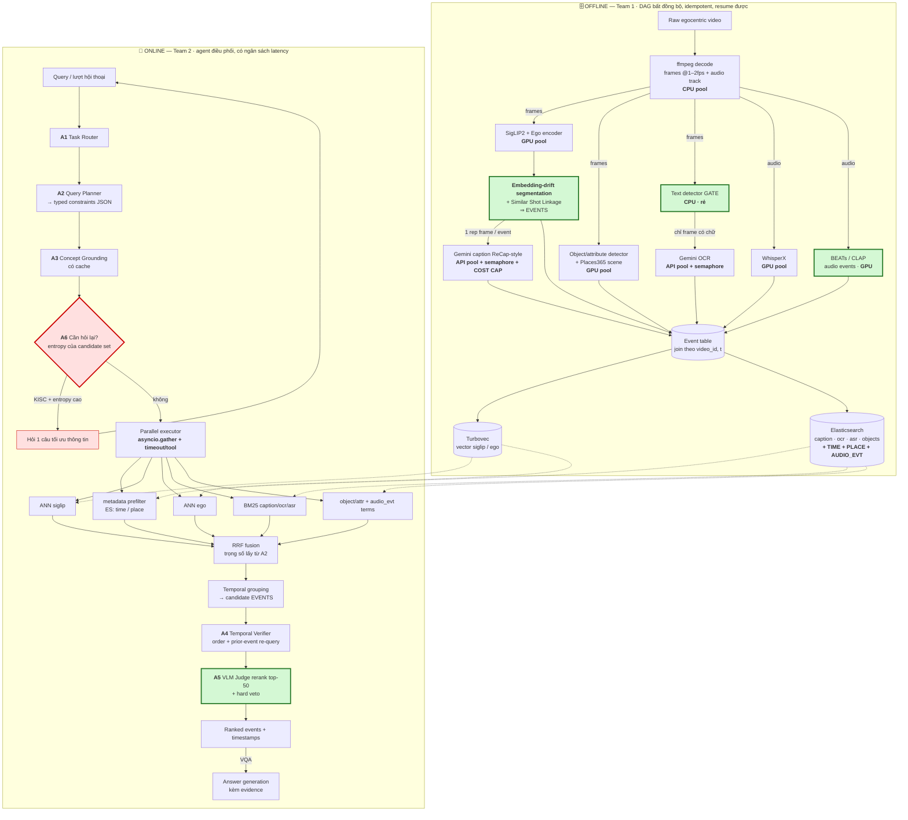

### 5.2 Nguyên tắc thiết kế cốt lõi

> ### 🔑 **Agent RA QUYẾT ĐỊNH — code biên dịch THỰC THI.**
>
> LLM **không bao giờ** nằm trong vòng lặp trên N frame hay N candidate.
> Agent chạy **O(1) lần mỗi lượt truy vấn**; mọi thứ O(N) là numpy, ES, và ANN.
>
> Đây chính là thứ giữ cho một hệ thống agentic vẫn nằm trong giới hạn thời gian của vòng thi.

---

## 6. Tầng Agentic: 6 agent và lý do tồn tại

### 6.1 Bảng agent

| Agent | Nhiệm vụ | Lý do tồn tại (failure mode nó chặn) | Prior art |
|---|---|---|---|
| **A1 · Task Router** | Phân loại KIS/AVS/VQA/KISC, set `top_k`, ngưỡng, chế độ trả kết quả | KIS và AVS có **mục tiêu ngược nhau** (precision@1 vs recall-all). Route sai = mất điểm mọi query loại đó | V-Agent routing agent |
| **A2 · Query Planner** | Sinh **typed constraint object** (không phải văn xuôi) | Quyết định đòn bẩy cao nhất hệ thống: modality weight, phân rã ràng buộc | SnapMind Planner, MAVIS decomposition |
| **A3 · Concept Grounding** | Concept → mô tả thị giác. Có **cache** | "lính chì" không embed được; "*người đứng mặc quân phục đỏ, khuy vàng, mũ lông đen cao*" thì được | LLandMark Landmark Agent |
| **A4 · Temporal Verifier** | Kiểm tra thứ tự sự kiện + **prior-event re-query** | Big Three #3 + Case Study 2 | — |
| **A5 · Rerank / Judge** | VLM cross-encoder trên **top-50**, có **hard veto** | Attribute binding (Case Study 3, biên 0.018 = nhiễu) | MAVIS veto (rút gọn) |
| **A6 · Clarification** | Chọn facet có **entropy cao nhất** → hỏi 1 câu | **Chính là bài toán KISC** | MemoriEase 3.0, V-Agent chat agent |

### 6.2 A2 — Query Planner output schema

Mọi stage phía sau là **pure function** của object này → test được **không cần API key**.

```json
{
  "task": "KIS",
  "visual": [
    "toy soldier figure, red military uniform, gold buttons, tall black hat",
    "shopping mall interior, retail display"
  ],
  "objects": ["purse", "clothes"],
  "attributes": { "purse": ["purple"] },
  "place":  { "category": "indoor/retail", "named": null },
  "time":   { "relative": "3 days after a flight", "absolute": null, "tod": null },
  "audio_events": ["indoor crowd", "background music"],
  "ocr_terms": [],
  "asr_terms": [],
  "temporal_order": [
    ["take a flight", "before"],
    ["photo of man at table", "after"]
  ],
  "modality_weights": {
    "visual": 0.70, "audio_evt": 0.15, "ocr": 0.10, "asr": 0.05
  }
}
```

### 6.3 A6 — Clarification agent: cách tính câu hỏi

**Đừng để LLM tự nghĩ câu hỏi.** Tính nó từ candidate set:

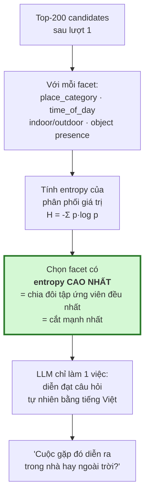

Slide 15 chính là ví dụ này: *"trong nhà hay ngoài trời?"* được hỏi vì indoor/outdoor chia tập ứng viên ~50/50.

> ⚠️ **Sửa trong code hiện tại:** `src/agents/orchestrator.py:157` — `_is_ambiguous()` đang trigger theo **số từ < 4**. Đó là placeholder. Trigger thật phải là **entropy của candidate set**: query 3 từ mà chỉ còn 2 ứng viên thì không cần hỏi; query 20 từ mà còn 5000 ứng viên thì phải hỏi.

### 6.4 Sequence diagram — một truy vấn KIS đầy đủ

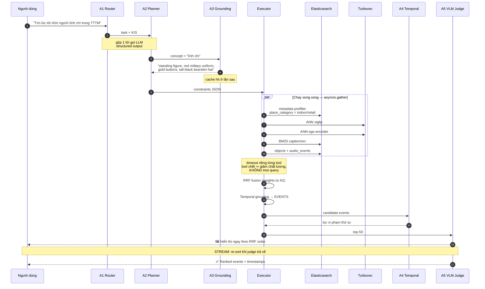

### 6.5 Sequence diagram — KISC (lượt hội thoại)

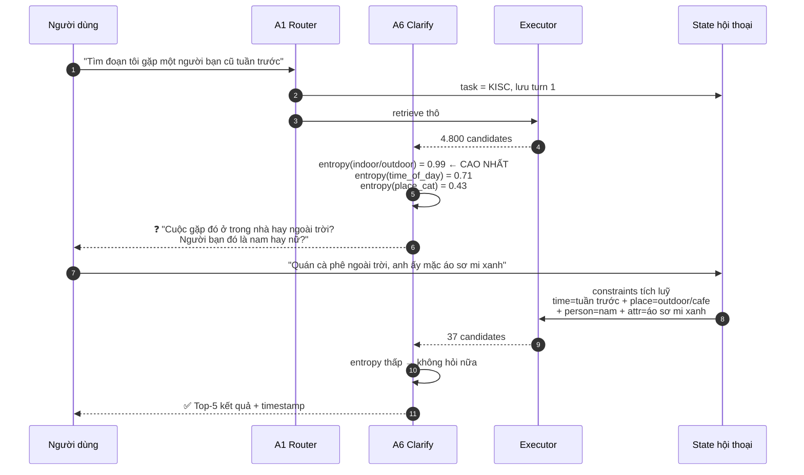

---

## 7. Workflow & Orchestration bất đồng bộ

### 7.1 Lỗi kinh điển cần tránh

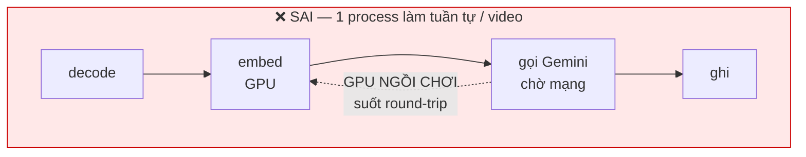

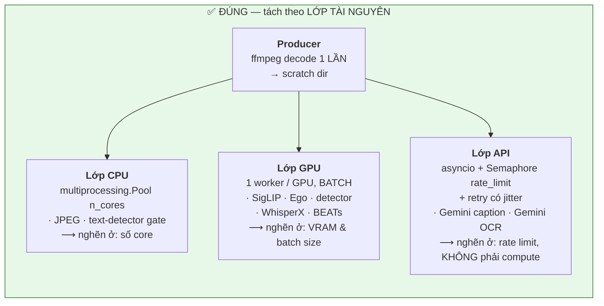

### 7.2 6 quy tắc bất đồng bộ bắt buộc

| # | Quy tắc | Vì sao |
|---|---|---|
| 1 | **Decode 1 lần, fan-out.** Một pass ghi frames + audio ra scratch; mọi consumer đọc từ đó | Decode đắt và mọi stage đều cần. Đừng bao giờ decode theo từng stage |
| 2 | **OCR và ASR chạy đồng thời tự nhiên** — khác tài nguyên (API vs GPU), khác input (frame vs audio) | Chúng không cần phối hợp gì, chỉ cần chung producer decode + chung khoá join `(video_id, t)` |
| 3 | **Segmentation là BARRIER.** Captioning phải đợi nó | Caption-per-event rẻ hơn caption-per-frame **10–50×**. Sai thứ tự này = khác biệt giữa $200 và $5000 tiền API |
| 4 | **Cost cap là hard stop.** Bộ đếm token trong API pool, raise khi chạm trần | Pipeline API hỏng một cách **tốn tiền**, không phải một cách ồn ào |
| 5 | **Backpressure bằng bounded queue.** `asyncio.Queue(maxsize=N)` giữa các stage | Queue vô hạn biến 1 consumer chậm thành OOM sau 3 tiếng |
| 6 | **Join muộn.** Mỗi stage ghi `(video_id, t, payload)` độc lập; pass cuối merge thành event doc | Stage ghi chéo vào record của nhau = race condition + không resume được |

### 7.3 DAG offline với barrier

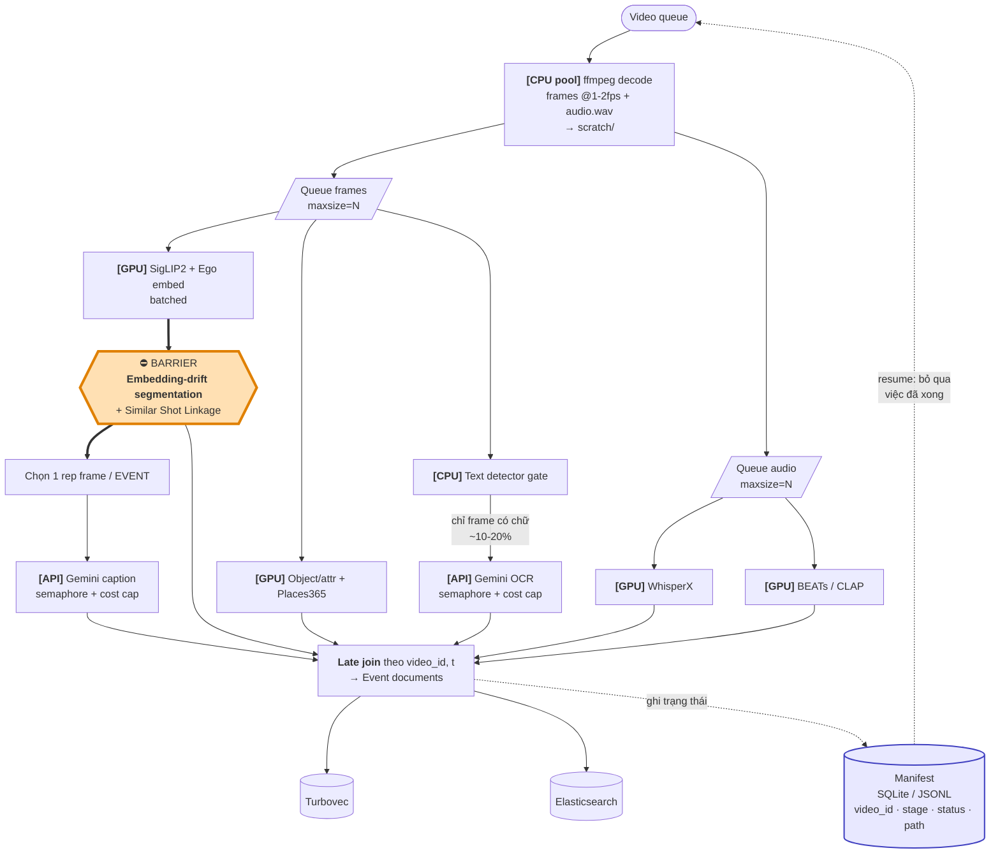

### 7.4 Đừng xây orchestration framework

> **Rung 3 của thang lười: stdlib đã đủ.**
>
> Một bảng manifest (SQLite, hoặc chỉ 1 file JSONL / stage) ghi `(video_id, stage, status, output_path)` cho bạn **idempotent resume miễn phí** — chạy lại pipeline sẽ tự bỏ qua việc đã xong.
>
> **~50 dòng code, thay thế hoàn toàn Airflow / Prefect / Celery ở quy mô này.**
> Chỉ với tới Ray khi thực sự có hardware nhiều node.

### 7.5 Online — ngân sách latency

```mermaid
gantt
    title Ngân sách latency một lượt truy vấn
    dateFormat  X
    axisFormat  %L ms

    section Agent
    A1+A2+A3 gộp 1 LLM call, A3 có cache   :a1, 0, 600

    section Retrieval song song
    metadata prefilter ES                   :b1, 600, 90
    ANN siglip                              :b2, 600, 120
    ANN ego                                 :b3, 600, 130
    BM25 caption/ocr/asr                    :b4, 600, 145
    objects + audio_events                  :b5, 600, 100

    section Fusion
    RRF + temporal grouping numpy           :c1, 750, 100

    section Verify
    A4 temporal - BỎ QUA nếu không có order :d1, 850, 200

    section Rerank
    A5 VLM judge top-50 STREAM              :e1, 1050, 1500
```

| Stage | Ngân sách | Hành vi |
|---|---|---|
| A1+A2+A3 | ~600 ms | **Gộp A1/A2 vào 1 structured-output call.** Cache A3 |
| Metadata prefilter + ANN + BM25 | **< 150 ms** | `asyncio.gather` với **timeout riêng từng retriever** |
| RRF + temporal grouping | < 100 ms | numpy thuần |
| A4 temporal verify | < 200 ms | **Bỏ hẳn** khi `temporal_order` rỗng |
| A5 VLM rerank top-50 | 1–2 s | **Stream**: render RRF order ngay, re-sort khi judge trả về |

**Hai quy tắc làm cho nó chạy được:**

1. **Kết quả một phần > kết quả đầy đủ.**
   ```python
   results = await asyncio.gather(
       *(asyncio.wait_for(tool(q), timeout=0.2) for tool in tools),
       return_exceptions=True,
   )
   ```
   ES chậm ⇒ trả vector hits trước, ES về sau. **Retriever chết chỉ được làm giảm chất lượng ranking, tuyệt đối không được treo query.**

2. **Agent chạy theo LƯỢT, không theo CANDIDATE.** A2 gọi 1 lần. A5 gọi 1 lần trên batch 50. Nếu bạn thấy mình gọi 1 LLM call / candidate → thiết kế đã sai.

### 7.6 Bảng chốt: chỗ nào đặt agent, chỗ nào không

| Bước pipeline | Agent? | Lý do |
|---|---|---|
| Decode, embedding, detection | **Không** | Deterministic. LLM chỉ thêm chi phí, 0 độ chính xác |
| Event segmentation | **Không** | Ngưỡng trên cosine distance. Tune nó, đừng suy luận về nó |
| OCR gating | **Không** | Ngưỡng confidence của detector |
| Caption từng event | **VLM, không phải agent** | Sinh 1 lần, không có vòng lặp planning |
| Phân loại task | **✅ A1** | Quyết định routing, đổi hàm mục tiêu |
| Phân rã query + gán modality weight | **✅ A2** | Quyết định đòn bẩy cao nhất hệ thống |
| Concept → thuộc tính thị giác | **✅ A3** | Cần tri thức thế giới. Nhớ cache |
| Thực thi retrieval | **Không** | Compiled. `asyncio.gather` trên tool cố định |
| Fusion | **Không** (weight *từ* A2) | Số học thuần |
| Verify thứ tự thời gian | **✅ A4** | Cần hiểu ngữ nghĩa thứ tự |
| Rerank top-50 | **✅ A5** | Phán đoán grounded, fine-grained |
| Hỏi lại làm rõ | **✅ A6** | **Chính là bài toán KISC** |
| Sinh câu trả lời VQA | **VLM** | Generation trên evidence đã truy xuất |

---

## 8. Lộ trình triển khai

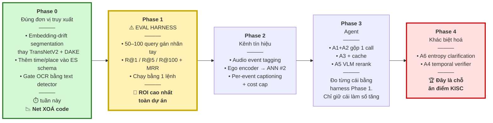

### ⚠️ Phase 1 — Đừng bỏ qua

50–100 query gán nhãn tay trên sample index, chấm R@1 / R@5 / R@100 và MRR, chạy được bằng **một lệnh**.

Không có nó, **mọi** trọng số fusion, **mọi** ngưỡng, **mọi** câu hỏi "reranker có giúp không?" đều là phỏng đoán — và bạn sẽ tiêu cả kỳ thi để tranh luận bằng trực giác.

> Đây là hạng mục ROI cao nhất toàn bộ kế hoạch, và cũng chính là hạng mục các đội **luôn luôn bỏ qua**.

### Đã cân nhắc và loại bỏ

| Bỏ | Lý do |
|---|---|
| Multi-agent debate + veto (MAVIS đầy đủ) | Giết latency trong vòng thi tính giờ. Một VLM judge đơn lẻ nắm được phần lớn lợi ích |
| RL query refinement (VideoSearch-R1) | Đề tài nghiên cứu, không phải bài dự thi |
| Knowledge graph trên event | Sớm. Chỉ xem lại nếu temporal reasoning bế tắc |
| Milvus / MongoDB | Turbovec + ES đã phủ hết. Đừng thêm store thứ ba |

---

## 9. Hai điều cần cảnh báo mạnh nhất

> ### 🔴 1. `docs/ARCHITECTURE.md:62` khẳng định TransNet V2 xử lý được "shaky egocentric footage" — **KHÔNG ĐÚNG.**
> Nó phát hiện shot boundary do người dựng tạo ra, thứ mà video egocentric **không hề có**.
> Nếu chỉ làm được một việc trong toàn bộ tài liệu này, hãy làm việc này.

> ### 🟠 2. Tune trọng số trên dữ liệu news AIC 2025 sẽ cho ra bộ weight SAI cho 2026.
> Bootstrap đường ống trên nó thì được; tune trọng số phải làm trên dữ liệu egocentric.

---

## 10. Nguồn tham khảo

**Hệ thống AIC / VBS / LSC**
- [U-CESE — Unified Clip-based Event Search Engine, AIC HCMC 2025](https://arxiv.org/abs/2605.23274)
- [MERVIN — Multimodal Event Retrieval in Vietnamese News Videos](https://arxiv.org/pdf/2605.16120)
- [LLandMark — Multi-Agent Landmark-Aware Interactive Video Retrieval (AI VIETNAM)](https://arxiv.org/html/2603.02888)
- [Results of the 2025 Video Browser Showdown](https://arxiv.org/pdf/2509.12000)
- [VBS Teams & Papers — mọi năm](https://videobrowsershowdown.org/teams/)
- [The State-of-the-Art in Lifelog Retrieval: LSC 2022–24 Review](https://arxiv.org/abs/2506.06743)
- [MemoriEase 3.0 — RAG-Enhanced Conversational Lifelog Retrieval, LSC'25](https://dl.acm.org/doi/10.1145/3729459.3748689)
- [LifeSearch — Multimodal Lifelog Search System, LSC'25](https://dl.acm.org/doi/10.1145/3729459.3748696)
- [From Expert Practices to Intelligent Agents: Autonomy in Interactive Video Retrieval](https://link.springer.com/chapter/10.1007/978-981-95-6963-2_20)
- [MADTempo — Multi-Event Temporal Video Retrieval with Query Augmentation](https://arxiv.org/pdf/2512.12929)

**Agentic retrieval**
- [MAVIS — Multi-Agent Video Retrieval via Structured Video Understanding](https://arxiv.org/abs/2606.09641)
- [V-Agent — Interactive Video Search System Using VLMs](https://arxiv.org/abs/2512.16925)
- [VideoSearch-R1 — Iterative Video Retrieval via Soft Query Refinement](https://arxiv.org/abs/2607.00446)
- [A Reference Architecture for Agentic Hybrid Retrieval](https://arxiv.org/html/2604.16394v1)
- [VideoRAG — RAG with Extreme Long-Context Videos](https://arxiv.org/pdf/2502.01549)

**Embedding / fusion / egocentric**
- [An Analysis of Fusion Functions for Hybrid Retrieval](https://arxiv.org/abs/2210.11934)
- [Video Embedding Benchmark 2026 — Gemini vs Marengo vs SigLIP vs InternVideo2](https://mixpeek.com/blog/video-embedding-benchmark-2026)
- [EgoVLP — Egocentric Video-Language Pretraining (NeurIPS 2022)](https://github.com/showlab/EgoVLP)
- [EgoCVR — Egocentric Benchmark for Fine-Grained Composed Video Retrieval (ECCV 2024)](https://github.com/ExplainableML/EgoCVR)
- [Object-Shot Enhanced Grounding Network for Egocentric Video](https://arxiv.org/pdf/2505.04270)

**Tài liệu nội bộ**
- `Tập-huấn-AIC-2026-Buổi-1.pptx.pdf` — tài liệu tập huấn chính thức AIC 2026
- `docs/ARCHITECTURE.md` — kiến trúc hiện tại (cần cập nhật theo §3.3 ①)
- `src/agents/orchestrator.py` — ReAct skeleton đã có, cần sửa `_is_ambiguous()` theo §6.3
