# Phân tích & Nâng cấp Kiến trúc cho AIC 2026

> **Tài liệu này thay thế phần "Data Shift" và "Agentic Pipeline" trong `ARCHITECTURE.md`.**
> Nguồn đối chiếu: **cả 3 buổi tập huấn chính thức AIC 2026** — Buổi 1 (bài toán & dữ liệu), Buổi 2 (ThS. Nguyễn Quang Thức — *Hệ thống tìm kiếm video*), Buổi 3 (Hồ Lê Minh Quân — *Kiến trúc Agentic AI*) — cùng `2605.23274v1.pdf` (U-CESE) và ~25 paper/hệ thống 2025–2026 (danh sách nguồn ở §11).
>
> Ngày phân tích: 2026-07-29 · Branch: `feat/team2`
> **Rev. 2** — đối chiếu lại sau khi có Buổi 2 & Buổi 3. Thay đổi lớn nhất: bổ sung **§7 Hiển thị & Phản hồi người dùng** (bản Rev. 1 chỉ bàn 1/3 hệ thống theo định nghĩa của BTC), **§5.3 cascade early/late fusion**, **§6.6 ba nền tảng agent**, **§6.7 đường VQA kiểu STAR**.

---

## Mục lục

1. [Phát hiện cốt lõi: dữ liệu 2026 đã đổi bản chất](#1-phát-hiện-cốt-lõi-dữ-liệu-2026-đã-đổi-bản-chất)
2. [Tổng hợp nghiên cứu (SOTA 12 tháng gần nhất)](#2-tổng-hợp-nghiên-cứu-sota-12-tháng-gần-nhất)
3. [Phân tích baseline: điểm mạnh & điểm gãy](#3-phân-tích-baseline-điểm-mạnh--điểm-gãy)
4. [Ma trận Độ khó vs Hiệu quả](#4-ma-trận-độ-khó-vs-hiệu-quả)
5. [Kiến trúc mục tiêu AIC 2026](#5-kiến-trúc-mục-tiêu-aic-2026)
6. [Tầng Agentic: 6 agent và lý do tồn tại](#6-tầng-agentic-6-agent-và-lý-do-tồn-tại)
7. [Hiển thị & Phản hồi người dùng — hai trụ cột bị bỏ quên](#7-hiển-thị--phản-hồi-người-dùng--hai-trụ-cột-bị-bỏ-quên)
8. [Workflow & Orchestration bất đồng bộ](#8-workflow--orchestration-bất-đồng-bộ)
9. [Lộ trình triển khai](#9-lộ-trình-triển-khai)
10. [Ba điều cần cảnh báo mạnh nhất](#10-ba-điều-cần-cảnh-báo-mạnh-nhất)
11. [Nguồn tham khảo](#11-nguồn-tham-khảo)

---

## 1. Phát hiện cốt lõi: dữ liệu 2026 đã đổi bản chất

**AIC 2026 không còn là news video. Đây là dữ liệu sousveillance — video góc nhìn thứ nhất từ thiết bị đeo (lifelog).**

Bằng chứng từ tài liệu tập huấn chính thức:

| Slide | Nội dung | Hệ quả kỹ thuật |
|---|---|---|
| 4–6 | Dịch chuyển Surveillance → Sousveillance: smart glasses, action cam, dashcam, lifelogging | Không còn khung hình tĩnh, không còn dựng phim |
| 7 | 4 bài toán: KIS, AVS, VQA, **KISC (Conversational KIS — "kỹ thuật mới của năm 2026")** | KISC bắt buộc phải có agent hội thoại |
| 16 | "Góc quay rung lắc", "điều kiện ánh sáng thay đổi liên tục", ví dụ video **5 tiếng liên tục** đi chợ/nấu ăn | Không có shot boundary; audio là tiếng ồn môi trường |
| 17 | Trích dẫn Cathal Gurrin, *"A guide to Creating and Managing Lifelogs"*, ACM MM 2016 | Đây là playbook của **Lifelog Search Challenge (LSC)** |
| 25 | Timeline kỹ thuật: 2024 "Natural description" → 2025 **"AI Agent"** → 2026 "?" | BTC gợi ý rõ: agent là hướng đi |
| 31 | Big Three: Semantic gap · Data sparsity & scale · **Temporal logic constraints** | Cần bộ lọc thô cực nhanh + verify thứ tự sự kiện |
| 33 | UI primitives: **Filter by Date-Time**, **Filter by Location**, Map-based Visualization | Bắt buộc có metadata index |
| 34–35 | `Filtering → Normalization → Grouping`; "Visual Shot Detection → **Similar Shot Linkage**"; "Sequence of contiguous similar images" | **Đây là embedding-drift segmentation, KHÔNG phải shot detection** |
| 37–39 | Case Study 1 (lính chì) · 2 (Hy Lạp + "3 ngày trước") · 3 (túi xách tím vs trắng) | Cần concept expansion, temporal verification, fine-grained rerank |

### 1.1 So sánh trực quan hai thế hệ dữ liệu

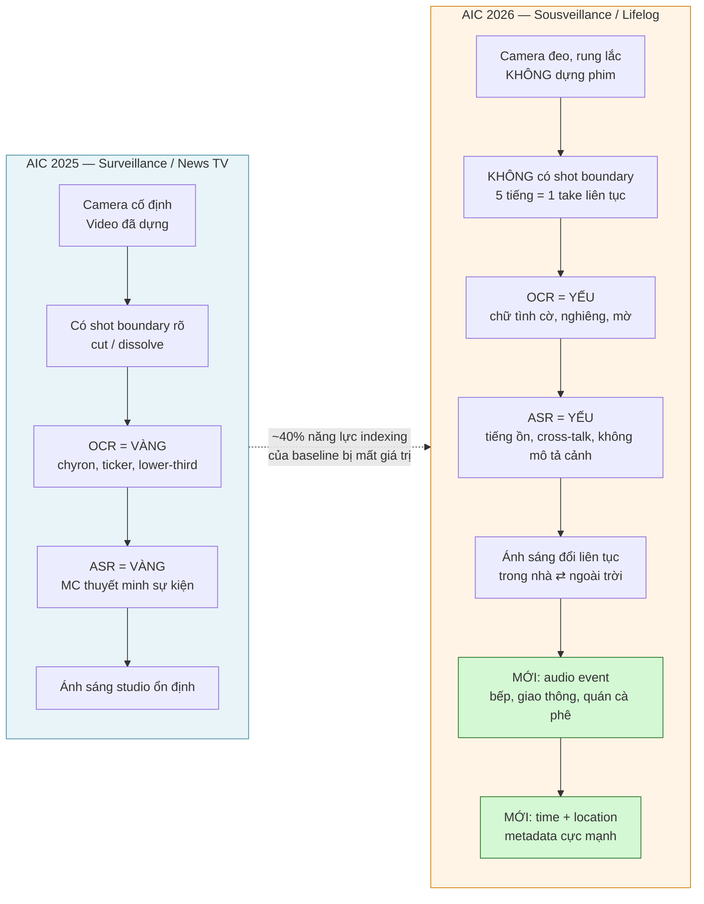

### 1.2 Bản đồ 4 bài toán và yêu cầu kỹ thuật

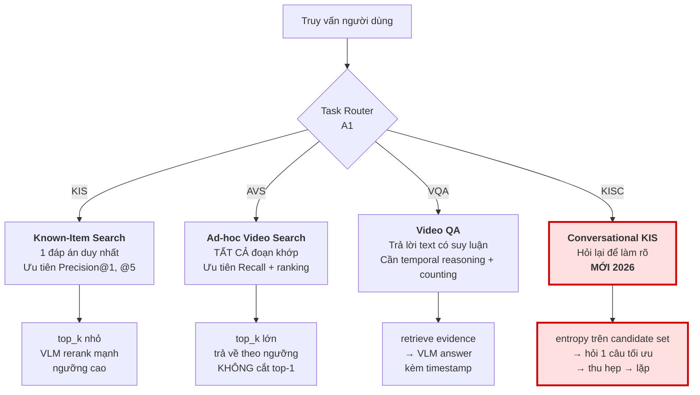

> **Điểm ăn điểm khác biệt:** KISC là bài toán mà chỉ hệ thống có agent hội thoại mới ghi điểm được. Đội nào bỏ qua KISC là tự bỏ một phần tư sân chơi.

### 1.3 Phát hiện thứ hai (Buổi 2): hệ thống ≠ mô hình truy vấn

Buổi 2 mở đầu bằng đúng một câu hỏi tu từ, và đó là câu hỏi dành cho mọi đội đang tối ưu encoder:

> ### ❝ Hệ thống tìm kiếm video **chỉ cần mô hình rút trích đặc trưng mạnh** là đủ? ❞
> — slide 2, Buổi 2

Câu trả lời của BTC là **không**, và họ đưa ra sơ đồ hệ thống gồm **ba** khối ngang hàng:

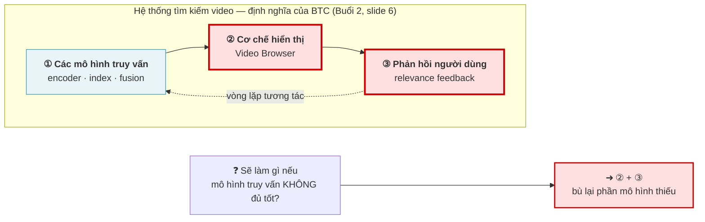

**Đây là lỗ hổng lớn nhất của bản Rev. 1 tài liệu này**: toàn bộ §3–§6 chỉ nói về khối ①. Khối ② và ③ được xử lý ở **§7 (mới)**.

Vì sao điều này quan trọng hơn nó có vẻ: AIC/VBS/LSC chấm **điểm suy giảm theo thời gian** — trả lời đúng ở giây thứ 30 ăn nhiều điểm hơn trả lời đúng ở phút thứ 4. Thứ quyết định *thời gian tới đáp án* là ② và ③, không phải mAP của encoder. Một encoder tốt hơn 3% nhưng browser bắt người dùng cuộn 200 thumbnail gần trùng nhau sẽ **thua** một encoder yếu hơn với browser gom nhóm tốt.

---

## 2. Tổng hợp nghiên cứu (SOTA 12 tháng gần nhất)

| Hệ thống | Nguồn | Ý tưởng đáng lấy |
|---|---|---|
| **U-CESE** (Nomial, AIC 2025) | [arXiv 2605.23274](https://arxiv.org/abs/2605.23274) | Unified Clipping: 1 thuật toán clipping cho mọi loại truy vấn. DAKE = keyframe training-free qua biến thiên kích thước file JPEG. |
| **MERVIN** | [arXiv 2605.16120](https://arxiv.org/pdf/2605.16120) | Framework hợp nhất cho multimodal event retrieval tiếng Việt; ASR + LLM clean. |
| **LLandMark** (AI VIETNAM) | [arXiv 2603.02888](https://arxiv.org/html/2603.02888) | **4 agent**: Query Parsing/Planning · *Landmark Knowledge* (tên → mô tả thị giác) · Orchestrator (chạy song song đa modality) · Rerank/Answer. Đạt 77.40/88 vòng loại HCMAIC 2025. |
| **MAVIS** | [arXiv 2606.09641](https://arxiv.org/abs/2606.09641) | Planner tách intent thành sub-task nguyên tử → agent chuyên biệt đề cử độc lập → **debate với strict veto protocol** chỉ trên candidate gây tranh cãi, không quét lại toàn corpus. |
| **V-Agent** | [arXiv 2512.16925](https://arxiv.org/abs/2512.16925) | Tách 3 agent: **routing / search / chat**. Chat agent chính là tương đương KISC. |
| **VideoSearch-R1** | [arXiv 2607.00446](https://arxiv.org/abs/2607.00446) | Agent multi-turn trên search engine; Soft Query Refinement trong latent space, train bằng GRPO. → *Ghi nhận, không khuyến nghị (research-grade).* |
| **SnapMind** (VBS 2026) | [VBS Teams](https://videobrowsershowdown.org/teams/) | **LLM Planner trên registry các retrieval component**, sinh ra *candidate execution plan* cho người dùng chọn/sửa/bỏ. Human-in-the-loop — đúng format thi đấu. |
| **MemoriEase 3.0** (LSC'25) | [ACM DL](https://dl.acm.org/doi/10.1145/3729459.3748689) | RAG-enhanced **conversational** lifelog retrieval. Prior art gần KISC nhất. |
| **LSC 2022–24 Review** | [arXiv 2506.06743](https://arxiv.org/abs/2506.06743) | Cùng bộ 3 task KIS/AD/QA như AIC 2026. **Đọc trước khi thiết kế bất cứ thứ gì.** |
| **Fusion Functions Analysis** | [arXiv 2210.11934](https://arxiv.org/abs/2210.11934) | Convex score fusion có normalization > RRF *khi đã tune*. RRF là default an toàn khi chưa tune. |
| **Mixpeek Benchmark 2026** | [link](https://mixpeek.com/blog/video-embedding-benchmark-2026) | SigLIP2 mean-pool 8 frame ≈ 0.325 NDCG@10, chỉ nhỉnh hơn InternVideo2. **"Video không phải là một túi các frame."** |
| **EgoVLP / EgoVLPv2 / EgoVideo / GroundNLQ** | [EgoVLP](https://github.com/showlab/EgoVLP), [arXiv 2505.04270](https://arxiv.org/pdf/2505.04270) | Encoder pretrain trên egocentric vượt xa CLIP web-image trên footage góc nhìn thứ nhất. |
| **Agentic Hybrid Retrieval Ref. Arch** | [arXiv 2604.16394](https://arxiv.org/html/2604.16394v1) | BM25 + dense + RRF điều phối bởi LLM: *plan → đánh giá đủ/thiếu → rerank*. Template sạch. |

---

## 3. Phân tích baseline: điểm mạnh & điểm gãy

### 3.1 Baseline hiện tại

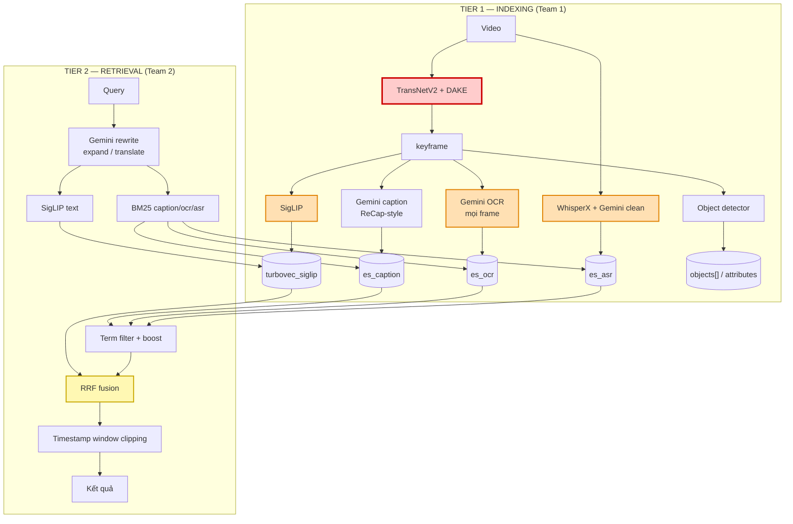

**Chú giải màu:** 🔴 gãy nghiêm trọng trên dữ liệu 2026 · 🟠 suy giảm mạnh, cần hạ trọng số / gate lại · 🟡 chấp nhận được nhưng thiếu tầng trên

### 3.2 Điểm mạnh — GIỮ NGUYÊN

| Thành phần | Vì sao giữ |
|---|---|
| **Turbovec + Elasticsearch (chỉ 2 store)** | Đúng và tiết kiệm. LLandMark chạy Milvus + ES + MongoDB để có cùng độ phủ. **Không thêm store thứ ba.** |
| **RRF fusion** | Sàn đúng: chỉ dùng rank, không dính bệnh normalization, chạy tốt khi chưa tune. |
| **LLM rewrite / expand / translate** | Vi ⇄ En là bắt buộc. Đã có sẵn `src/query_processing/llm_pipeline.py`. |
| **Timestamp window clipping** | Primitive đúng. Trên lifelog còn **quan trọng hơn** vì không có shot boundary. |
| **Team 1 / Team 2 split** | Đúng đường cắt: offline-indexing vs online-retrieval. Cũng chính là đường cắt bất đồng bộ (§8). |

### 3.3 Điểm gãy — xếp theo mức nghiêm trọng

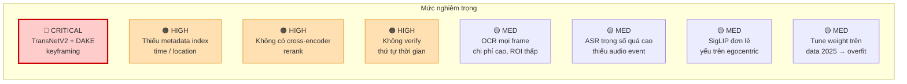

---

#### ① 🔴 CRITICAL — TransNetV2 + DAKE: sai bản chất bài toán

TransNetV2 là **shot-boundary detector**, train trên video đã dựng: cut, dissolve, wipe.

> **Video đeo người không có người dựng, nên không có shot boundary.** Một bản ghi 5 tiếng từ smart glasses là **một take liên tục**.

Hai kịch bản hỏng, cả hai đều tệ:

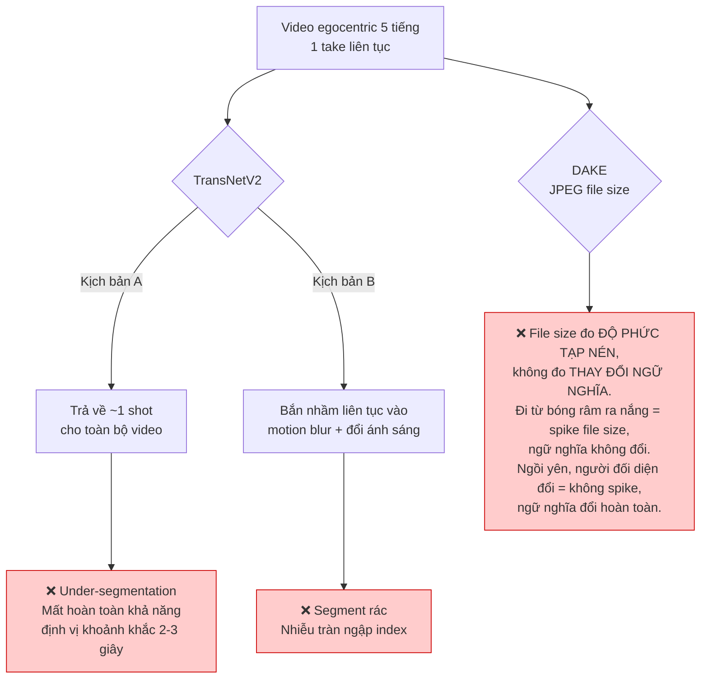

**Giải pháp — chính là thứ slide 34–35 mô tả:**

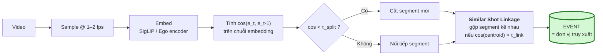

**Chi phí triển khai: ~30 dòng numpy** trên embedding bạn *vốn đã tính rồi*. Và nó **xoá bớt** 2 dependency (TransNetV2 weights, DAKE) — đây là thay đổi làm code *ngắn đi*, không dài ra.

Ánh xạ trực tiếp sang thuật ngữ của BTC:

| Slide 34–35 | Triển khai |
|---|---|
| Filtering | bỏ frame quá mờ / quá tối (Laplacian variance) |
| Normalization | L2-normalize embedding |
| Grouping — *"Sequence of contiguous similar images"* | changepoint trên chuỗi cosine |
| *"Visual Shot Detection → Similar Shot Linkage"* | split theo τ_split, rồi merge theo τ_link |

---

#### ② 🟠 HIGH — Thiếu metadata index (time / location)

Slide 33 liệt kê **Filter by Date-Time** và **Filter by Location** là UI primitive hạng nhất. Case Study 2 (slide 38) được giải **bằng metadata trước tiên**:

```
Filter by location (Hy Lạp) → Query by description → Prior event verification (3 ngày trước)
```

Baseline hiện **không có index thời gian, không có index vị trí**. Trên lifelog, "chiều thứ Ba tuần trước" hoặc "ở Hy Lạp" cắt candidate set đi **100–1000 lần** trước khi bất kỳ model nào chạy — và đó là câu trả lời rẻ nhất cho Big Three #2 (slide 31: *"Phải có bộ lọc thô cực nhanh"*).

Bổ sung vào ES event document:

```json
{
  "video_id": "...", "event_id": "...",
  "start_sec": 0.0, "end_sec": 0.0,
  "timestamp_utc": "2026-03-14T15:04:05Z",
  "date": "2026-03-14", "hour_of_day": 15, "day_of_week": "Sat",
  "gps": {"lat": 0.0, "lon": 0.0}, "place_id": "...",
  "place_category": "indoor/retail",
  "duration_sec": 0.0,
  "caption": "...", "ocr_text": "...", "asr_text": "...",
  "objects": [...], "attributes": {...},
  "audio_events": ["indoor crowd", "background music"]
}
```

> Đây là **thay đổi schema, không phải thêm model.** Chi phí gần bằng 0, lợi ích cao nhất toàn hệ thống.

---

#### ③ 🟠 HIGH — Không có cross-encoder rerank

Bi-encoder + RRF **không thể** giải:

- **Big Three #3** (slide 31): *"cởi mũ trước khi bước vào phòng"* vs *"bước vào phòng rồi mới cởi mũ"* — bag-of-terms cho hai cảnh này điểm y hệt nhau.
- **Case Study 3** (slide 39): túi tím 0.251 vs túi trắng 0.233 — biên **0.018 là nhiễu**, không phải tín hiệu. Đây là bài toán *attribute binding*, bi-encoder không giải được.

`ARCHITECTURE.md` hiện chỉ định **BLIP-2** làm reranker. BLIP-2 là model 2023, yếu ở attribute binding. Dùng VLM judge hiện đại (Gemini 2.5 Flash / Qwen3-VL-Reranker) **chỉ trên top-50**.

---

#### ④ 🟠 HIGH — Không verify thứ tự thời gian

Case Study 2 nguyên văn là: *"Tôi đã bay đến thành phố này cách đây 3 ngày"* → phải **truy vấn lần hai neo vào timestamp của kết quả thứ nhất**. Đây là *prior event verification*, không phải một model mới — là một windowed re-query cộng một phép kiểm tra thứ tự.

---

#### ⑤ 🟡 MED — OCR mọi frame: chi phí cao, ROI thấp

| | News video (2025) | Lifelog (2026) |
|---|---|---|
| Nguồn chữ | Chyron, ticker, lower-third — cố ý đặt để đọc | Biển hiệu nghiêng, nhãn sản phẩm, màn hình điện thoại, mờ do rung |
| Yield/frame | Cao | Sụp đổ |
| Chi phí API/frame | Như nhau | **Như nhau** |

**Gate lại:** chạy text *detector* rẻ (PaddleOCR DB head, CPU, vài ms), chỉ trả tiền Gemini OCR cho frame có diện tích chữ vượt ngưỡng.

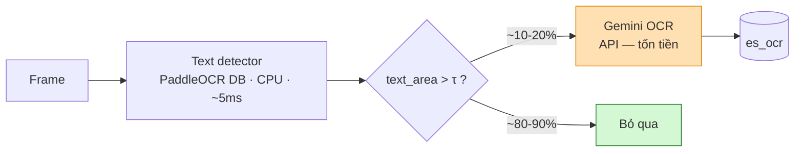

→ Cắt ~85% lời gọi OCR API, gần như không mất recall. **Giữ kênh này** (Case Study 1 diễn ra trong trung tâm thương mại đầy chữ thương hiệu) nhưng hạ từ hạng nhất xuống *entity boost*.

---

#### ⑥ 🟡 MED — ASR quá nặng, thiếu kênh thay thế

Trong news, MC **thuyết minh chính sự kiện** → ASR thường là kênh mạnh nhất.
Trong lifelog, ASR thưa, chồng tiếng, ồn gió, và **hiếm khi mô tả thứ camera đang thấy**. Ví dụ slide 16 ("đi chợ, nấu ăn, giao tiếp") là hội thoại vãng lai, không phải narration.

**Kênh thay thế: Audio Event Tagging** (BEATs / CLAP / AST) — một model, một pass trên đúng audio track bạn đã decode cho WhisperX.

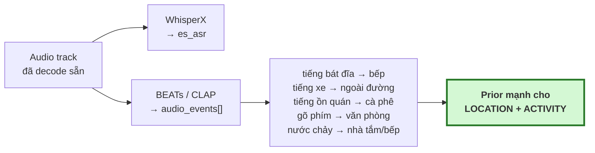

> Đây là **kênh mới có ROI cao nhất cho 2026**: tín hiệu cực mạnh trên lifelog, gần như vô dụng trên news — nên đây chính xác là thứ baseline 2025 không có lý do gì để có.

---

#### ⑦ 🟡 MED — SigLIP đơn lẻ yếu trên ảnh egocentric

SigLIP train trên cặp web-caption: góc nhìn thứ ba, bố cục đẹp, đủ sáng. Frame egocentric thì có tay trong khung, lệch trục, nhoè do chuyển động. Thêm nữa, benchmark Mixpeek 2026 cho thấy mean-pooling frame yếu với mọi thứ phụ thuộc chuyển động.

Hai mức khắc phục, theo thứ tự chi phí:
- **(a)** Giữ SigLIP làm bộ lọc recall nhanh, thêm **encoder pretrain egocentric** (họ EgoVLP/EgoVideo) làm kênh ANN thứ hai, fuse bằng RRF.
- **(b)** Với action, embed **clip ngắn** thay vì frame đơn.

---

#### ⑧ 🟡 MED — Tune trọng số trên dữ liệu 2025 sẽ overfit

`docs/ARCHITECTURE.md:100` khuyến nghị bootstrap trên video AIC 2025. **Ổn cho việc thông đường ống, có hại cho việc tune trọng số fusion** — weight tune trên news sẽ over-weight OCR/ASR và under-weight visual/audio-event.

| Mục đích | Dữ liệu dùng |
|---|---|
| Bootstrap *pipeline* (chạy thông, không lỗi) | AIC 2025 subset ✅ |
| Tune *trọng số fusion & ngưỡng* | Ego4D / EPIC-Kitchens / LSC release ✅ |

---

## 4. Ma trận Độ khó vs Hiệu quả

Hiệu quả được chấm **riêng cho dữ liệu egocentric AIC 2026** — nhiều dòng sẽ có điểm rất khác nếu chấm trên news 2025.

| Thành phần | Độ khó | Hiệu quả | Kết luận |
|---|---|---|---|
| Metadata index (time/place) | **XS** | **Rất cao** | ✅ **Làm trước tiên.** Pruning 100× miễn phí |
| Embedding-drift segmentation (thay TransNetV2+DAKE) | **XS** | **Rất cao** | ✅ **Làm trước tiên.** Net *xoá* code |
| Gate OCR bằng text detector | XS | TB (chi phí) | ✅ Cắt ~85% chi phí API |
| Audio event tagging (BEATs/CLAP) | S | **Cao** | ✅ Kênh mới tốt nhất |
| VLM cross-encoder rerank top-50 | S | **Rất cao** | ✅ Thắng lợi precision lớn nhất |
| Task Router agent (A1) | S | Cao | ✅ Đã có skeleton trong repo |
| Clarification agent KISC (A6) | S | **Rất cao** | ✅ Ghi điểm ở task không ai khác chạm được |
| Concept-expansion agent (A3, kiểu LLandMark) | S | Cao | ✅ Giải thẳng Case Study 1 |
| Temporal-order verifier (A4) | M | Cao | ✅ Big Three #3 + Case Study 2 |
| **Local eval harness + weight tuning** | M | **Rất cao** | ✅ **Xem §9 Phase 1** |
| Egocentric encoder làm kênh ANN #2 | M | Cao | ✅ Nếu đủ GPU-hours |
| Per-event VLM captioning (ReCap-style) | M | Cao | ⚠️ Làm, nhưng **phải chặn ngân sách** |
| Learned/convex fusion thay RRF | M | TB | ⏸️ Chỉ sau khi có eval harness |
| Multi-agent debate + veto (MAVIS) | L | TB | ❌ **Bỏ.** Giết latency trong vòng thi tính giờ |
| RL query refinement (VideoSearch-R1) | XL | ? | ❌ **Bỏ.** Đề tài nghiên cứu, không phải bài thi |
| Knowledge graph trên event | L | TB | ❌ **Bỏ ở v1.** Chỉ xem lại nếu temporal reasoning bế tắc |
| Thêm Milvus / MongoDB | S | **Âm** | ❌ Turbovec + ES đã đủ. Đừng thêm store thứ ba |

### 4.1 Bổ sung sau khi đối chiếu Buổi 2 & Buổi 3

Nhóm này **rẻ bất thường** so với hiệu quả, vì phần lớn tái sử dụng thứ đã có trong index.

| Thành phần | Nguồn | Độ khó | Hiệu quả | Kết luận |
|---|---|---|---|---|
| **Diversity cap: ≤2 event / video ở trang đầu** | B2 s.15 | **XS** | **Rất cao** | ✅ Chống 200 thumbnail gần trùng. ~5 dòng |
| **Truy vấn bằng ảnh ("tìm ảnh giống ảnh này")** | B2 s.10, 16 | **XS** | **Rất cao** | ✅ Image tower SigLIP **đã có sẵn** — không thêm model nào |
| **Prompt ensembling cho text tower** | B2 s.44 | **XS** | Cao | ✅ Mean-pool embedding của K cách diễn đạt từ A2. Miễn phí |
| **ES `_count` dry-run → nới/siết ràng buộc** | B3 s.21–25 | **XS** | **Rất cao** | ✅ Diệt lỗi "filter quá chặt ⇒ 0 kết quả". ~5 ms/lần |
| **Semantic memory bền: cache concept ra đĩa** | B3 s.17 | XS | Cao | ✅ Ấm dần trong suốt vòng thi |
| **Concept chips: khám phá ⇄ khai phá** | B2 s.20–21 | S | **Rất cao** | ✅ BTC mô tả *đúng* A6, nhưng ở tầng UI và **hai chiều** |
| **Rocchio feedback: cập nhật vector truy vấn** | B2 s.19 · MemoriEase 3.0 | S | **Cao** | ✅ 5 dòng numpy, không train lại gì |
| **Episodic memory cho KISC (turn log)** | B3 s.16 | S | **Cao** | ✅ KISC không chạy được nếu thiếu |
| **Zoom tool (crop + OCR/VLM ở full-res)** | B3 s.30 (STAR) | S | **Cao** | ✅ Cách duy nhất đọc được nhãn giá / hoá đơn / màn hình |
| **Chế độ truy vấn đa khung hình (temporal)** | B2 s.13 | M | Cao | ✅ Nâng A4 từ "verifier" thành **chế độ truy xuất** |
| **ToT-lite: A2 sinh 2–3 plan, chạy SONG SONG** | B3 s.14 | S | TB | ⏸️ Latency ~0 vì retriever vốn đã song song. Thử sau eval harness |
| **Action detection (VideoMAE / ego action)** | B1 s.35 | M | TB–Cao | ⏸️ BTC có liệt kê. Sau Phase 2, nếu verb query còn yếu |
| **Early-fusion grounding (GLIP/UNINEXT) thay A5** | B2 s.35–36 | L | TB | ⏸️ VLM judge đơn giản hơn, gần hiệu quả. Chỉ đổi nếu attribute binding vẫn hỏng |
| **Sketch → ảnh → truy vấn** | B2 s.10 | M | Thấp | ❌ Di sản VBS. AIC 2026 không có UI này trong đề |
| **HippoRAG / graph memory** | B3 s.18 | L | TB | ❌ "Đồ thị" của lifelog chính là **trục thời gian**, đã index rồi |

---

## 5. Kiến trúc mục tiêu AIC 2026

### 5.1 Toàn cảnh

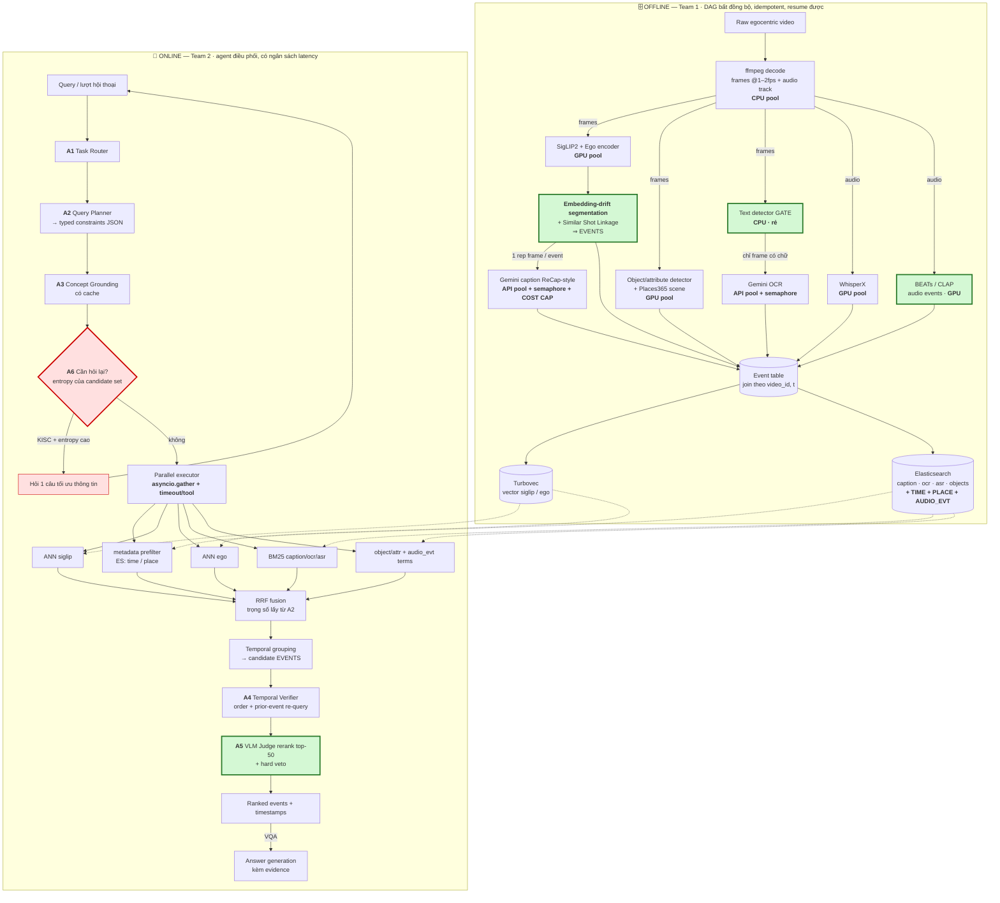

### 5.2 Nguyên tắc thiết kế cốt lõi

> ### 🔑 **Agent RA QUYẾT ĐỊNH — code biên dịch THỰC THI.**
>
> LLM **không bao giờ** nằm trong vòng lặp trên N frame hay N candidate.
> Agent chạy **O(1) lần mỗi lượt truy vấn**; mọi thứ O(N) là numpy, ES, và ANN.
>
> Đây chính là thứ giữ cho một hệ thống agentic vẫn nằm trong giới hạn thời gian của vòng thi.

### 5.3 Vì sao kiến trúc phải là CASCADE — khung early/late fusion của BTC

Buổi 2 dành 10 slide cho đúng một sự đánh đổi, và nó là bộ khung lý thuyết chuẩn cho toàn bộ §5.1:

| | **Late-fusion** | **Bước trung gian** | **Early-fusion** |
|---|---|---|---|
| Mô hình tiêu biểu (BTC nêu) | CLIP, OWL-ViT · *(ta: SigLIP2, Ego)* | — | GLIP, UNINEXT · *(ta: VLM judge)* |
| Cách hoạt động | Rút trích đặc trưng **độc lập** từng modality, so cosine | Sau khi fusion còn thêm các bước tính toán | Ảnh + ngôn ngữ **bổ trợ nhau ngay trong lúc rút trích** |
| Ưu (nguyên văn) | *"Tiết kiệm thời gian lúc truy vấn do dữ liệu ảnh đã được rút trích đặc trưng sẵn"* | *"Càng phức tạp cho ra độ chính xác cao"* | *"Tăng tính lý giải… tạo liên kết chính xác giữa ngôn ngữ và hình ảnh (visual grounding)"* |
| Nhược (nguyên văn) | *"Rất khó kiểm soát kết quả trả về do phụ thuộc hoàn toàn vào sức mạnh của mô hình rút trích"* | *"Đổi lại thời gian chạy lâu"* | *"Cần chạy lại toàn bộ mô hình với mỗi truy vấn khác nhau"* |
| BTC nói dùng khi nào | *"Khi truy vấn trên **dữ liệu lớn**"* | — | *"Phù hợp với **số lượng dữ liệu thấp** — các bước **cuối cùng** của quá trình truy vấn"* |

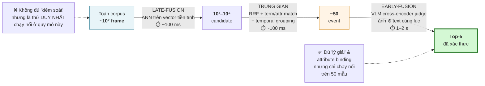

> **Kết luận đối chiếu:** tầng **A5 VLM rerank top-50** trong §5.1 không phải ý tưởng thêm vào cho sang — nó chính là **"các bước cuối cùng của quá trình truy vấn"** mà BTC dạy ở slide 36. Baseline AIC 2025 dừng ở late-fusion + RRF, tức là **thiếu hẳn nhánh phải của sơ đồ này**.
>
> Hệ quả về độ khó: `Mức độ phức tạp ở bước cuối cùng phụ thuộc vào độ lớn dữ liệu` (slide 43). Cho nên **top-50 là con số phải tune**, không phải hằng số — corpus càng lớn thì càng phải để cascade lọc sâu hơn trước khi trả cho early-fusion.

#### 5.3.1 Một món miễn phí rơi ra từ đây: prompt ensembling

Slide 44 trích Radford (CLIP): *"zero-shot performance can be significantly improved by customizing the prompt text to each task."*

A2 **vốn đã** sinh ra nhiều cách diễn đạt thị giác cho một truy vấn (mảng `visual[]` ở §6.2). Thay vì chọn một cái:

```python
# ponytail: mean-pool đã đủ; đổi sang weighted pool nếu eval harness cho thấy có lợi
z = normalize(np.mean([siglip_text(p) for p in plan["visual"]], axis=0))
```

Không thêm model, không thêm latency đáng kể (K lần text tower, mỗi lần <5 ms), và nó ép SigLIP về đúng phân bố prompt mà nó được train. Với dữ liệu egocentric, hãy đưa vào ensemble ít nhất một template góc nhìn thứ nhất: `"a first-person view of {}"`, `"a photo taken from wearable glasses showing {}"`.

---

## 6. Tầng Agentic: 6 agent và lý do tồn tại

### 6.1 Bảng agent

| Agent | Nhiệm vụ | Lý do tồn tại (failure mode nó chặn) | Prior art |
|---|---|---|---|
| **A1 · Task Router** | Phân loại KIS/AVS/VQA/KISC, set `top_k`, ngưỡng, chế độ trả kết quả | KIS và AVS có **mục tiêu ngược nhau** (precision@1 vs recall-all). Route sai = mất điểm mọi query loại đó | V-Agent routing agent |
| **A2 · Query Planner** | Sinh **typed constraint object** (không phải văn xuôi) | Quyết định đòn bẩy cao nhất hệ thống: modality weight, phân rã ràng buộc | SnapMind Planner, MAVIS decomposition |
| **A3 · Concept Grounding** | Concept → mô tả thị giác. Có **cache** | "lính chì" không embed được; "*người đứng mặc quân phục đỏ, khuy vàng, mũ lông đen cao*" thì được | LLandMark Landmark Agent |
| **A4 · Temporal Verifier** | Kiểm tra thứ tự sự kiện + **prior-event re-query** | Big Three #3 + Case Study 2 | — |
| **A5 · Rerank / Judge** | VLM cross-encoder trên **top-50**, có **hard veto** | Attribute binding (Case Study 3, biên 0.018 = nhiễu) | MAVIS veto (rút gọn) |
| **A6 · Clarification** | Chọn facet có **entropy cao nhất** → hỏi 1 câu | **Chính là bài toán KISC** | MemoriEase 3.0, V-Agent chat agent |

> **Đối chiếu Buổi 2 & 3 (Rev. 2):**
> · **A3 chính là "semantic memory"** theo phân loại của Buổi 3 (§6.6.1) — hãy bền hoá cache ra đĩa, đừng để nó chết theo process.
> · **A6 mới chỉ làm một nửa việc.** Buổi 2 slide 20–21 yêu cầu gợi ý concept theo **hai chiều**: *khai phá* (giảm bất định — đúng cái A6 đang làm) **và** *khám phá* (mở rộng phạm vi khi encoder trượt). Nửa còn lại ở §7.2.
> · **A2 nên có một bước world-model dry-run** trước khi cam kết plan — §6.6.2.

### 6.2 A2 — Query Planner output schema

Mọi stage phía sau là **pure function** của object này → test được **không cần API key**.

```json
{
  "task": "KIS",
  "visual": [
    "toy soldier figure, red military uniform, gold buttons, tall black hat",
    "shopping mall interior, retail display"
  ],
  "objects": ["purse", "clothes"],
  "attributes": { "purse": ["purple"] },
  "place":  { "category": "indoor/retail", "named": null },
  "time":   { "relative": "3 days after a flight", "absolute": null, "tod": null },
  "audio_events": ["indoor crowd", "background music"],
  "ocr_terms": [],
  "asr_terms": [],
  "temporal_order": [
    ["take a flight", "before"],
    ["photo of man at table", "after"]
  ],
  "modality_weights": {
    "visual": 0.70, "audio_evt": 0.15, "ocr": 0.10, "asr": 0.05
  }
}
```

### 6.3 A6 — Clarification agent: cách tính câu hỏi

**Đừng để LLM tự nghĩ câu hỏi.** Tính nó từ candidate set:

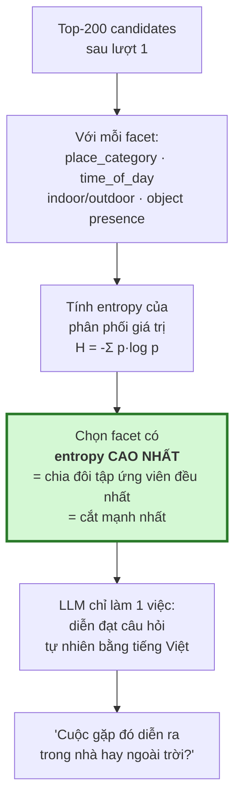

Slide 15 chính là ví dụ này: *"trong nhà hay ngoài trời?"* được hỏi vì indoor/outdoor chia tập ứng viên ~50/50.

> ⚠️ **Sửa trong code hiện tại:** `src/agents/orchestrator.py:157` — `_is_ambiguous()` đang trigger theo **số từ < 4**. Đó là placeholder. Trigger thật phải là **entropy của candidate set**: query 3 từ mà chỉ còn 2 ứng viên thì không cần hỏi; query 20 từ mà còn 5000 ứng viên thì phải hỏi.

### 6.4 Sequence diagram — một truy vấn KIS đầy đủ

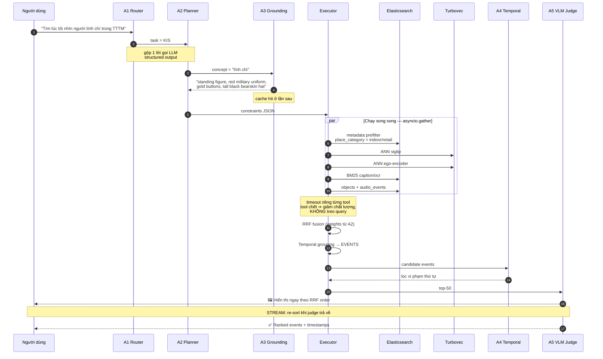

### 6.5 Sequence diagram — KISC (lượt hội thoại)

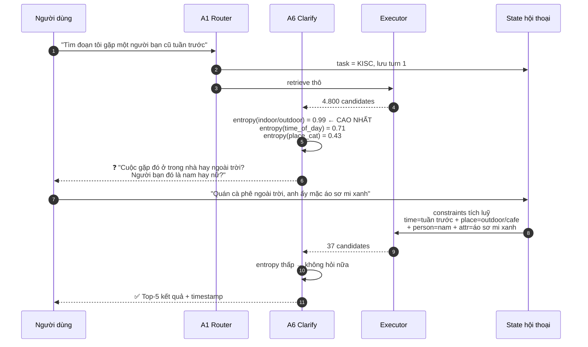

### 6.6 Đối chiếu với ba nền tảng Agent của BTC (Buổi 3)

Buổi 3 định nghĩa AI Agent qua đúng ba nền tảng: **Reasoning · Memory · Planning**. Dưới đây là chỗ đứng của 6 agent trên bản đồ đó — và hai chỗ hệ thống đang **thiếu**.

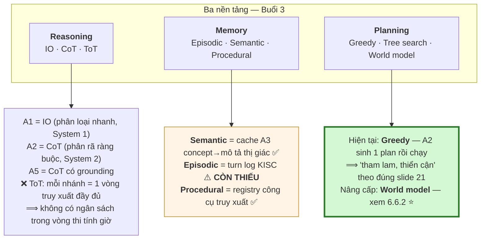

#### 6.6.1 Memory — đặt đúng tên cho thứ đã có, và bù thứ còn thiếu

| Loại (BTC) | Định nghĩa | Trong hệ thống này | Trạng thái |
|---|---|---|---|
| **Semantic** — *lưu trữ kiến thức*, ghi bằng suy luận LLM | "lính chì" → *"người đứng mặc quân phục đỏ, khuy vàng, mũ lông đen cao"* | Cache của **A3**. **Ghi ra đĩa**, không chỉ in-memory | ✅ có, cần bền hoá |
| **Episodic** — *lưu trữ trải nghiệm*, ghi **append-only**, đọc bằng **điểm heuristic** | Log từng lượt KISC: `(turn, câu hỏi đã hỏi, câu trả lời, ràng buộc tích luỹ, snapshot candidate)` | **Chưa có** — `orchestrator.py` hiện không giữ state qua lượt | ⚠️ **thiếu** |
| **Procedural** — *lưu trữ kỹ năng* | Registry công cụ: retriever nào tồn tại, tham số gì, chi phí bao nhiêu | Danh sách tool của Executor (SnapMind gọi là *component registry*) | ✅ có |

> **Vì sao episodic memory là bắt buộc, không phải tuỳ chọn:** KISC = nhiều lượt. Không có append-only turn log thì lượt 2 không biết lượt 1 đã hỏi gì — agent sẽ hỏi lại đúng câu đã hỏi, và ràng buộc người dùng cung cấp ở lượt 1 bị mất. Đây là **một bảng, ba cột**, không cần framework memory nào cả.

#### 6.6.2 ⭐ Planning — world model của bài toán truy xuất là MIỄN PHÍ

Slide 21 Buổi 3 nêu ba kiểu planning, và để ngỏ một câu hỏi:

> *Greedy:* ✅ nhanh, dễ · ⚠️ tham lam, thiển cận
> *Tree search:* ✅ khám phá hệ thống · ⚠️ hành động không đảo ngược, không an toàn, chậm
> *World model:* ✅ nhanh hơn, an toàn hơn, đảo ngược được · ⚠️ **"Làm thế nào để có được world model?"**

**Trong bài toán truy xuất, câu hỏi đó có lời giải tầm thường: chính cái index là world model.** Một lệnh `_count` trên Elasticsearch mô phỏng được kết quả của một plan mà **không** phải thực thi nó — ~5 ms, hoàn toàn đảo ngược được.

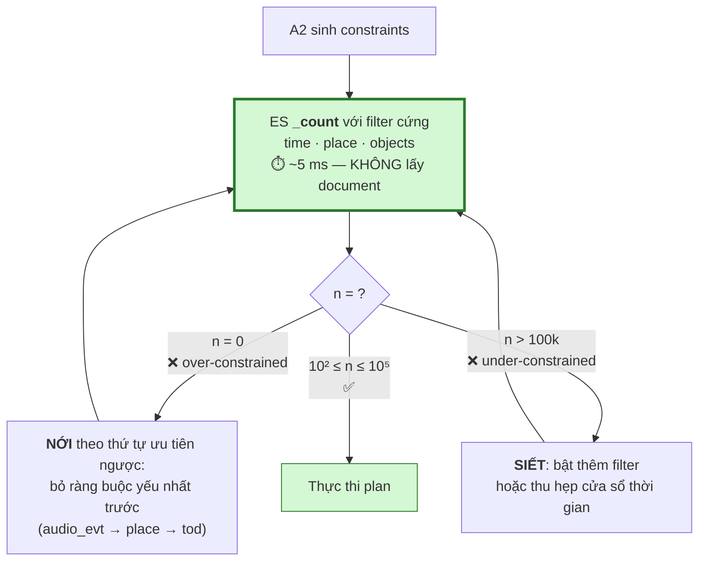

Chi phí: tối đa 3 vòng × 5 ms = **15 ms**, nằm gọn trong ngân sách latency §8.5. Lợi ích: xoá sạch chế độ hỏng tệ nhất và phổ biến nhất của mọi hệ thống có metadata filter — **người dùng gõ ràng buộc hơi lệch, hệ thống trả về 0 kết quả, và mất 2 phút mới nhận ra**. Giới hạn vòng lặp ở 3 để không biến planner thành vòng lặp vô hạn.

### 6.7 Đường VQA — mô hình STAR mà BTC nêu

Buổi 3 slide 30 mô tả kiến trúc agent cho VideoQA: **LLM Planner điều phối bộ công cụ qua khung STAR (Spatiotemporal Reasoning)**, với action space **luân phiên giữa công cụ Thời gian và công cụ Không gian**. Bản Rev. 1 xử lý VQA quá sơ sài (chỉ "retrieve evidence → VLM answer"). Bổ sung:

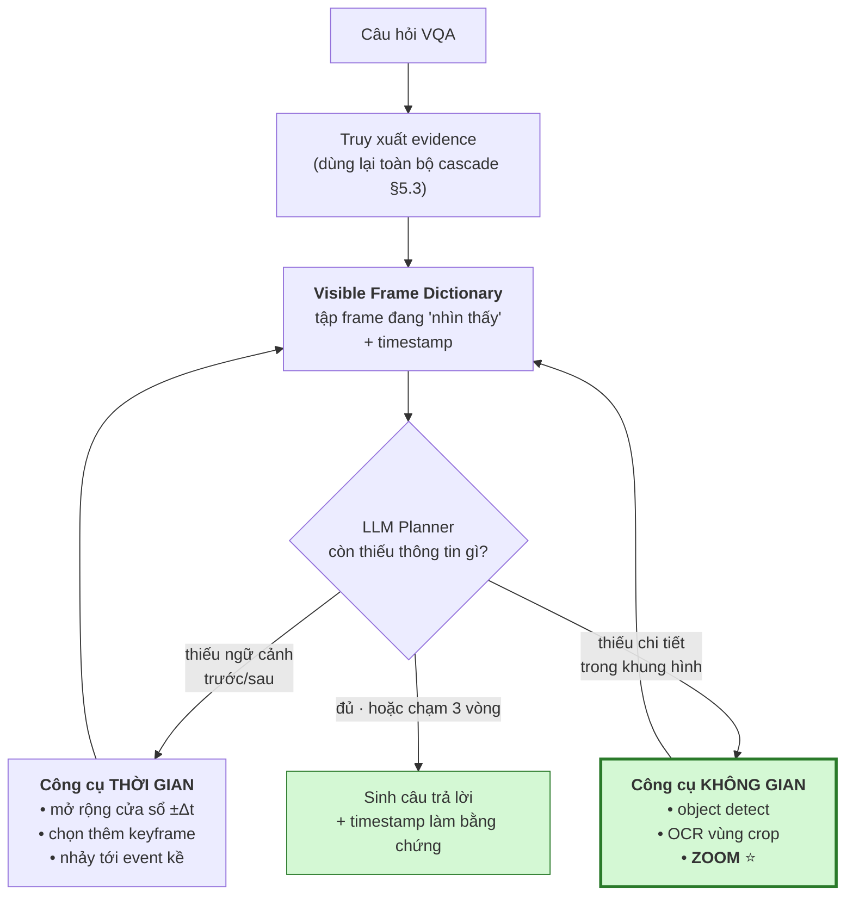

**⭐ Công cụ ZOOM là món đáng giá nhất và hiện đang thiếu.** Frame đã nằm trên đĩa ở độ phân giải gốc; detector đã cho sẵn bounding box. Zoom = crop theo box rồi chạy lại OCR/VLM **ở full-res**. Trên video egocentric đây là **cách duy nhất** đọc được nhãn giá, hoá đơn, biển hiệu, màn hình điện thoại — những thứ mà VQA hay hỏi và mà một frame downscale 384×384 đã xoá sạch thông tin.

> **Chặn vòng lặp:** tối đa **3 vòng công cụ**, hết thì trả lời bằng những gì đang có. Không có trần này, agent VQA sẽ đốt hết đồng hồ vào một câu hỏi. Đây vẫn đúng nguyên tắc §5.2 — planner chạy O(1) theo *lượt hỏi*, không phải O(N) theo frame.

---

## 7. Hiển thị & Phản hồi người dùng — hai trụ cột bị bỏ quên

> Toàn bộ §7 là phần **bổ sung Rev. 2**, dựng từ Buổi 2. Đây là khối ② và ③ trong sơ đồ §1.3.

### 7.1 Bài toán hiển thị

BTC nêu đúng hai triệu chứng (slide 15):

| Triệu chứng | Nguyên nhân trên dữ liệu egocentric | Cách chữa |
|---|---|---|
| *"Các frame gần giống nhau trong một video"* | Camera đeo đứng yên 10 phút ⇒ 600 frame gần **trùng khít** | Đơn vị hiển thị là **EVENT**, không phải frame (§3.3 ①) — cộng thêm **diversity cap** |
| *"Số lượng video có liên quan quá nhiều"* | Một concept (bếp, đường phố) xuất hiện mỗi ngày | **Cap ≤2 event / video** ở trang đầu; xem thêm bằng "mở rộng video này" |

Và một câu hỏi thiết kế (slide 15) mà đa số đội bỏ trống:

> ❝ Chúng ta sẽ hiển thị gì khi người dùng **không biết bắt đầu từ đâu**? ❞

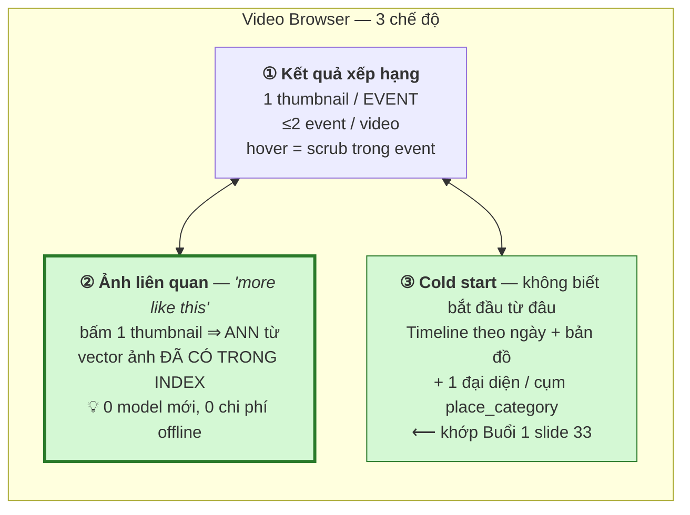

**Chế độ ② rẻ đến mức vô lý.** Index đã chứa vector ảnh của mọi keyframe (Turbovec). "Ảnh liên quan" = một truy vấn ANN với vector đó làm query, thay vì embedding của text. Không thêm mô hình, không thêm bước offline nào — chỉ là một endpoint mới. BTC minh hoạ đúng cơ chế này ở slide 16 (*Ảnh truy vấn → Ảnh liên quan*) và trong hệ thống VISIONE'23 / vitrivr.

> **Đây cũng chính là câu trả lời cho slide 10** — *"thay đổi phương thức truy vấn để liên kết chặt chẽ hơn"*. Khi text không diễn tả nổi (kết cấu, bố cục, sắc thái màu), ảnh diễn tả được.

### 7.2 Phản hồi người dùng — Khám phá ⇄ Khai phá

Slide 19 đặt ra yêu cầu cân bằng **hai chiều ngược nhau**, và slide 20–21 nói rõ nó phải hiện ra dưới dạng **gợi ý concept**:

| Chiều | BTC định nghĩa | Mục tiêu toán học | Cách tính |
|---|---|---|---|
| **Khám phá** (exploration) | *"hiển thị thông tin ít liên quan nhằm mở rộng phạm vi tìm kiếm"* — bù cho cách diễn đạt thiếu chặt của người dùng và encoder yếu | **Tăng recall** khi encoder trượt | Concept **anh em** từ A3: cùng ngữ cảnh nhưng chưa xuất hiện trong candidate set |
| **Khai phá** (exploitation) | *"hiển thị thông tin liên quan cao nhằm tách bạch các video giống nhau"* | **Giảm entropy** của candidate set | Chính là **A6** — facet có entropy cao nhất (§6.3) |

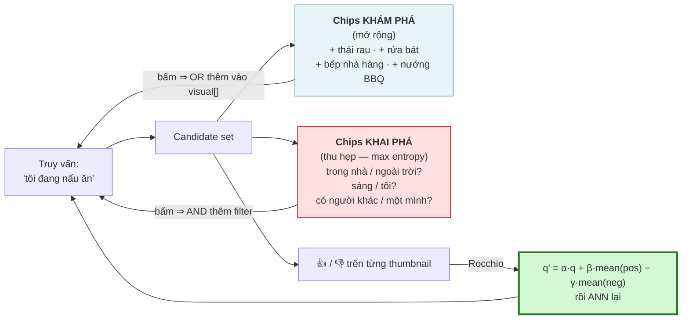

**Rocchio — 5 dòng, không train gì:**

```python
def rocchio(q, pos_vecs, neg_vecs, a=1.0, b=0.75, c=0.25):
    """Cập nhật vector truy vấn từ 👍/👎. Vector đã L2-normalized sẵn trong index."""
    q2 = a * q
    if len(pos_vecs): q2 = q2 + b * np.mean(pos_vecs, axis=0)
    if len(neg_vecs): q2 = q2 - c * np.mean(neg_vecs, axis=0)
    return q2 / np.linalg.norm(q2)
    # ponytail: γ nhỏ hơn β có chủ đích — negative feedback nhiễu hơn positive.
    # Nếu eval harness cho thấy 👎 đáng tin, kéo c lên 0.5.
```

MemoriEase 3.0 (LSC'25) — hệ thống mà chính Buổi 3 slide 31 đưa ra làm mẫu — mô tả action space của nó gồm đúng bước này: *"tính toán lại vector trọng số từ phản hồi người dùng"*. Đây là prior art trực tiếp, không phải sáng chế.

### 7.3 Truy vấn đa khung hình — chỗ mô hình ảnh đơn bó tay

Slide 13 nêu vấn đề bằng một ví dụ cụ thể:

> ❝ Làm sao để liên kết giữa các khung hình khi sử dụng các mô hình trên ảnh đơn? ❞
> *Text query: "A slow pan up from a canyon, **static shots of a bridge** and redrock mountain."*

SigLIP nhìn từng frame độc lập; không frame nào chứa cả chuỗi. Cách chữa **không cần model mới** — dùng lại trục thời gian đã index:

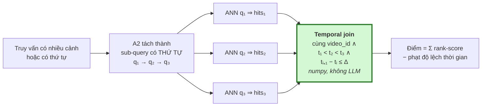

Đây chính là **A4 được nâng cấp**: ở Rev. 1 nó chỉ *lọc* kết quả vi phạm thứ tự (post-hoc verifier); ở đây nó trở thành **chế độ truy xuất** khi `temporal_order` không rỗng. Nó cũng là câu trả lời trực tiếp cho **Big Three #3** (Buổi 1 slide 31: *"cởi mũ trước khi vào phòng"* vs *"vào phòng rồi mới cởi mũ"*) — hai câu này có cùng túi từ khoá và chỉ khác nhau ở dấu của `t₁ − t₂`.

### 7.4 Đánh đổi mà BTC yêu cầu cân bằng

Slide 9 nêu tam giác: **tốc độ thuật toán ⇄ sức mạnh thuật toán ⇄ chi phí hệ thống** (mốc quy mô họ đưa: V3C1 = 1000 giờ video).

| | Chọn gì | Vì sao chấp nhận được |
|---|---|---|
| **Tốc độ** | Late-fusion ANN cho toàn corpus | Không có lựa chọn nào khác chạy nổi ở 10⁷ frame |
| **Sức mạnh** | Early-fusion chỉ trên top-50 | Trả tiền cho độ chính xác đúng chỗ nó đổi thành điểm |
| **Chi phí** | Gate OCR, caption theo event, cost cap cứng | Chênh lệch **$200 vs $5000** tiền API (§8.2 quy tắc 3) |
| **Khi cả ba đều thua** | ② hiển thị + ③ phản hồi | Đây là lý do tồn tại của §7 — *"sẽ làm gì nếu mô hình truy vấn không đủ tốt?"* |

---

## 8. Workflow & Orchestration bất đồng bộ

### 8.1 Lỗi kinh điển cần tránh

```mermaid
flowchart LR
  subgraph BAD["❌ SAI — 1 process làm tuần tự / video"]
    direction LR
    B1["decode"] --> B2["embed<br/>GPU"] --> B3["gọi Gemini<br/>chờ mạng"] --> B4["ghi"]
    B3 -.->|"GPU NGỒI CHƠI<br/>suốt round-trip"| B2
  end
  style BAD fill:#ffe8e8,stroke:#c00
```

```mermaid
flowchart TB
  subgraph GOOD["✅ ĐÚNG — tách theo LỚP TÀI NGUYÊN"]
    direction TB
    DEC["<b>Producer</b><br/>ffmpeg decode 1 LẦN<br/>→ scratch dir"]
    DEC --> CPU["<b>Lớp CPU</b><br/>multiprocessing.Pool n_cores<br/>· JPEG · text-detector gate<br/>⟶ nghẽn ở: số core"]
    DEC --> GPU["<b>Lớp GPU</b><br/>1 worker / GPU, BATCH<br/>· SigLIP · Ego · detector<br/>· WhisperX · BEATs<br/>⟶ nghẽn ở: VRAM & batch size"]
    DEC --> API["<b>Lớp API</b><br/>asyncio + Semaphore rate_limit<br/>+ retry có jitter<br/>· Gemini caption · Gemini OCR<br/>⟶ nghẽn ở: rate limit, KHÔNG phải compute"]
  end
  style GOOD fill:#e8f8e8,stroke:#2a7a2a
```

### 8.2 6 quy tắc bất đồng bộ bắt buộc

| # | Quy tắc | Vì sao |
|---|---|---|
| 1 | **Decode 1 lần, fan-out.** Một pass ghi frames + audio ra scratch; mọi consumer đọc từ đó | Decode đắt và mọi stage đều cần. Đừng bao giờ decode theo từng stage |
| 2 | **OCR và ASR chạy đồng thời tự nhiên** — khác tài nguyên (API vs GPU), khác input (frame vs audio) | Chúng không cần phối hợp gì, chỉ cần chung producer decode + chung khoá join `(video_id, t)` |
| 3 | **Segmentation là BARRIER.** Captioning phải đợi nó | Caption-per-event rẻ hơn caption-per-frame **10–50×**. Sai thứ tự này = khác biệt giữa $200 và $5000 tiền API |
| 4 | **Cost cap là hard stop.** Bộ đếm token trong API pool, raise khi chạm trần | Pipeline API hỏng một cách **tốn tiền**, không phải một cách ồn ào |
| 5 | **Backpressure bằng bounded queue.** `asyncio.Queue(maxsize=N)` giữa các stage | Queue vô hạn biến 1 consumer chậm thành OOM sau 3 tiếng |
| 6 | **Join muộn.** Mỗi stage ghi `(video_id, t, payload)` độc lập; pass cuối merge thành event doc | Stage ghi chéo vào record của nhau = race condition + không resume được |

### 8.3 DAG offline với barrier

```mermaid
flowchart TB
    START(["Video queue"]) --> DEC["<b>[CPU pool]</b> ffmpeg decode<br/>frames @1-2fps + audio.wav<br/>→ scratch/"]

    DEC --> Q1[/"Queue frames<br/>maxsize=N"/]
    DEC --> Q2[/"Queue audio<br/>maxsize=N"/]

    Q1 --> GEMB["<b>[GPU]</b> SigLIP2 + Ego embed<br/>batched"]
    Q1 --> GDET["<b>[GPU]</b> Object/attr + Places365"]
    Q1 --> CTXT["<b>[CPU]</b> Text detector gate"]

    Q2 --> GASR["<b>[GPU]</b> WhisperX"]
    Q2 --> GAUD["<b>[GPU]</b> BEATs / CLAP"]

    GEMB ==> BAR{{"⛔ BARRIER<br/><b>Embedding-drift segmentation</b><br/>+ Similar Shot Linkage"}}
    BAR ==> REP["Chọn 1 rep frame / EVENT"]
    REP --> ACAP["<b>[API]</b> Gemini caption<br/>semaphore + cost cap"]

    CTXT -->|"chỉ frame có chữ<br/>~10-20%"| AOCR["<b>[API]</b> Gemini OCR<br/>semaphore + cost cap"]

    GDET --> JOIN
    GASR --> JOIN
    GAUD --> JOIN
    ACAP --> JOIN
    AOCR --> JOIN
    BAR  --> JOIN

    JOIN["<b>Late join</b> theo video_id, t<br/>→ Event documents"] --> W1[("Turbovec")]
    JOIN --> W2[("Elasticsearch")]

    JOIN -.->|"ghi trạng thái"| MAN[("Manifest<br/>SQLite / JSONL<br/>video_id · stage · status · path")]
    MAN -.->|"resume: bỏ qua<br/>việc đã xong"| START

    style BAR fill:#ffe0b3,stroke:#e08000,stroke-width:4px
    style MAN fill:#e8e8ff,stroke:#4040c0,stroke-width:2px
```

### 8.4 Đừng xây orchestration framework

> **Rung 3 của thang lười: stdlib đã đủ.**
>
> Một bảng manifest (SQLite, hoặc chỉ 1 file JSONL / stage) ghi `(video_id, stage, status, output_path)` cho bạn **idempotent resume miễn phí** — chạy lại pipeline sẽ tự bỏ qua việc đã xong.
>
> **~50 dòng code, thay thế hoàn toàn Airflow / Prefect / Celery ở quy mô này.**
> Chỉ với tới Ray khi thực sự có hardware nhiều node.

### 8.5 Online — ngân sách latency

```mermaid
gantt
    title Ngân sách latency một lượt truy vấn
    dateFormat  X
    axisFormat  %L ms

    section Agent
    A1+A2+A3 gộp 1 LLM call, A3 có cache   :a1, 0, 600

    section Retrieval song song
    metadata prefilter ES                   :b1, 600, 90
    ANN siglip                              :b2, 600, 120
    ANN ego                                 :b3, 600, 130
    BM25 caption/ocr/asr                    :b4, 600, 145
    objects + audio_events                  :b5, 600, 100

    section Fusion
    RRF + temporal grouping numpy           :c1, 750, 100

    section Verify
    A4 temporal - BỎ QUA nếu không có order :d1, 850, 200

    section Rerank
    A5 VLM judge top-50 STREAM              :e1, 1050, 1500
```

| Stage | Ngân sách | Hành vi |
|---|---|---|
| A1+A2+A3 | ~600 ms | **Gộp A1/A2 vào 1 structured-output call.** Cache A3 |
| Metadata prefilter + ANN + BM25 | **< 150 ms** | `asyncio.gather` với **timeout riêng từng retriever** |
| RRF + temporal grouping | < 100 ms | numpy thuần |
| A4 temporal verify | < 200 ms | **Bỏ hẳn** khi `temporal_order` rỗng |
| A5 VLM rerank top-50 | 1–2 s | **Stream**: render RRF order ngay, re-sort khi judge trả về |

**Hai quy tắc làm cho nó chạy được:**

1. **Kết quả một phần > kết quả đầy đủ.**
   ```python
   results = await asyncio.gather(
       *(asyncio.wait_for(tool(q), timeout=0.2) for tool in tools),
       return_exceptions=True,
   )
   ```
   ES chậm ⇒ trả vector hits trước, ES về sau. **Retriever chết chỉ được làm giảm chất lượng ranking, tuyệt đối không được treo query.**

2. **Agent chạy theo LƯỢT, không theo CANDIDATE.** A2 gọi 1 lần. A5 gọi 1 lần trên batch 50. Nếu bạn thấy mình gọi 1 LLM call / candidate → thiết kế đã sai.

### 8.6 Bảng chốt: chỗ nào đặt agent, chỗ nào không

| Bước pipeline | Agent? | Lý do |
|---|---|---|
| Decode, embedding, detection | **Không** | Deterministic. LLM chỉ thêm chi phí, 0 độ chính xác |
| Event segmentation | **Không** | Ngưỡng trên cosine distance. Tune nó, đừng suy luận về nó |
| OCR gating | **Không** | Ngưỡng confidence của detector |
| Caption từng event | **VLM, không phải agent** | Sinh 1 lần, không có vòng lặp planning |
| Phân loại task | **✅ A1** | Quyết định routing, đổi hàm mục tiêu |
| Phân rã query + gán modality weight | **✅ A2** | Quyết định đòn bẩy cao nhất hệ thống |
| Concept → thuộc tính thị giác | **✅ A3** | Cần tri thức thế giới. Nhớ cache |
| Thực thi retrieval | **Không** | Compiled. `asyncio.gather` trên tool cố định |
| Fusion | **Không** (weight *từ* A2) | Số học thuần |
| Verify thứ tự thời gian | **✅ A4** | Cần hiểu ngữ nghĩa thứ tự |
| Rerank top-50 | **✅ A5** | Phán đoán grounded, fine-grained |
| Hỏi lại làm rõ | **✅ A6** | **Chính là bài toán KISC** |
| Sinh câu trả lời VQA | **VLM** | Generation trên evidence đã truy xuất |
| **Dry-run `_count` + nới/siết ràng buộc** | **✅ A2** (vòng ≤3) | World model miễn phí. Quyết định *"plan này có khả thi không"* — §6.6.2 |
| **Chọn công cụ VQA (thời gian ⇄ không gian)** | **✅ Planner** (vòng ≤3) | Đúng khung STAR của BTC — §6.7 |
| **Xếp hạng lại sau feedback (Rocchio)** | **Không** | Đại số vector thuần. LLM ở đây chỉ thêm độ trễ — §7.2 |
| **Sinh chip khám phá / khai phá** | **✅ A3 + A6** | Khám phá cần tri thức thế giới (A3); khai phá là entropy (A6) |
| **Gom nhóm & diversity cap khi hiển thị** | **Không** | Luật cứng: 1 thumbnail/event, ≤2 event/video — §7.1 |

---

## 9. Lộ trình triển khai

```mermaid
flowchart LR
    P0["<b>Phase 0</b><br/>Đúng đơn vị truy xuất<br/>———<br/>• Embedding-drift segmentation<br/>  thay TransNetV2 + DAKE<br/>• Thêm time/place vào ES schema<br/>• Gate OCR bằng text detector<br/>———<br/>⏱️ tuần này<br/>📉 <b>Net XOÁ code</b>"]

    P1["<b>Phase 1</b><br/>⚠️ EVAL HARNESS<br/>———<br/>• 50–100 query gán nhãn tay<br/>• R@1 / R@5 / R@100 + MRR<br/>• Chạy bằng 1 lệnh<br/>———<br/>🎯 <b>ROI cao nhất<br/>toàn dự án</b>"]

    P2["<b>Phase 2</b><br/>Kênh tín hiệu<br/>———<br/>• Audio event tagging<br/>• Ego encoder → ANN #2<br/>• Per-event captioning<br/>  + cost cap"]

    P3["<b>Phase 3</b><br/>Agent<br/>———<br/>• A1+A2 gộp 1 call<br/>• A3 + cache<br/>• A5 VLM rerank<br/>———<br/>Đo từng cái bằng<br/>harness Phase 1.<br/>Chỉ giữ cái làm số tăng"]

    P4["<b>Phase 4</b><br/>Khác biệt hoá<br/>———<br/>• A6 entropy clarification<br/>• A4 temporal verifier<br/>———<br/>🏆 <b>Đây là chỗ<br/>ăn điểm KISC</b>"]

    P2B["<b>Phase 2b</b> — SONG SONG với P2<br/>Browser & Feedback<br/>———<br/>• 1 thumbnail / EVENT<br/>• diversity cap ≤2/video<br/>• 'ảnh liên quan' (image query)<br/>• chip khám phá ⇄ khai phá<br/>• Rocchio 👍/👎<br/>———<br/>👤 người khác làm (frontend)<br/>🚫 KHÔNG tranh GPU với P2"]

    P0 --> P1 --> P2 --> P3 --> P4
    P1 --> P2B --> P3

    style P0 fill:#d4f8d4,stroke:#2a7a2a,stroke-width:3px
    style P1 fill:#fff0b3,stroke:#c8a800,stroke-width:4px
    style P2B fill:#e0f0ff,stroke:#0066cc,stroke-width:3px
    style P4 fill:#ffe0e0,stroke:#c00,stroke-width:3px
```

**Phase 2b tách riêng có chủ đích.** Nó là khối ② + ③ (§7), chạy trên frontend, **không đụng tới GPU hay pipeline offline** — nên nó chạy song song Phase 2 mà không tranh tài nguyên với ai. Đây là hạng mục dễ bị hoãn nhất và cũng là hạng mục đổi thành điểm nhanh nhất, vì AIC chấm theo thời gian tới đáp án.

Ba món XS nên nhét vào Phase 0 luôn vì gần như không tốn công: **prompt ensembling** (§5.3.1), **ES `_count` dry-run** (§6.6.2), **bền hoá cache A3** (§6.6.1).

### 9.1 ⚠️ Phase 1 — Đừng bỏ qua

50–100 query gán nhãn tay trên sample index, chấm R@1 / R@5 / R@100 và MRR, chạy được bằng **một lệnh**.

Không có nó, **mọi** trọng số fusion, **mọi** ngưỡng, **mọi** câu hỏi "reranker có giúp không?" đều là phỏng đoán — và bạn sẽ tiêu cả kỳ thi để tranh luận bằng trực giác.

> Đây là hạng mục ROI cao nhất toàn bộ kế hoạch, và cũng chính là hạng mục các đội **luôn luôn bỏ qua**.

### 9.2 Đã cân nhắc và loại bỏ

| Bỏ | Lý do |
|---|---|
| Multi-agent debate + veto (MAVIS đầy đủ) | Giết latency trong vòng thi tính giờ. Một VLM judge đơn lẻ nắm được phần lớn lợi ích |
| RL query refinement (VideoSearch-R1) | Đề tài nghiên cứu, không phải bài dự thi |
| Knowledge graph trên event | Sớm. Chỉ xem lại nếu temporal reasoning bế tắc |
| Milvus / MongoDB | Turbovec + ES đã phủ hết. Đừng thêm store thứ ba |

---

## 10. Ba điều cần cảnh báo mạnh nhất

> ### 🔴 1. `docs/ARCHITECTURE.md:62` khẳng định TransNet V2 xử lý được "shaky egocentric footage" — **KHÔNG ĐÚNG.**
> Nó phát hiện shot boundary do người dựng tạo ra, thứ mà video egocentric **không hề có**.
> Nếu chỉ làm được một việc trong toàn bộ tài liệu này, hãy làm việc này.

> ### 🟠 2. Tune trọng số trên dữ liệu news AIC 2025 sẽ cho ra bộ weight SAI cho 2026.
> Bootstrap đường ống trên nó thì được; tune trọng số phải làm trên dữ liệu egocentric.

> ### 🟠 3. Đừng để hệ thống chỉ có 1/3 số khối mà BTC định nghĩa. *(bổ sung Rev. 2)*
> Buổi 2 mở đầu bằng đúng câu hỏi này: *"Hệ thống tìm kiếm video chỉ cần mô hình rút trích đặc trưng mạnh là đủ?"*
> Bản Rev. 1 của chính tài liệu này đã mắc lỗi đó — 100% nội dung nằm ở khối ① mô hình truy vấn.
> **Cơ chế hiển thị** và **phản hồi người dùng** không phải phần "làm nốt nếu còn thời gian"; chúng là thứ quyết định *thời gian tới đáp án*, và AIC chấm điểm suy giảm theo thời gian. Xem §7.

---

## 11. Nguồn tham khảo

**Hệ thống AIC / VBS / LSC**
- [U-CESE — Unified Clip-based Event Search Engine, AIC HCMC 2025](https://arxiv.org/abs/2605.23274)
- [MERVIN — Multimodal Event Retrieval in Vietnamese News Videos](https://arxiv.org/pdf/2605.16120)
- [LLandMark — Multi-Agent Landmark-Aware Interactive Video Retrieval (AI VIETNAM)](https://arxiv.org/html/2603.02888)
- [Results of the 2025 Video Browser Showdown](https://arxiv.org/pdf/2509.12000)
- [VBS Teams & Papers — mọi năm](https://videobrowsershowdown.org/teams/)
- [The State-of-the-Art in Lifelog Retrieval: LSC 2022–24 Review](https://arxiv.org/abs/2506.06743)
- [MemoriEase 3.0 — RAG-Enhanced Conversational Lifelog Retrieval, LSC'25](https://dl.acm.org/doi/10.1145/3729459.3748689)
- [LifeSearch — Multimodal Lifelog Search System, LSC'25](https://dl.acm.org/doi/10.1145/3729459.3748696)
- [From Expert Practices to Intelligent Agents: Autonomy in Interactive Video Retrieval](https://link.springer.com/chapter/10.1007/978-981-95-6963-2_20)
- [MADTempo — Multi-Event Temporal Video Retrieval with Query Augmentation](https://arxiv.org/pdf/2512.12929)

**Agentic retrieval**
- [MAVIS — Multi-Agent Video Retrieval via Structured Video Understanding](https://arxiv.org/abs/2606.09641)
- [V-Agent — Interactive Video Search System Using VLMs](https://arxiv.org/abs/2512.16925)
- [VideoSearch-R1 — Iterative Video Retrieval via Soft Query Refinement](https://arxiv.org/abs/2607.00446)
- [A Reference Architecture for Agentic Hybrid Retrieval](https://arxiv.org/html/2604.16394v1)
- [VideoRAG — RAG with Extreme Long-Context Videos](https://arxiv.org/pdf/2502.01549)

**Embedding / fusion / egocentric**
- [An Analysis of Fusion Functions for Hybrid Retrieval](https://arxiv.org/abs/2210.11934)
- [Video Embedding Benchmark 2026 — Gemini vs Marengo vs SigLIP vs InternVideo2](https://mixpeek.com/blog/video-embedding-benchmark-2026)
- [EgoVLP — Egocentric Video-Language Pretraining (NeurIPS 2022)](https://github.com/showlab/EgoVLP)
- [EgoCVR — Egocentric Benchmark for Fine-Grained Composed Video Retrieval (ECCV 2024)](https://github.com/ExplainableML/EgoCVR)
- [Object-Shot Enhanced Grounding Network for Egocentric Video](https://arxiv.org/pdf/2505.04270)

**Video browser & tương tác người dùng** *(bổ sung Rev. 2 — nền cho §7)*
- [vitrivr — Open-Source Multimedia Retrieval Stack](https://vitrivr.org/) *(BTC nêu ở Buổi 2 slide 11)*
- [VISIONE — Video Search System, VBS](https://github.com/ffalchi/it.cnr.isti.visione) *(BTC nêu ở Buổi 2 slide 17)*
- [Rocchio Algorithm — Relevance Feedback (IR textbook, Stanford NLP)](https://nlp.stanford.edu/IR-book/html/htmledition/rocchio-algorithm-for-relevance-feedback-1.html)
- [Learning Transferable Visual Models From Natural Language Supervision (CLIP — prompt engineering & ensembling, §3.1.4)](https://arxiv.org/abs/2103.00020)
- [GLIP — Grounded Language-Image Pre-training (early-fusion, CVPR 2022)](https://arxiv.org/abs/2112.03857)
- [UNINEXT — Universal Instance Perception as Object Discovery and Retrieval (CVPR 2023)](https://arxiv.org/abs/2303.06674)

**Nền tảng Agent** *(bổ sung Rev. 2 — nền cho §6.6–§6.7)*
- [Tree of Thoughts — Deliberate Problem Solving with LLMs (NeurIPS 2023)](https://arxiv.org/abs/2305.10601)
- [Generative Agents — Interactive Simulacra of Human Behavior (episodic memory)](https://arxiv.org/abs/2304.03442)
- [Voyager — Open-Ended Embodied Agent with LLMs (procedural memory / skill library)](https://arxiv.org/abs/2305.16291)
- [HippoRAG — Neurobiologically Inspired Long-Term Memory for LLMs](https://arxiv.org/abs/2405.14831) *(BTC nêu ở Buổi 3 slide 18 — đánh giá: chưa cần, xem §4.1)*
- [Mind2Web — Towards a Generalist Agent for the Web (NeurIPS 2024)](https://arxiv.org/abs/2306.06070)
- [OSWorld — Benchmarking Multimodal Agents in Real Computer Environments](https://arxiv.org/abs/2404.07972)
- [MemoriEase 2.0 — Conversational Lifelog Retrieval, LSC'24](https://dl.acm.org/doi/10.1145/3643489.3661116)

**Tài liệu nội bộ**
- `Tập huấn AIC 2026 - Buổi 1.pptx.pdf` — bài toán, dữ liệu, Big Three, tiền xử lý lifelog
- `Tập huấn AIC 2026 - Buổi 2.pdf` — ThS. Nguyễn Quang Thức, *Hệ thống tìm kiếm video*: ba trụ cột, early/late fusion, hiển thị & phản hồi
- `Tập huấn AIC 2026 - Buổi 3.pdf` — Hồ Lê Minh Quân, *Kiến trúc Agentic AI*: Reasoning · Memory · Planning, ứng dụng VideoQA & lifelog QA
- `docs/ARCHITECTURE.md` — kiến trúc hiện tại (cần cập nhật theo §3.3 ①)
- `src/agents/orchestrator.py` — ReAct skeleton đã có, cần sửa `_is_ambiguous()` theo §6.3 và bổ sung episodic memory theo §6.6.1
