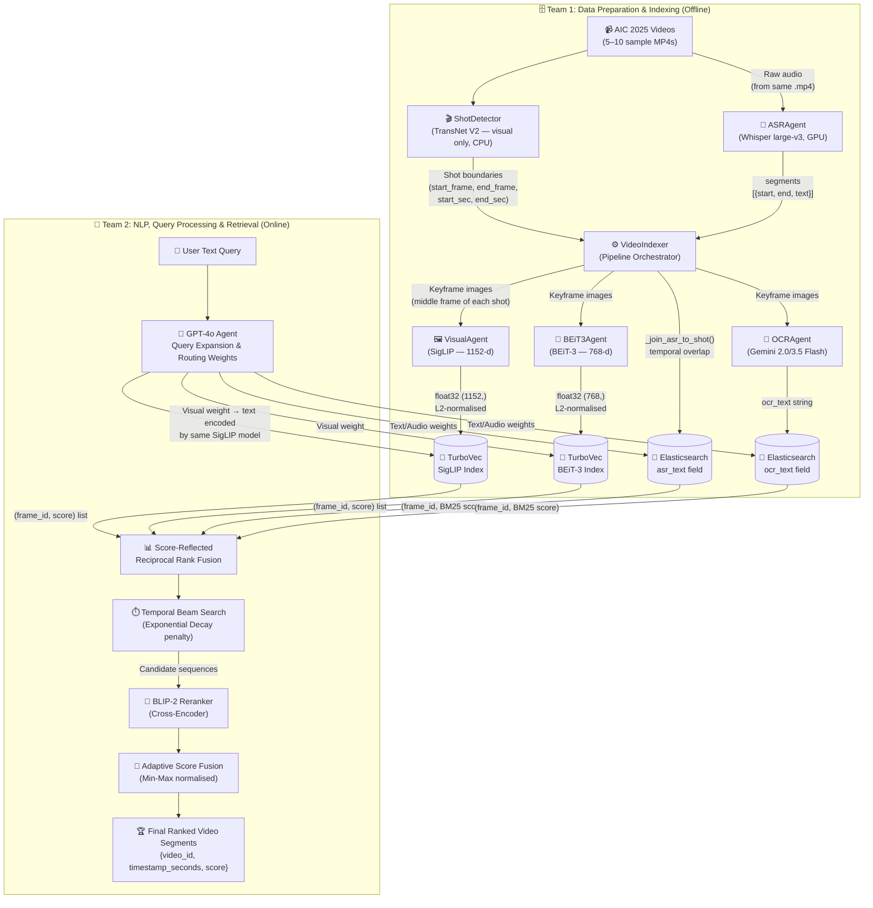

# System Architecture — AIC 2026

This document defines the Multimodal Retrieval Architecture for the AI Challenge 2026,
based on the U-CESE evolution ("Cascaded Embedding-Reranking and Temporal-Aware Score
Fusion") and official competition guidelines.

---

## 1. Competition Snapshot & The Data Shift

The AIC 2026 dataset represents a massive shift from **Surveillance** (fixed CCTV, clean
broadcast TV) to **Sousveillance** (wearable, first-person, egocentric POV cameras like
smart glasses or action cams).

**Practical Implications:**
- **Shaky & Variable Video:** We cannot rely on clean, static frames. Visual embeddings must be robust.
- **Noisy Audio:** Unlike TV news anchors, egocentric audio has wind noise, cross-talk, and silence.
- **The "Big Three" Challenges:**
  1. **Semantic Gap:** Human queries are abstract; pixels are raw data.
  2. **Data Sparsity & Scale:** Finding a 2-second clip in hundreds of hours of video requires an extremely fast initial filter (embedding search).
  3. **Temporal Logic Constraints:** The order of events matters ("entering a room, then taking off a hat"). Standard search ignores this.

---

## 2. Functional Areas (GitNexus Clusters)

The codebase has **3 functional clusters** identified by static analysis:

| Cluster | Symbols | Cohesion | Role |
|:---|:---:|:---:|:---|
| **Agents** | 22 | 97% | All model wrappers (SigLIP, BEiT-3, Whisper, Gemini, BaseAgent) |
| **Retrieval** | 15 | 86% | Shot detection, video indexing, TurboVec store, Elasticsearch store |
| **Routing** | 9 | 100% | Query classifier, rule-based classify, dynamic dispatcher |

### 🧩 A. Agents (Cohesion: 97%)
- **BaseAgent:** Abstract base with `asyncio.Semaphore` concurrency control and `time.perf_counter` latency tracking.
- **VisualAgent:** Encodes images **and** text into a shared 1152-d embedding space via **SigLIP ViT-SO400M-14-384** (`open_clip`). This shared space is what makes text queries find visual frames.
- **BEiT3Agent:** Vision-only 768-d encoder using **BEiT-3 base_patch16_224** (`timm`). Loaded as an image classifier with the classification head removed.
- **ASRAgent:** Runs **Whisper large-v3** locally; returns `{text, segments[{start, end, text}]}`.
- **OCRAgent:** Calls **Gemini 2.0/3.5 Flash API**; returns extracted text as a plain string.

### 🗄️ B. Retrieval & Storage (Cohesion: 86%)
- **ShotDetector:** Wraps **TransNet V2** (forced to CPU via TensorFlow device masking) to detect visual shot boundaries. Outputs `Shot(start_frame, end_frame, start_sec, end_sec)` objects with caching.
- **VideoIndexer:** The offline pipeline orchestrator. Coordinates all agents and writes to both stores.
- **TurbovecStore:** 4-bit quantized vector index (TurboQuant). Maintains a JSON sidecar mapping `frame_id ↔ uint64 handle` because Turbovec only accepts integer IDs internally. Two separate stores are used — one per encoder (SigLIP at 1152-d, BEiT-3 at 768-d).
- **ElasticsearchStore:** Inverted-index text store. Uses `frame_id` as the ES document `_id` for O(1) upsert/lookup.

### 🧠 C. Routing & Classification (Cohesion: 100%)
- **rule_based_classify:** Phase 1 keyword-regex classifier (`QueryType`: TEXT_ONLY, OCR, ASR, HYBRID).
- **QueryClassifier:** MLP (3 layers: input → 256 → 128 → output) for Phase 2 trained classification.
- **DynamicDispatcher:** Maps `QueryType` to a list of agents and runs them with `asyncio.gather`.

---

## 3. The Agentic Architecture Pipeline

We have abandoned the legacy M/M/c queuing system in favour of a modern
**Agent-guided Multimodal Pipeline** with **Temporal Event Reasoning**.

> **Note on the diagram:** TransNet V2 is a **visual-only** shot-boundary detector.
> The `Whisper ASR` node receives the **raw video file** directly from the
> `VideoIndexer` orchestrator — not from TransNet V2. TransNet V2's shot timestamps
> are used *afterward* to temporally map Whisper segments onto each detected shot via
> `_join_asr_to_shot()`.



### Phase 1: Offline Indexing (Team 1)
1. **Shot Boundary Detection:** `ShotDetector` runs **TransNet V2** (visual only) to locate scene cuts, producing `Shot` objects with frame numbers and timestamps in seconds.
2. **Keyframe Extraction:** `VideoIndexer` grabs the middle frame of each shot via a single sequential `cv2.VideoCapture` decode pass (not per-frame seeking, which is unreliable across H.264 GOP structures).
3. **ASR — Full Video Audio:** `ASRAgent` (Whisper large-v3) transcribes the entire raw video's audio track once per video. The resulting timed segments are then mapped to each shot via `_join_asr_to_shot()` using temporal overlap logic.
4. **Vision Encoding (Dual):** Each keyframe image is embedded by **VisualAgent** (SigLIP, 1152-d) and **BEiT3Agent** (BEiT-3, 768-d). Both vectors are L2-normalised before storage.
5. **OCR:** Each keyframe image is sent to **Gemini OCR** for on-screen text extraction.
6. **Storage:** SigLIP + BEiT-3 vectors → two `TurbovecStore` indices. ASR + OCR text + timestamp → `ElasticsearchStore` with `frame_id` as the document `_id`.

### Phase 2: Online Retrieval (Team 2)
1. **Agentic Query Decomposition:** A user submits a complex query. **GPT-4o** expands it into 4 variations and dynamically routes importance weights between Visual, OCR, and ASR modalities.
2. **Parallel Search:** The system queries Elasticsearch and both TurboVec stores simultaneously.
3. **Temporal Beam Search:** Solves the Temporal Logic Constraint. A **Beam Search** algorithm with an **Exponential Decay** penalty `exp(-alpha * dt)` stitches isolated frames into coherent event sequences, penalising frames that are chronologically far apart.
4. **Fine-grained Reranking:** The top candidate sequences are passed through a **BLIP-2** cross-encoder for precise image-text matching.
5. **Adaptive Score Fusion:** Final scores are Min-Max normalised and fused based on GPT-4o's assigned weights.

---

## 4. Key Execution Flows (GitNexus Traces)

12 execution flows were extracted from the static call graph. The most important:

### Flow 1 — Offline Indexing: `_build_and_run → _get_fps` *(cross-community)*
```
_build_and_run (video_indexer.py)
  └─ index_directory (video_indexer.py)
       └─ index_video (video_indexer.py)
            └─ _get_fps (shot_detector.py)
```
Entry point for the CLI: `python -m src.retrieval.video_indexer --config configs/config.yaml`

### Flow 2 — Offline Indexing: `_build_and_run → _grab_frames` *(cross-community)*
```
_build_and_run → index_directory → index_video → _grab_frames
```
Sequential frame decode pass using `cv2.VideoCapture` over all shot midpoints.

### Flow 3 — Offline Indexing: `_build_and_run → _transcribe` *(cross-community)*
```
_build_and_run → index_directory → index_video → _transcribe
```
Runs Whisper on the full raw video audio. Result is held in memory, then joined to shots.

### Flow 4 — Offline Indexing: `_build_and_run → _extract_text` *(cross-community)*
```
_build_and_run → index_directory → index_video → _extract_text
```
Calls `OCRAgent.process(keyframe_path)` per keyframe and stores result in the ES doc.

### Flow 5 — Online Query: `Evaluate → rule_based_classify` *(intra-community)*
```
evaluate (eval.py)
  └─ search (inference.py)
       └─ _search_async (inference.py)
            └─ rule_based_classify (classifier.py)
```

### Flow 6 — Online Query: `Evaluate → Dispatch` *(intra-community)*
```
evaluate → search → _search_async → dispatch (dispatcher.py)
```

### Flow 7 — Online Query: `Evaluate → _hybrid_rerank` *(intra-community)*
```
evaluate → search → _search_async → _hybrid_rerank (inference.py)
```
Fuses TurboVec cosine scores with BM25 text scores from Elasticsearch.

### Flow 8 — Verification: `_check_frame → _run` *(intra-community)*
```
_check_frame (verify_index.py)
  └─ process (base_agent.py)
       └─ _run (base_agent.py)
```
Used by `scripts/verify_index.py` to validate the index handoff from Team 1 to Team 2.

---

## 5. Core Tech Stack

### The Primary Key: `frame_id`
```
frame_id = "{video_id}_{frame_index:06d}"
Example:   L01_V001_000145
```
Used as the key in **both** TurboVec (via JSON sidecar) and Elasticsearch (as `_id`), and as the filename stem on disk. All cross-store joins are O(1) dict lookups on this string.

### The Two Databases

| | TurboVec (×2 instances) | Elasticsearch |
|:---|:---|:---|
| **Stores** | Float vectors (images) | Text (ASR + OCR) + metadata |
| **Index type** | 4-bit quantised ANN (TurboQuant) | Inverted index (BM25) |
| **Files on disk** | `*.tvim` + `*.sidecar.json` | Docker volume `es_data` |
| **Query returns** | `[(frame_id, cosine_score)]` | `[(frame_id, BM25_score)]` |
| **Why two TurboVec?** | SigLIP (1152-d) and BEiT-3 (768-d) have different dims; one index per encoder |

### Full Library Reference

| Purpose | Library / Model |
|:---|:---|
| Shot boundary detection | `transnetv2`, `tensorflow` (CPU-forced) |
| Frame decode | `opencv-python` (`cv2.VideoCapture`) |
| Visual embedding | `open-clip-torch`, SigLIP `ViT-SO400M-14-384` |
| Vision-only embedding | `timm`, BEiT-3 `beit3_base_patch16_224.in22k_ft_in1k` |
| ASR | `openai-whisper`, `large-v3` |
| OCR | `google-genai`, Gemini 2.0/3.5 Flash |
| Vector store | `turbovec` (Rust, 4-bit TurboQuant) |
| Text store | `elasticsearch>=8.13` |
| Reranking (Phase 2) | `transformers`, BLIP-2 |
| LLM query expansion (Phase 2) | `openai`, GPT-4o |
| Web UI | `streamlit` |

---

## 6. The 2-Team Split

```
Team 1 (Data & Indexing)          Team 2 (NLP & Retrieval)
─────────────────────────         ────────────────────────────
Pham Viet Truong                  Le Nguyen Khoi
Pham Huu Huy                      Truong Hoang Thong

Owns:                             Owns:
  src/agents/         ← shared →    src/agents/ (text mode)
  src/retrieval/                    src/routing/
  scripts/                          src/inference.py
  configs/config.yaml               src/eval.py
                                    src/ui/app.py

Delivers:                         Consumes:
  data/index/turbovec/siglip.*      TurboVec stores (read)
  data/index/turbovec/beit3.*       Elasticsearch index (read)
  Elasticsearch index               data/keyframes/**/*.jpg
  data/keyframes/**/*.jpg
```
