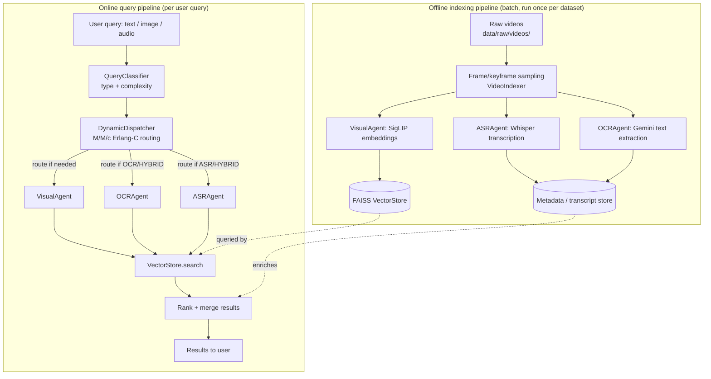
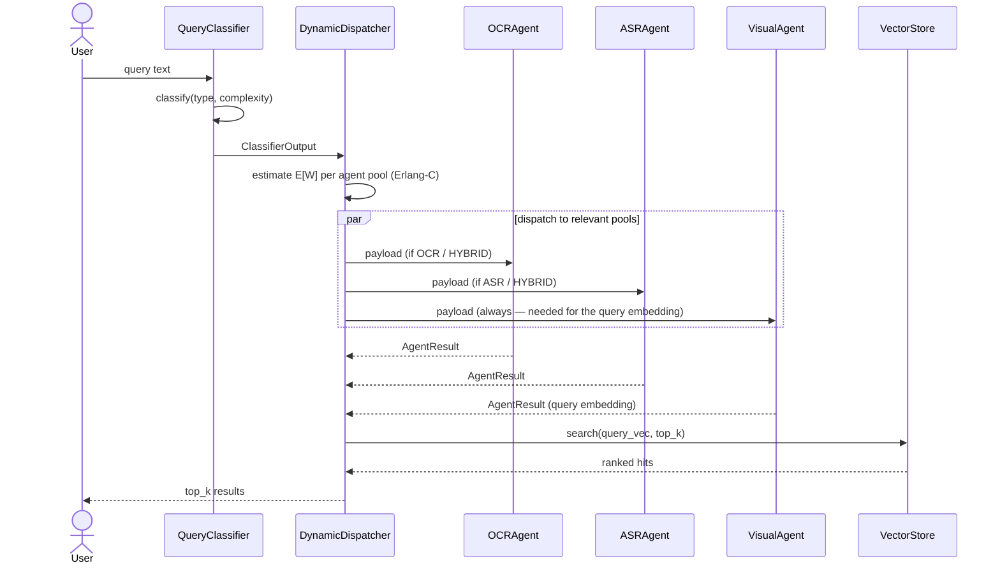
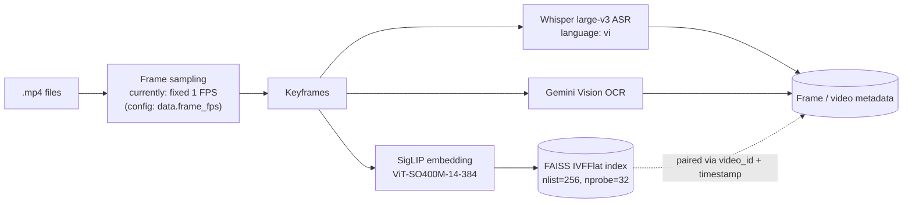
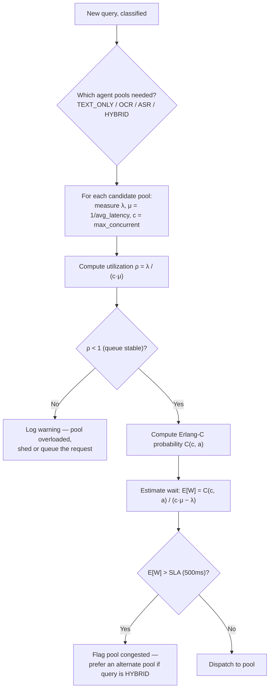

# System Architecture — AIC 2026

This document explains, end to end, what we're building and why. It synthesizes
three sources: the U-CESE paper (`2605.23274v1.pdf`, the AIC 2025 reference
system), the organizers' 2026 training deck
(`Tập-huấn-AIC-2026-Buổi-1.pptx.pdf`), and the official rules at
[aichallenge.hochiminhcity.gov.vn](https://aichallenge.hochiminhcity.gov.vn/) —
reconciled against what's actually in this repo (`README.md`,
`configs/config.yaml`, `src/`). It does not implement anything; it's the shared
mental model before we fill in the `NotImplementedError` stubs.

---

## 1. Competition snapshot

### Task types

| Task | What it asks | What makes it hard |
|---|---|---|
| **KIS** (Known-Item Search) | Find the *one* correct moment. Two variants: **Video-KIS** (shown a 20s clip, must find the same moment) and **Textual-KIS** (given 5 progressive text hints over 5 minutes). | Needs top-1/top-5 precision — being "close" scores zero. |
| **AVS** (Ad-hoc Video Search) | Return *every* moment matching a general description, ranked by relevance. | Breadth, not a single answer — must sweep the whole corpus and rank, not just find one hit. |
| **VQA** (Video Question Answering) | Given a video, answer a natural-language question (often needs counting or ordering reasoning). | Output is a reasoned answer, not a frame — needs an LVLM reasoning step, not just retrieval. |
| **KISC** (Conversational KIS) — **new in 2026** | Multi-turn: the assistant asks clarifying questions back to the user to narrow an ambiguous query before answering. | Needs session state across turns, not a single-shot query. |
| TRAKE (Temporal Alignment) | Order several key moments of one action correctly. | Present in the 2025 rules and paper (Fig. 9); **not shown in the 2026 deck** — treat as unconfirmed for 2026, not guaranteed to appear. |

### The 2026 dataset shift (the most important thing to internalize)

AIC 2025's corpus was **broadcast TV** (1,478 videos / 324 hours across 9 news
and lifestyle programs — see U-CESE Table 1). That data has fixed camera
angles, consistent lighting, and clean anchor-desk narration, which is why
Whisper-transcribed subtitles were such a strong signal for U-CESE.

The 2026 deck explicitly frames the shift as **Surveillance → Sousveillance**:
data is moving from public/official systems (CCTV, traffic cams) toward
**personal, wearable, first-person (egocentric/POV) devices** — smart glasses,
chest cameras, dashcams, action cams, vlogs. The deck's own example: a
5-hour smart-glasses recording of someone shopping, cooking, and talking, and
the assistant has to reconstruct what the person did.

Practical implications for us:
- Footage will be **shakier, with variable lighting** — visual embeddings need
  to be robust to this, not just clean broadcast frames.
- **No reliable narrated audio** to lean on the way TV anchor speech did —
  ASR may pick up ambient noise, cross-talk, or nothing at all.
- Queries lean on **personal/semantic context** (who, relationship, prior
  event) more than object keywords — reinforces the deck's "Big Three"
  point about semantic gap (§3).

### Timeline (2026)

| Milestone | Date |
|---|---|
| Registration opens | mid-May 2026 |
| Registration closes | June 15, 2026 |
| Preliminary content released | June 25, 2026 |
| Training period | June – July 2026 |
| Preliminary round | August 2026 |
| Preliminary results | August 30, 2026 |
| **Final round** | **September 12–26, 2026** |
| Awards | October 2026 |

### Format & eligibility

- Teams of up to 5 (we're 4 — fine).
- Category A: university/AI-field participants. Category B: high schoolers,
  who may use organizer-provided pre-built tools.
- Two competition modes: **Traditional/interactive** (a human drives our tool
  to answer queries) and **Automated** (assistants compete head-to-head with
  no human in the loop). Worth deciding early which mode we're optimizing UI
  for — they have different engineering priorities (fast plausible answers
  vs. a fast human-usable interface).

---

## 2. What U-CESE actually did (the reference system)

U-CESE won't be graded on its own — it's the thing we're studying to avoid
reinventing worse versions of solved problems. Its pipeline in two halves:

**Offline indexing**
1. **DAKE** (Dynamic-Aware Keyframe Extraction) — a *training-free* keyframe
   selector. Instead of a learned shot-boundary model (TransNetV2, AutoShot),
   it tracks how much each frame's **JPEG file size** jumps between
   neighboring frames (compressed size ≈ proxy for motion/texture change),
   and keeps the top-ρ frames by that "steepness" score. Cheap, no GPU
   needed, and tunable (ρ trades recall vs. storage).
2. Keyframes → **MobileCLIP** vision encoder → embeddings → **Milvus**
   (`VisualDB`).
3. Audio → **Whisper** → subtitles.
4. Keyframes + subtitles → **ReCap**: a captioning loop that mimics an RNN —
   each shot's caption is generated by an LVLM (Gemini) conditioned on a
   **memory string carried over from the previous shot**, so captions stay
   consistent about who's who and what's going on across cuts, instead of
   re-describing generic "a man in a red shirt" every time.
5. Subtitles (raw) → **Elasticsearch**; subtitles + captions (embedded) →
   **Milvus** (`TextualDB`).

**Online retrieval**
6. A user's text/image query is embedded (MobileCLIP) and run against both
   `VisualDB` and `TextualDB`.
7. The **Unified Clipping Algorithm** merges hits per video into candidate
   *clips* (not single frames) using a linear two-pointer sweep bounded by a
   max clip length `T`, then ranks clips by (a) how many distinct
   sub-queries they cover, tie-broken by (b) best per-frame similarity.
   This is the paper's core contribution: earlier systems (CESE) ran three
   separate pipelines/UIs per modality; U-CESE unifies them into one ranked
   list.
8. Results render in a web UI with a frame grid, an interactive per-clip
   viewer, and keyboard shortcuts (e.g. Tab to stamp a timestamp) built
   specifically to speed up TRAKE-style multi-moment answers.

The takeaway for us: **the retrieval "algorithm" is only half the system.**
Cheap pre-filtering (DAKE) and a UI built for the actual query format
(TRAKE's Tab-to-stamp shortcut) mattered as much as the embedding model.

---

## 3. The "Big Three" technical challenges

The 2026 deck names three problems every team hits, independent of task type:

| Challenge | What it means | Design implication |
|---|---|---|
| **Semantic gap** | Human queries are abstract ("a cozy moment," "nostalgic scene"); the database is raw pixels. | We need a strong foundation model (CLIP-family) doing the heavy lifting of bridging language ↔ vision — this is *the* justification for `VisualAgent`/SigLIP being central, not optional. |
| **Data sparsity & scale** | A KIS target is often 2–3 seconds inside thousands of hours of footage. Running a heavy model over everything at query time is infeasible. | Must have a cheap, fast **first-pass filter** (embedding search) before any expensive reasoning step (LVLM captioning, VQA reasoning) — never run the expensive model over the whole corpus per query. |
| **Temporal logic constraints** | Order matters: "took off his hat *before* entering" ≠ "entered, *then* took off his hat." Bag-of-keywords matching treats these as identical. | Any TRAKE/VQA reasoning layer needs explicit temporal ordering, not just similarity scoring. |

---

## 4. Target system architecture

Our repo already commits to a specific angle beyond plain retrieval:
**Research Topic 3.1 — routing heterogeneous queries to specialized agent
pools using queuing theory (M/M/c)**, to keep latency predictable as query
volume and agent cost vary. That dispatcher sits *inside* the online path,
in front of the retrieval agents — it decides *which agents to run and how
urgently*, it doesn't replace the retrieval logic itself (that's still
embedding search + ranking, same as U-CESE's Unified Clipping idea, just not
yet built).

One query's journey through the dispatcher, in sequence:

---

## 5. Offline indexing pipeline (detail)

**Known simplification vs. U-CESE:** the scaffold currently samples frames at
a fixed FPS (`config.yaml: data.frame_fps: 1`), not DAKE's adaptive,
motion-aware keyframing. Fixed-FPS is fine to get a working pipeline first,
but it will over-sample static scenes and under-sample fast cuts — worth
revisiting once end-to-end retrieval works, especially given 2026's shakier
egocentric footage where motion is less uniform than broadcast TV.

### Component → file map

| Component | File | Owner | Status |
|---|---|---|---|
| Query type/complexity classifier (rule-based) | `src/routing/classifier.py` | Le Nguyen Khoi | Working (fallback) |
| Query type/complexity classifier (learned MLP) | `src/model.py` (`QueryClassifier`) | Le Nguyen Khoi | Stub |
| M/M/c dispatcher | `src/routing/dispatcher.py` | Le Nguyen Khoi | Stub |
| Base agent (timing, concurrency) | `src/agents/base_agent.py` | Truong Hoang Thong | Stub |
| OCR agent (Gemini) | `src/agents/ocr_agent.py` | Truong Hoang Thong | Stub |
| ASR agent (Whisper) | `src/agents/asr_agent.py` | Truong Hoang Thong | Stub |
| Visual agent (SigLIP) | `src/agents/visual_agent.py` | Truong Hoang Thong | Stub |
| End-to-end inference (`search()`) | `src/inference.py` | Truong Hoang Thong | Stub |
| FAISS vector store | `src/retrieval/vector_store.py` | Pham Viet Truong | Stub |
| Video frame sampling/indexing | `src/retrieval/video_indexer.py` | Pham Viet Truong | Stub |
| Classifier training loop | `src/train.py` | Pham Viet Truong | Stub |
| Dataset/dataloader | `src/data_loader.py` | Pham Huu Huy | Stub |

---

## 6. The M/M/c dispatcher, explained

Each agent pool (OCR / ASR / Visual) is modeled as a queue:

- **λ** — measured arrival rate of requests to that pool (queries/sec)
- **μ** — service rate = 1 / average latency per request
- **c** — number of parallel workers (`max_concurrent` in `config.yaml`)

The dispatcher's job: given a new query, decide which pool(s) to hit and
whether the estimated wait would blow the latency budget
(`dispatcher.sla_latency_ms: 500` in config).

This is genuinely our differentiator versus a plain U-CESE clone: instead of
always running every agent for every query, we route based on *predicted
queueing delay*, which matters once query volume is high (e.g. the
Automated competition mode, or many teammates querying concurrently in
Traditional mode).

---

## 7. Hardware & system requirements

We haven't committed to a specific setup yet, so here's what each tier
unlocks rather than a single mandate.

| Tier | What it handles | What it can't do |
|---|---|---|
| **CPU-only laptop** | `QueryClassifier` inference, FAISS search *once embeddings already exist*, UI/dispatcher logic dev and testing. | Cannot generate SigLIP embeddings or run Whisper `large-v3` at usable speed over hundreds of hours of video — indexing would take days. |
| **Recommended: single consumer GPU, 8–12GB+ VRAM** (e.g. RTX 3060/4070) | Local batch indexing: SigLIP `ViT-SO400M-14-384` embedding generation and Whisper `large-v3` transcription at reasonable throughput. This is enough for iterative development on a training-period-sized subset. | Full-corpus indexing (hundreds of hours) will still take hours to a day or more, depending on how much of the pipeline runs in parallel. |
| **Cloud/burst option** (RunPod, Colab Pro, GCP/AWS spot GPU) | Use for the one-time full-dataset indexing pass close to the preliminary/final rounds, when the corpus is finalized and needs to be indexed on a deadline. | Costs money per GPU-hour — budget it as a short burst, not an always-on service. |

**Storage:** raw video + extracted keyframes + embeddings + the FAISS index
all need disk. As a reference point, AIC 2025's corpus was 324 hours / 1,478
videos; 2026's is likely comparable or larger given the added
sousveillance/egocentric sources. Keyframes and embeddings are much smaller
than raw video, but plan for raw video alone to be the dominant storage
cost — worth checking actual dataset size as soon as it's released
(June 25, 2026) before assuming a number.

**API cost:** the OCR agent calls Gemini per image. If we follow U-CESE's
approach of processing every keyframe (not just OCR'able ones), that cost
scales linearly with keyframe count — worth capacity-planning once we know
roughly how many keyframes the corpus will produce, or limiting Gemini OCR
calls to keyframes where fast local heuristics suggest text is present.

---

## 8. Software/infrastructure stack

| Role | Our scaffold (`requirements.txt`) | U-CESE's choice | Why ours is a reasonable substitute |
|---|---|---|---|
| Visual embedding | SigLIP `ViT-SO400M-14-384` (via `open-clip-torch`) | MobileCLIP | SigLIP is a strong, well-supported CLIP-family model; MobileCLIP's edge is being lighter-weight for on-device use, which isn't a constraint we have (we're not shipping to mobile). |
| ASR | Whisper `large-v3`, local | Whisper (unspecified size) | Same model family; `large-v3` trades speed for accuracy — fine given ASR reliability is already weaker on 2026's egocentric audio (§1). |
| OCR | Gemini Vision API | PARSeq (Vietnamese fine-tuned) / DeepSolo | API-based is simpler for a 4-person team to stand up than fine-tuning an OCR model, at the cost of per-call API pricing (§7). |
| Vector store | FAISS (`faiss-cpu`, IVFFlat) | Milvus | FAISS is simpler to self-host for a single-team, single-index use case; Milvus's advantage is multi-collection/distributed scale, which isn't needed here. |
| Text search | *(not yet in scaffold)* | Elasticsearch | Gap — see §9; U-CESE used this for raw-text/keyword search alongside embedding search. |
| Captioning (LVLM) | *(not yet in scaffold)* | Gemini via ReCap | Gap — see §9. |

---

## 9. Coverage gaps vs. 2026 task types

This is the actionable part: what Sprint 3/4 needs to add on top of the
current stubs to actually answer competition queries, not just route them.

| Task | Current scaffold coverage | What's missing |
|---|---|---|
| **KIS** | Closest match — `VectorStore.search` + agents give single-hit top-k retrieval once implemented. | Nothing structural; just needs the stubs filled in. |
| **AVS** | Partial — FAISS `search(top_k)` returns a ranked list already, which is AVS's basic shape. | Needs corpus-wide sweep semantics (not just top-k from one query embedding) and probably higher `top_k`/different ranking than KIS's precision-focused top-1. |
| **VQA** | Not covered. | Needs an LVLM reasoning step *after* retrieval — retrieve the relevant moment, then ask an LVLM (Gemini or similar) the actual question against that clip. This is a new component, not in `src/` yet. |
| **KISC** | Not covered. | Needs multi-turn session state (remember prior turns, narrow the search incrementally) — the current `search()` in `inference.py` is single-shot. |
| **TRAKE** (if it appears) | Not covered. | U-CESE's answer was mostly UI (Tab-to-stamp keyboard shortcut for multi-moment answers) rather than a model change — cheap to add once the base UI exists. |

Recommendation: treat filling the existing stubs (KIS-shaped retrieval) as
the Sprint 1–2 goal per the README's plan, since everything else builds on
it — then use Sprint 3–4 to decide, as a team, which of AVS/VQA/KISC to
prioritize based on how the preliminary round's task mix looks once content
is released (June 25, 2026).

---

## 10. Query-tactics playbook (for whoever operates the UI)

From the training deck's worked examples — these are usage patterns, not
architecture, but worth knowing since they shape what the UI needs to
support:

- **Narrow progressively, most-certain signal last.** Time → location →
  subject → scene, roughly in order of how much each filters the search
  space (deck's case studies: filter by location first, then query by
  description).
- **Try multiple phrasings of the same concept** before assuming "no
  match" — semantic gap means one phrasing can miss what another catches.
- **State temporal order explicitly in queries** ("before X" vs "after X")
  since retrieval that ignores order will treat both as equally relevant
  (§3).
- **Use visual similarity re-search**: once one plausible hit is found,
  searching by *image* similarity to that hit (not just text) often surfaces
  the real target faster than refining the text query further.
