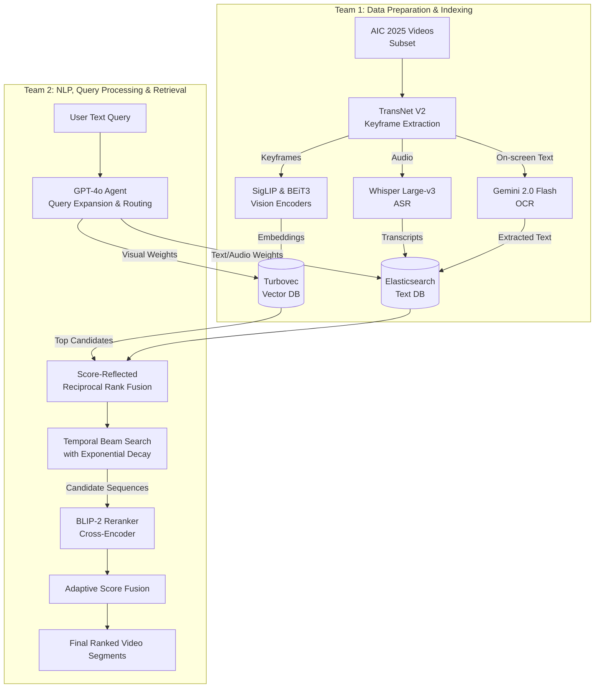

# System Architecture — AIC 2026

This document defines the cutting-edge Multimodal Retrieval Architecture for the AI Challenge 2026, based on the U-CESE evolution ("Cascaded Embedding-Reranking and Temporal-Aware Score Fusion") and official competition guidelines.

---

## 1. Competition Snapshot & The Data Shift

The AIC 2026 dataset represents a massive shift from **Surveillance** (fixed CCTV, clean broadcast TV) to **Sousveillance** (wearable, first-person, egocentric POV cameras like smart glasses or action cams).

**Practical Implications:**
- **Shaky & Variable Video:** We cannot rely on clean, static frames. Visual embeddings must be robust.
- **Noisy Audio:** Unlike TV news anchors, egocentric audio has wind noise, cross-talk, and silence.
- **The "Big Three" Challenges:**
  1. **Semantic Gap:** Human queries are abstract; pixels are raw data.
  2. **Data Sparsity & Scale:** Finding a 2-second clip in hundreds of hours of video requires an extremely fast initial filter (embedding search).
  3. **Temporal Logic Constraints:** The order of events matters ("entering a room, then taking off a hat"). Standard search ignores this.

---

## 2. The Agentic Architecture Pipeline

We have abandoned the legacy M/M/c queuing system in favor of a modern **Agent-guided Multimodal Pipeline** with **Temporal Event Reasoning**.

### Phase 1: Offline Indexing (Team 1)
1. **Keyframe Extraction:** Uses **TransNet V2** for highly accurate shot-boundary detection to handle shaky egocentric footage.
2. **Cascaded Dual-Encoders:** Frames are embedded using BOTH **SigLIP** (for broad generalization) and **BEiT-3** (for high semantic precision).
3. **Audio & Text:** **Whisper Large-v3** transcribes spoken words (ASR). **Gemini 2.0 Flash** extracts on-screen text (OCR).
4. **Storage:** Image embeddings are stored in **Turbovec**. Text/Audio transcripts are indexed in **Elasticsearch**.

### Phase 2: Online Retrieval (Team 2)
1. **Agentic Query Decomposition:** A user submits a complex query. **GPT-4o** expands it into 4 variations and dynamically routes the importance weights between Visual, OCR, and ASR modalities.
2. **Parallel Search:** The system queries Elasticsearch and Turbovec simultaneously.
3. **Temporal Beam Search:** *This solves the Temporal Logic Constraint.* Using a **Beam Search** algorithm with an **Exponential Decay** penalty (`exp(-alpha * dt)`), the system stitches together isolated frames into a coherent storyline, penalizing frames that are chronologically too far apart.
4. **Fine-grained Reranking:** The top candidate sequences are passed through a **BLIP-2** cross-encoder for precise image-text matching.
5. **Adaptive Score Fusion:** The final scores are normalized (Min-Max) and fused based on the weights assigned by GPT-4o.

---

## 3. Core Tech Stack (The Two Databases)

You only need **TWO** databases for this entire system:

- **Vector Database (turbovec):** Python bindings for Rust.
  - *What goes in it:* The mathematical representations (vectors) of your images generated by `SigLIP` and `BEiT-3`.
  - *Why you need it:* To find scenes based on visual similarity. Uses Google's TurboQuant algorithm for 16x memory compression (e.g., 31GB shrinks to 4GB) without requiring a pre-training step like FAISS. Supports real-time online ingestion.
- **Text Database (Elasticsearch):** Running via Docker.
  - *What goes in it:* The actual text extracted from the video (spoken words from `Whisper` ASR and on-screen text from `Gemini` OCR).
  - *Why you need it:* Vector DBs are bad at exact keyword matching. Elasticsearch instantly finds exact words (e.g., a specific jersey number or a name on a billboard) using BM25 and fuzzy matching.

- **Keyframe Extraction:** `transnetv2`.
- **Vision Models:** `open_clip` (SigLIP) and `transformers` (BEiT-3, BLIP-2).
- **LLM/Generative Agents:** `openai` (GPT-4o) and `google-genai` (Gemini 2.0 Flash).
- **Unified App (Backend & UI):** `Streamlit`. Streamlit will handle both the Web UI and the Python backend logic (querying the databases, running GPT-4o, etc.). This simplifies the architecture immensely for a competition setting.

---

## 4. The 2-Team Vibe Coding Split (Data vs. NLP/Query)

Your team's strategy is a classic and highly effective approach: **Data Engineering vs. Search Engineering**.

### 🗄️ Team 1: Data Preparation & Indexing (The "Backend")
**Focus:** Build the searchable databases using a sample dataset.
- Download a small sample (e.g., 5-10 videos) from the **AIC 2025 dataset** to bootstrap development since the 2026 dataset isn't public yet.
- Extract keyframes from this subset using `TransNet V2`.
- Run models (`SigLIP`, `BEiT-3`, `Whisper`, `Gemini OCR`) to generate embeddings and text.
- Insert this sample data into **Turbovec** (for vectors) and **Elasticsearch** (for text).
- *Goal:* Provide Team 2 with fully populated, working databases to query against.

### 🧠 Team 2: NLP, Query Processing & Retrieval (The "Brain")
**Focus:** Understand the user's text and fetch the right data.
- Build the unified `Streamlit` Web Interface.
- Handle the raw text input from the user.
- Build the **NLP Pipeline**: Use `GPT-4o` to expand the query, decompose it into visual/text/audio components, and assign routing weights.
- Write the search algorithms to query the databases that Team 1 built.
- Handle the complex Temporal Beam Search algorithm and Reranking logic to return the final results.
