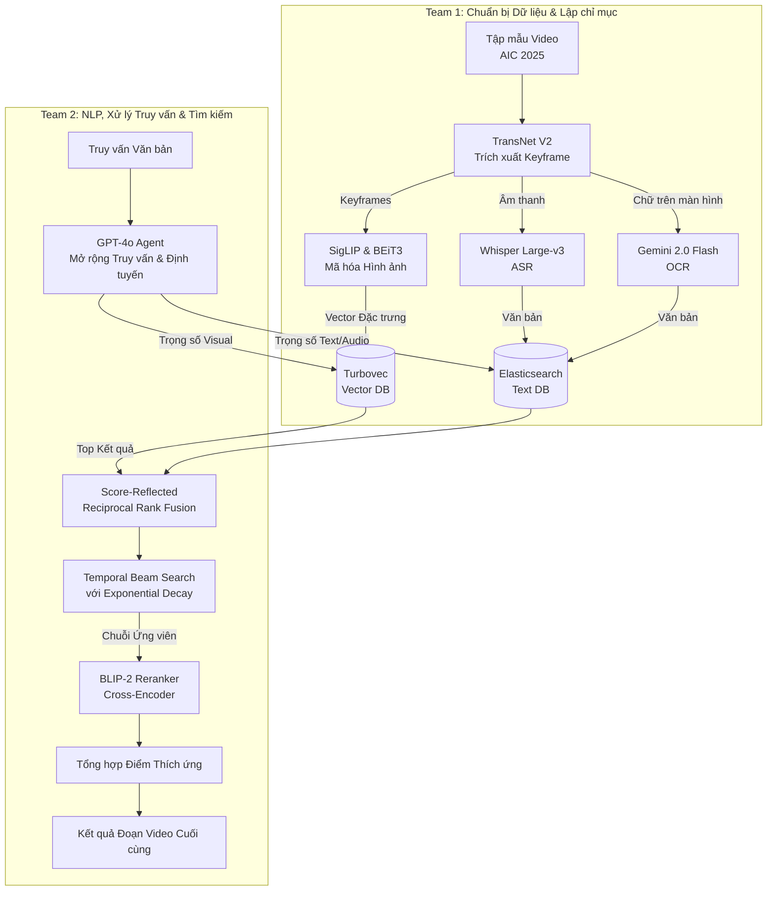

# Kiến trúc Hệ thống — AIC 2026

Tài liệu này định nghĩa Kiến trúc Truy xuất Đa phương thức tiên tiến cho cuộc thi AI Challenge (AIC) 2026, dựa trên sự phát triển của hệ thống tham chiếu ("Cascaded Embedding-Reranking and Temporal-Aware Score Fusion") và các tài liệu hướng dẫn chính thức từ Ban tổ chức.

---

## 1. Tổng quan Cuộc thi & Sự thay đổi Dữ liệu

Dữ liệu của AIC 2026 thể hiện một sự dịch chuyển lớn từ **Surveillance** (Giám sát công cộng, camera an ninh tĩnh, tin tức truyền hình) sang **Sousveillance** (Góc nhìn thứ nhất/Ego-centric từ các thiết bị đeo cá nhân như kính thông minh, camera hành trình).

**Hệ quả thực tế:**
- **Video rung lắc & Không ổn định:** Không thể dựa vào các khung hình tĩnh, sạch sẽ. Embedding hình ảnh phải thật sự mạnh mẽ.
- **Âm thanh nhiễu (Noisy Audio):** Khác với giọng đọc chuẩn của biên tập viên truyền hình, âm thanh đời thường có lẫn tiếng gió, tiếng ồn môi trường và sự im lặng.
- **Ba Thách thức Cốt lõi (The Big Three):**
  1. **Khoảng cách Ngữ nghĩa (Semantic Gap):** Truy vấn của con người mang tính trừu tượng; pixel chỉ là dữ liệu thô.
  2. **Dữ liệu thưa thớt & Quy mô lớn:** Việc tìm kiếm một đoạn clip 2 giây trong hàng trăm giờ video đòi hỏi một bộ lọc ban đầu cực kỳ nhanh.
  3. **Ràng buộc Logic Thời gian:** Thứ tự của hành động rất quan trọng ("bước vào phòng rồi mới cởi mũ" khác với "cởi mũ rồi mới bước vào"). Tìm kiếm thông thường bỏ qua yếu tố này.

---

## 2. Đường ống Kiến trúc Dựa trên Agent (Agentic Architecture)

Chúng ta đã loại bỏ hệ thống hàng đợi M/M/c cũ để chuyển sang một **Đường ống Đa phương thức Dẫn dắt bởi Agent (Agent-guided)** kết hợp với **Suy luận Chuỗi sự kiện Thời gian (Temporal Event Reasoning)**.

### Pha 1: Tiền xử lý & Lập chỉ mục (Team 1)
1. **Trích xuất Keyframe:** Sử dụng **TransNet V2** để phát hiện chuyển cảnh chính xác, xử lý tốt các video rung lắc góc nhìn thứ nhất.
2. **Bộ mã hóa Kép (Cascaded Dual-Encoders):** Hình ảnh được mã hóa bằng CẢ HAI mô hình: **SigLIP** (tìm kiếm diện rộng) và **BEiT-3** (độ chính xác ngữ nghĩa cao).
3. **Âm thanh & Văn bản:** **Whisper Large-v3** chuyển đổi giọng nói thành văn bản (ASR). **Gemini 2.0 Flash** trích xuất chữ viết xuất hiện trên màn hình (OCR).
4. **Lưu trữ:** Vector hình ảnh được lưu vào **Turbovec**. Dữ liệu văn bản và âm thanh được lưu vào **Elasticsearch**.

### Pha 2: Tìm kiếm Thời gian thực (Team 2)
1. **Phân rã Truy vấn bởi Agent:** Người dùng nhập một câu truy vấn phức tạp. **GPT-4o** sẽ mở rộng nó thành 4 biến thể và phân bổ trọng số động cho các luồng Visual, OCR, và ASR.
2. **Tìm kiếm Song song:** Hệ thống quét trên cả Elasticsearch và Turbovec cùng một lúc.
3. **Tìm kiếm Chuỗi Thời gian (Temporal Beam Search):** *Đây là bước giải quyết Ràng buộc Logic Thời gian.* Sử dụng thuật toán **Beam Search** với hình phạt **Huy giảm Hàm mũ (Exponential Decay)** `exp(-alpha * dt)`, hệ thống sẽ kết nối các khung hình rời rạc thành một chuỗi sự kiện liền mạch, đồng thời trừ điểm các khung hình có khoảng cách thời gian quá xa nhau.
4. **Tái xếp hạng Tinh chỉnh (Reranking):** Các chuỗi kết quả tiềm năng nhất được đưa qua mô hình cross-encoder **BLIP-2** để đối chiếu chéo hình ảnh và văn bản với độ chính xác cao nhất.
5. **Tổng hợp Điểm số Thích ứng (Adaptive Score Fusion):** Điểm số cuối cùng được chuẩn hóa (Min-Max) và kết hợp dựa trên trọng số mà GPT-4o đã phân bổ.

---

## 3. Công nghệ Cốt lõi (Hai Cơ sở Dữ liệu)

Bạn chỉ cần **HAI** cơ sở dữ liệu cho toàn bộ hệ thống này:

- **Vector Database (turbovec):** Thư viện Rust có giao tiếp Python.
  - *Lưu trữ gì:* Các biểu diễn toán học (vector) của hình ảnh do `SigLIP` và `BEiT-3` tạo ra.
  - *Lý do:* Để tìm kiếm cảnh dựa trên sự tương đồng về mặt hình ảnh. Sử dụng thuật toán TurboQuant của Google, đạt mức nén bộ nhớ 16x (thu nhỏ 31GB xuống 4GB) mà không cần huấn luyện (training) như FAISS.
- **Text Database (Elasticsearch):** Chạy thông qua Docker.
  - *Lưu trữ gì:* Toàn bộ văn bản trích xuất từ video (lời thoại từ `Whisper` ASR và chữ trên màn hình từ `Gemini` OCR).
  - *Lý do:* Vector DB rất kém trong việc tìm kiếm từ khóa chính xác. Elasticsearch sẽ tìm ngay lập tức các từ khóa chính xác (ví dụ: số áo cầu thủ hoặc tên trên biển quảng cáo) bằng thuật toán BM25 và fuzzy matching.

- **Trích xuất Keyframe:** `transnetv2`.
- **Mô hình Thị giác:** `open_clip` (SigLIP) và `transformers` (BEiT-3, BLIP-2).
- **LLM/Generative Agents:** `openai` (GPT-4o) và `google-genai` (Gemini 2.0 Flash).
- **Ứng dụng Hợp nhất (Backend & UI):** `Streamlit`. Streamlit sẽ đóng vai trò vừa là giao diện Web, vừa là backend Python xử lý logic (truy vấn DB, chạy GPT-4o, v.v.). Điều này giúp tối giản kiến trúc rất nhiều cho môi trường thi đấu.

---

## 4. Phân chia Công việc cho 2 Team (Dữ liệu vs. NLP/Truy vấn)

Chiến lược của nhóm bạn là một cách tiếp cận kinh điển và cực kỳ hiệu quả: **Kỹ sư Dữ liệu (Data) vs. Kỹ sư Tìm kiếm (Search)**.

### 🗄️ Team 1: Chuẩn bị Dữ liệu & Lập chỉ mục (Data Preparation)
**Mục tiêu:** Xây dựng cơ sở dữ liệu có thể tìm kiếm được bằng cách sử dụng một tập dữ liệu mẫu.
- Tải một tập mẫu nhỏ (ví dụ: 5-10 video) từ **tập dữ liệu AIC 2025** để bắt đầu phát triển trong khi chờ dữ liệu 2026.
- Trích xuất keyframes từ tập này bằng `TransNet V2`.
- Chạy các mô hình (`SigLIP`, `BEiT-3`, `Whisper`, `Gemini OCR`) để tạo ra vector đặc trưng và văn bản.
- Đưa tập dữ liệu mẫu này vào cơ sở dữ liệu **Turbovec** (cho vector) và **Elasticsearch** (cho văn bản).
- *Kết quả cuối cùng:* Cung cấp cho Team 2 các cơ sở dữ liệu đã có sẵn dữ liệu để họ chạy thử thuật toán truy vấn.

### 🧠 Team 2: Xử lý Ngôn ngữ Tự nhiên (NLP) & Truy vấn (Querying)
**Mục tiêu:** Hiểu văn bản của người dùng và lấy ra dữ liệu chính xác.
- Xây dựng Ứng dụng Giao diện Web hợp nhất bằng `Streamlit`.
- Tiếp nhận đầu vào bằng văn bản (text query) từ người dùng.
- Xây dựng **Đường ống NLP**: Sử dụng `GPT-4o` để mở rộng câu hỏi, phân rã nó thành các thành phần hình ảnh/âm thanh/chữ viết, và gán trọng số.
- Viết các thuật toán truy vấn vào cơ sở dữ liệu do Team 1 xây dựng.
- Xử lý thuật toán Toán học Thời gian (Temporal Beam Search) và logic Tái xếp hạng (Reranking) để trả về kết quả cuối cùng.
