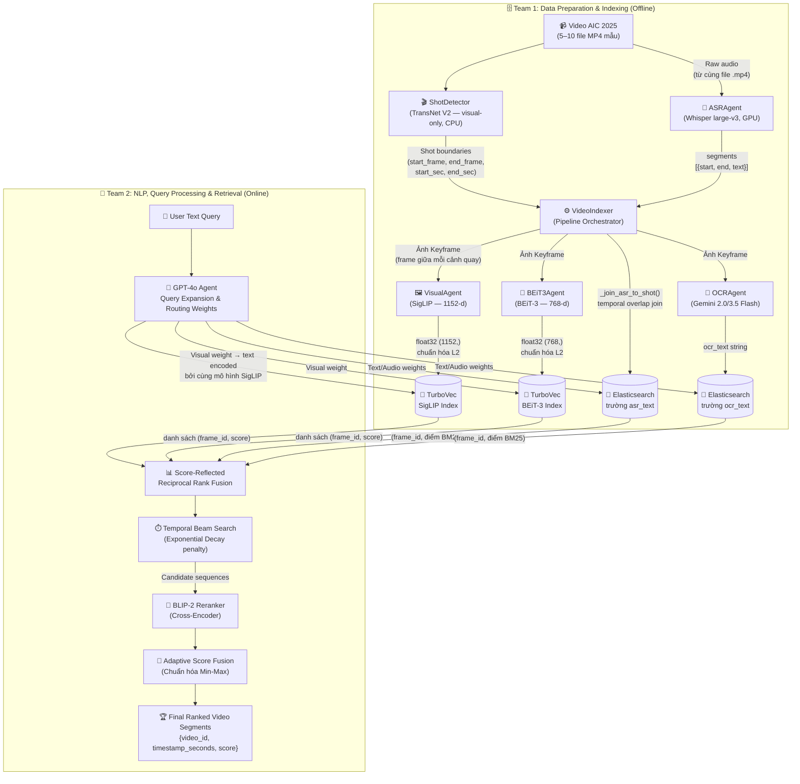

# Kiến trúc Hệ thống — AIC 2026

Tài liệu này định nghĩa Kiến trúc Truy xuất Đa phương thức (Multimodal Retrieval Architecture) cho cuộc thi AI Challenge 2026, dựa trên hệ thống tham chiếu ("Cascaded Embedding-Reranking and Temporal-Aware Score Fusion") và các hướng dẫn chính thức từ Ban tổ chức.

---

## 1. Tổng quan Cuộc thi & Sự thay đổi Dữ liệu

Dữ liệu AIC 2026 thể hiện một sự dịch chuyển lớn từ **Surveillance** (camera an ninh cố định, tin tức truyền hình góc quay tĩnh) sang **Sousveillance** (góc nhìn thứ nhất / Ego-centric từ các thiết bị cá nhân đeo trên người như kính thông minh, camera hành trình).

**Hệ quả thực tế:**
- **Video rung lắc & Biến động:** Không thể dựa vào các khung hình tĩnh, sạch sẽ. Visual embeddings phải thật sự robust.
- **Âm thanh nhiều tiếng ồn (Noisy Audio):** Khác với giọng biên tập viên truyền hình, âm thanh ego-centric lẫn tiếng gió, tiếng ồn môi trường và nhiều khoảng im lặng.
- **Ba Thách thức Cốt lõi (The "Big Three" Challenges):**
  1. **Semantic Gap:** Truy vấn của con người mang tính trừu tượng; pixel chỉ là dữ liệu thô.
  2. **Data Sparsity & Scale:** Tìm một đoạn clip 2 giây trong hàng trăm giờ video đòi hỏi một bộ lọc ban đầu (embedding search) cực kỳ nhanh.
  3. **Temporal Logic Constraints:** Thứ tự thời gian của các hành động rất quan trọng ("bước vào phòng rồi mới cởi mũ"). Tìm kiếm thông thường bỏ qua yếu tố này.

---

## 2. Các Nhóm Chức năng (GitNexus Clusters)

Codebase được tổ chức thành **3 functional clusters** được xác định qua phân tích tĩnh:

| Cluster | Symbols | Cohesion | Vai trò |
|:---|:---:|:---:|:---|
| **Agents** | 22 | 97% | Tất cả model wrappers (SigLIP, BEiT-3, Whisper, Gemini, BaseAgent) |
| **Retrieval** | 15 | 86% | Shot boundary detection, video indexing pipeline, TurboVec store, Elasticsearch store |
| **Routing** | 9 | 100% | Query classifier, rule-based classify, dynamic dispatcher |

### 🧩 A. Agents (Cohesion: 97%)
- **BaseAgent:** Abstract base class cung cấp cơ chế kiểm soát đồng thời `asyncio.Semaphore` và tự động đo latency bằng `time.perf_counter`.
- **VisualAgent:** Mã hóa cả **hình ảnh lẫn văn bản** vào chung một không gian embedding 1152 chiều bằng **SigLIP ViT-SO400M-14-384** (`open_clip`). Không gian chung này giúp câu truy vấn dạng văn bản tìm thấy các khung hình tương đồng.
- **BEiT3Agent:** Bộ mã hóa **chỉ dành cho hình ảnh** 768 chiều bằng **BEiT-3 base_patch16_224** (`timm`). Được nạp dưới dạng mô hình phân loại ảnh với phần đầu phân loại (classification head) bị loại bỏ.
- **ASRAgent:** Chạy **Whisper large-v3** cục bộ; trả về `{text, segments[{start, end, text}]}`.
- **OCRAgent:** Gọi **API Gemini 2.0/3.5 Flash**; trả về văn bản trích xuất dưới dạng chuỗi (plain string).

### 🗄️ B. Retrieval & Storage (Cohesion: 86%)
- **ShotDetector:** Bọc mô hình **TransNet V2** (buộc chạy trên CPU qua TensorFlow device masking) để phát hiện ranh giới cảnh quay hình ảnh (shot boundaries). Xuất ra các đối tượng `Shot(start_frame, end_frame, start_sec, end_sec)` có hỗ trợ cache.
- **VideoIndexer:** Bộ điều phối offline pipeline. Phối hợp tất cả các agent và ghi dữ liệu vào cả hai store.
- **TurbovecStore:** Chỉ mục vector nén 4-bit (sử dụng thuật toán TurboQuant). Duy trì một file JSON sidecar để ánh xạ giữa `frame_id ↔ uint64 handle` vì Turbovec chỉ chấp nhận ID dạng số nguyên nội bộ. Hệ thống dùng hai store riêng biệt — một store cho SigLIP (1152-d) và một store cho BEiT-3 (768-d).
- **ElasticsearchStore:** Kho lưu trữ văn bản dạng chỉ mục đảo ngược (inverted-index). Dùng `frame_id` làm document `_id` của Elasticsearch để hỗ trợ thao tác upsert/lookup đạt tốc độ O(1).

### 🧠 C. Routing & Classification (Cohesion: 100%)
- **rule_based_classify:** Phân loại loại câu hỏi bằng từ khóa regex ở Phase 1 (`QueryType`: TEXT_ONLY, OCR, ASR, HYBRID).
- **QueryClassifier:** MLP (3 lớp: input → 256 → 128 → output) để phân loại câu hỏi ở Phase 2 (sau khi có dữ liệu training).
- **DynamicDispatcher:** Ánh xạ `QueryType` sang danh sách các agent cần chạy và thực thi song song bằng `asyncio.gather`.

---

## 3. Đường ống Kiến trúc Agentic (Agentic Pipeline)

Hệ thống đã loại bỏ cơ chế hàng đợi M/M/c cũ để chuyển sang **Agent-guided Multimodal Pipeline** kết hợp với **Temporal Event Reasoning**.

> **Lưu ý về sơ đồ:** TransNet V2 là bộ phát hiện ranh giới cảnh quay **chỉ dựa trên hình ảnh (visual-only)**.
> Node `Whisper ASR` nhận **file video thô** trực tiếp từ bộ điều phối `VideoIndexer` —
> **không phải từ TransNet V2**. Các mốc thời gian (timestamp) của TransNet V2 được dùng
> *sau đó* để ánh xạ các đoạn văn bản Whisper vào từng cảnh quay tương ứng qua hàm `_join_asr_to_shot()`.



### Phase 1: Offline Indexing (Team 1)
1. **Shot Boundary Detection:** `ShotDetector` chạy **TransNet V2** (chỉ xử lý hình ảnh) để xác định vị trí chuyển cảnh, tạo ra các đối tượng `Shot` với số frame và mốc thời gian tính bằng giây.
2. **Keyframe Extraction:** `VideoIndexer` lấy frame ở giữa mỗi cảnh quay qua một lần giải mã tuần tự `cv2.VideoCapture` (không dùng seek từng frame vì không đáng tin cậy trên nhiều cấu trúc H.264 GOP).
3. **ASR — Âm thanh Toàn video:** `ASRAgent` (Whisper large-v3) transcribes toàn bộ âm thanh của video một lần. Các segment văn bản sau đó được ánh xạ vào từng cảnh quay qua `_join_asr_to_shot()` dựa trên logic chồng lấp thời gian.
4. **Vision Encoding (Dual):** Mỗi ảnh keyframe được mã hóa bởi **VisualAgent** (SigLIP, 1152-d) và **BEiT3Agent** (BEiT-3, 768-d). Cả hai vector đều được chuẩn hóa L2 trước khi lưu trữ.
5. **OCR:** Mỗi ảnh keyframe được gửi tới **Gemini OCR** để trích xuất văn bản xuất hiện trên màn hình.
6. **Storage:** Vector SigLIP + BEiT-3 → hai chỉ mục `TurbovecStore`. Văn bản ASR + OCR + timestamp → `ElasticsearchStore` với `frame_id` là document `_id`.

### Phase 2: Online Retrieval (Team 2)
1. **Agentic Query Decomposition:** Người dùng gửi một truy vấn phức tạp. **GPT-4o** mở rộng nó thành 4 biến thể và phân bổ trọng số động cho các luồng Visual, OCR, ASR.
2. **Parallel Search:** Hệ thống truy vấn song song Elasticsearch và cả hai TurboVec store cùng lúc.
3. **Temporal Beam Search:** Giải quyết Ràng buộc Logic Thời gian. Thuật toán **Beam Search** với hình phạt **Exponential Decay** `exp(-alpha * dt)` kết nối các frame rời rạc thành chuỗi sự kiện liền mạch, trừ điểm những frame có khoảng cách thời gian quá xa nhau.
4. **Fine-grained Reranking:** Các chuỗi ứng viên tiềm năng nhất được đưa qua cross-encoder **BLIP-2** để đối chiếu hình ảnh và văn bản với độ chính xác cao nhất.
5. **Adaptive Score Fusion:** Điểm số cuối cùng được chuẩn hóa Min-Max và kết hợp theo trọng số GPT-4o phân bổ.

---

## 4. Các Luồng Thực thi Chính (GitNexus Traces)

12 luồng thực thi chính được trích xuất từ đồ thị lời gọi tĩnh:

### Luồng 1 — Offline Indexing: `_build_and_run → _get_fps` *(cross-community)*
```
_build_and_run (video_indexer.py)
  └─ index_directory (video_indexer.py)
       └─ index_video (video_indexer.py)
            └─ _get_fps (shot_detector.py)
```
Lệnh thực thi CLI: `python -m src.retrieval.video_indexer --config configs/config.yaml`

### Luồng 2 — Offline Indexing: `_build_and_run → _grab_frames` *(cross-community)*
```
_build_and_run → index_directory → index_video → _grab_frames
```
Giải mã frame tuần tự qua `cv2.VideoCapture` trên tất cả các điểm giữa cảnh quay.

### Luồng 3 — Offline Indexing: `_build_and_run → _transcribe` *(cross-community)*
```
_build_and_run → index_directory → index_video → _transcribe
```
Chạy Whisper trên toàn bộ âm thanh video thô. Kết quả được giữ trong bộ nhớ, sau đó ghép vào các cảnh quay.

### Luồng 4 — Offline Indexing: `_build_and_run → _extract_text` *(cross-community)*
```
_build_and_run → index_directory → index_video → _extract_text
```
Gọi `OCRAgent.process(keyframe_path)` cho mỗi keyframe và lưu kết quả vào document ES.

### Luồng 5 — Truy vấn Trực tuyến: `Evaluate → rule_based_classify` *(intra-community)*
```
evaluate (eval.py)
  └─ search (inference.py)
       └─ _search_async (inference.py)
            └─ rule_based_classify (classifier.py)
```

### Luồng 6 — Truy vấn Trực tuyến: `Evaluate → Dispatch` *(intra-community)*
```
evaluate → search → _search_async → dispatch (dispatcher.py)
```

### Luồng 7 — Truy vấn Trực tuyến: `Evaluate → _hybrid_rerank` *(intra-community)*
```
evaluate → search → _search_async → _hybrid_rerank (inference.py)
```
Kết hợp điểm cosine từ TurboVec với điểm BM25 từ Elasticsearch.

### Luồng 8 — Kiểm tra: `_check_frame → _run` *(intra-community)*
```
_check_frame (verify_index.py)
  └─ process (base_agent.py)
       └─ _run (base_agent.py)
```
Dùng bởi `scripts/verify_index.py` để xác nhận dữ liệu bàn giao từ Team 1 sang Team 2.

---

## 5. Công nghệ Cốt lõi

### Khóa Chính: `frame_id`
```
frame_id = "{video_id}_{frame_index:06d}"
Ví dụ:     L01_V001_000145
```
Được dùng làm khóa trong **cả hai** TurboVec (qua JSON sidecar) và Elasticsearch (làm `_id`), đồng thời là tên file ảnh trên đĩa. Tất cả join cross-store là tra cứu dict O(1) trên chuỗi này.

### Hai Cơ sở Dữ liệu

| | TurboVec (×2 instance) | Elasticsearch |
|:---|:---|:---|
| **Lưu trữ** | Vector số thực (hình ảnh) | Văn bản (ASR + OCR) + metadata |
| **Loại chỉ mục** | ANN nén 4-bit (TurboQuant) | Chỉ mục đảo ngược (BM25) |
| **Files trên đĩa** | `*.tvim` + `*.sidecar.json` | Docker volume `es_data` |
| **Kết quả truy vấn** | `[(frame_id, cosine_score)]` | `[(frame_id, BM25_score)]` |
| **Tại sao 2 TurboVec?** | SigLIP (1152-d) and BEiT-3 (768-d) có số chiều khác nhau; một chỉ mục mỗi bộ mã hóa |

### Danh sách Thư viện / Mô hình chính

| Mục đích | Thư viện / Mô hình |
|:---|:---|
| Shot boundary detection | `transnetv2`, `tensorflow` (buộc CPU) |
| Frame decode | `opencv-python` (`cv2.VideoCapture`) |
| Visual embedding | `open-clip-torch`, SigLIP `ViT-SO400M-14-384` |
| Vision-only embedding | `timm`, BEiT-3 `beit3_base_patch16_224.in22k_ft_in1k` |
| ASR | `openai-whisper`, `large-v3` |
| OCR | `google-genai`, Gemini 2.0/3.5 Flash |
| Vector store | `turbovec` (Rust, nén 4-bit TurboQuant) |
| Text store | `elasticsearch>=8.13` |
| Reranking (Phase 2) | `transformers`, BLIP-2 |
| LLM query expansion (Phase 2) | `openai`, GPT-4o |
| Web UI | `streamlit` |

---

## 6. Phân chia Công việc Hai Team

```
Team 1 (Data & Indexing)          Team 2 (NLP & Retrieval)
─────────────────────────         ────────────────────────────
Pham Viet Truong                  Le Nguyen Khoi
Pham Huu Huy                      Truong Hoang Thong

Owns:                             Owns:
  src/agents/         ← shared →    src/agents/ (chế độ text)
  src/retrieval/                    src/routing/
  scripts/                          src/inference.py
  configs/config.yaml               src/eval.py
                                    src/ui/app.py

Delivers:                         Consumes:
  data/index/turbovec/siglip.*      TurboVec stores (đọc)
  data/index/turbovec/beit3.*       Chỉ mục Elasticsearch (đọc)
  Chỉ mục Elasticsearch               data/keyframes/**/*.jpg
  data/keyframes/**/*.jpg
```
