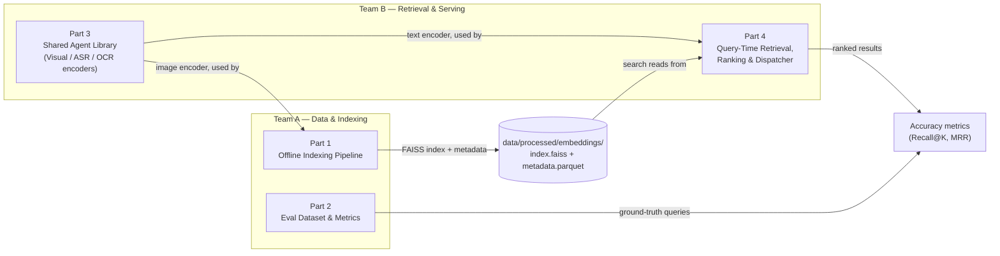

# Implementation & Integration Plan — Preliminary Round

Companion to `docs/ARCHITECTURE.md` (system-level "why"). This document is
the "how to build it without the two teams' work failing to merge" — exact
libraries per step, exact interface contracts, exact database schema.

**Governing principle:** the preliminary round is graded on **accuracy**,
not latency. Every part below has a **Phase 1 (baseline)** scope — the
simplest thing that is *correct* — and a **Phase 2 (refine)** scope — the
optimizations (DAKE, the M/M/c dispatcher, Milvus, etc.) that matter for the
final round or for scale, deliberately deferred so Phase 1 ships fast.
Do not start Phase 2 work on any part until Phase 1 works end-to-end for
all four parts and is merged.

---

## 1. Team split — 4 parts, 2 people each

This reuses the module ownership already in `README.md` rather than
reinventing a split — it already happens to divide into two natural pairs:

| Team | Members | Owns |
|---|---|---|
| **Team A — Data & Indexing** | Pham Viet Truong, Pham Huu Huy | Part 1 (offline indexing), Part 2 (eval dataset & metrics) |
| **Team B — Retrieval & Serving** | Le Nguyen Khoi, Truong Hoang Thong | Part 3 (shared agent library), Part 4 (query-time retrieval, ranking, dispatcher) |



The one thing this diagram makes obvious: **Part 3 is a dependency of both
Part 1 and Part 4.** Its interface must be frozen before either team writes
code against it — that's why it's listed first below, and why it should be
the first thing built (even as a thin stub that just loads the model and
returns a correctly-shaped vector) before either team's part starts in
earnest.

---

## 2. The contract to agree on *before* splitting work

Freeze these in one short meeting. Everything below is designed to slot
directly into the existing stubs in `src/`, so no files need renaming.

### 2.1 Embedding contract
- Model: **SigLIP `ViT-SO400M-14-384`**, pretrained tag `webli`, loaded via
  `open_clip` (`open-clip-torch`) — already pinned in `configs/config.yaml`.
- Output: `numpy.ndarray`, shape `(1152,)`, dtype `float32`.
- **Must be L2-normalized** (`faiss.normalize_L2` or manual `/ np.linalg.norm`)
  before storage/search — this makes inner-product search equivalent to
  cosine similarity, which is the standard convention for CLIP-family
  models and what FAISS's `IndexFlatIP`/`IndexIVFFlat` expect.
- Image and text queries **must go through the same model instance/weights**
  so they land in the same joint embedding space — this is the single most
  important shared fact between Team A (embeds keyframes) and Team B
  (embeds query text).

### 2.2 Keyframe/frame identity convention
- `video_id`: filename stem, e.g. `L21_V001` (matches the corpus's own
  naming; don't invent a new id scheme).
- `frame_idx`: integer frame index in the original video, from the frame
  sampler.
- `timestamp_sec`: float seconds from video start — this, not `frame_idx`,
  is the field a KIS/AVS answer is graded against, so treat it as the
  source of truth.
- `embedding_id`: integer, assigned by Team A at insertion time, one per
  keyframe, stable for the lifetime of the index. This is the join key
  between the FAISS index and the metadata table (see §7).

### 2.3 Agent output contract (`AgentResult.output`, per `base_agent.py`)

| Agent | `output` type | Exact shape/fields |
|---|---|---|
| `VisualAgent` | `np.ndarray` | `(1152,)` float32, L2-normalized |
| `ASRAgent` | `dict` | `{"text": str, "segments": [{"start": float, "end": float, "text": str}]}` |
| `OCRAgent` | `str` | extracted text, `""` if none found (not `None` — keep it a string so downstream code never null-checks) |

### 2.4 The retrieval function signature (already stubbed — don't change it)

```python
# src/inference.py
def search(query: str, config: dict, top_k: int = 10) -> list[dict]:
    # returns: [{"video_id": str, "frame_idx": int, "timestamp_sec": float, "score": float}, ...]
```

This is what both the eval harness (Part 2) and any future UI call. Team B
owns the implementation; Team A only needs to know this exact shape to
write the eval harness against it without waiting for Part 4 to finish —
mock it with hardcoded return values in the meantime.

### 2.5 Two separate query datasets — don't conflate them

There are two different JSON files with "query" in them; keep them distinct:

1. **Classifier training data** (`data/raw/queries/queries.json`, per
   `config.yaml: data.query_file`, consumed by `src/data_loader.py`) —
   labeled examples to train `QueryClassifier`:
   ```json
   [{"query": "find the moment...", "embedding": [0.01, ...], "query_type": 0, "complexity": 1}]
   ```
2. **Retrieval ground truth** (new file, e.g.
   `data/raw/queries/eval_ground_truth.json`, owned by Part 2, **no stub
   exists for this yet — Team A needs to create it**) — the answer key
   used to measure accuracy:
   ```json
   [{"query_id": "q001", "query_text": "...", "query_type": "KIS",
     "video_id": "L21_V001", "timestamp_sec": 142.5, "tolerance_sec": 2.0}]
   ```

---

## 3. Part 1 — Offline Indexing Pipeline (Team A)

**Files:** `src/retrieval/video_indexer.py`, `src/retrieval/vector_store.py`

**Phase 1 goal:** every provided video becomes a set of embedded, searchable
keyframes with correct metadata. Simplicity over cleverness — every
shortcut below is chosen to remove a failure mode, not to cut corners on
accuracy.

| Step | Library / Model | Phase 1 (baseline) | Phase 2 (refine) |
|---|---|---|---|
| Video ingestion | `pathlib` | List `data/raw/videos/*.mp4` | — |
| Frame sampling | `decord.VideoReader` (already in `requirements.txt`) | **Fixed FPS** sampling, `frame_fps: 1` per config — fast, predictable, no tuning | **DAKE** (U-CESE's JPEG-file-size "steepness" method, no training required): re-encode frames as JPEG via `Pillow`, score motion by size deltas, keep top-ρ frames. Upgrade only once Phase 1 is proven, to reclaim recall on fast cuts and reduce storage on static shots — matters more for 2026's egocentric footage where motion isn't uniform like broadcast TV. |
| Visual embedding | `open_clip` (`open-clip-torch`) — SigLIP `ViT-SO400M-14-384` | One embedding per keyframe, per §2.1 contract | — |
| ASR | `openai-whisper`, model `large-v3`, `language="vi"` | Run once per video (not per keyframe); join each keyframe's `timestamp_sec` to the Whisper segment whose `[start, end]` contains it, else `asr_text = null` | — |
| OCR | `google-generativeai` (Gemini), model `gemini-1.5-flash` per config | **Optional for Phase 1** — skip it if time-constrained; KIS/AVS accuracy is driven mainly by visual embeddings, OCR mainly helps queries that reference on-screen text/signs | Add once baseline works; also consider capping calls to keyframes where a cheap local heuristic (e.g. edge/text-region detection) suggests text is present, to control Gemini API cost |
| Vector index | `faiss-cpu` | **`faiss.IndexIDMap(faiss.IndexFlatIP(1152))`** — brute-force, exact, no `train()` step required, removes a whole class of "forgot to train before add" bugs. Fine for prelim-scale data. | `faiss.IndexIVFFlat` (nlist=256, nprobe=32, per `config.yaml`) wrapped the same way, once corpus size makes brute-force too slow |
| Metadata store | `pandas` (already in `requirements.txt`) | Single Parquet file, schema in §7 — `df.to_parquet()` | Migrate to **Milvus** (paired vector+metadata) or **Elasticsearch** (if raw-text/keyword search on `asr_text`/`ocr_text` becomes a bottleneck) — only if Phase 1's file-based approach becomes a real constraint, not by default. Standing up server infra during the prelim crunch is ops overhead the team doesn't need yet. |
| Captioning | *(not in Phase 1)* | Skipped | U-CESE's **ReCap** (Gemini-based recurrent captioning with cross-shot memory) — valuable for AVS/complex semantic queries, but adds LVLM cost per keyframe; only pursue after the embedding-only baseline's accuracy is measured, so you know whether it's actually needed |

**Part 1 output (what gets merged):** `data/processed/embeddings/index.faiss`
+ `data/processed/embeddings/metadata.parquet` — exact schema in §7.

---

## 4. Part 2 — Evaluation Dataset & Metrics (Team A)

**Files:** new — no existing stub covers this; suggest
`src/eval.py` + `data/raw/queries/eval_ground_truth.json`.

**Phase 1 goal:** a way to answer "is our system actually accurate?" — this
directly serves the stated prelim priority, and both teams need it to know
if their changes help or hurt.

| Step | Library / Model | Phase 1 (baseline) |
|---|---|---|
| Ground-truth authoring | manual + `json` | Hand-label a set of query→answer pairs against the indexed corpus, schema per §2.5. Start with ~30–50 KIS-style queries (single correct video_id + timestamp) — enough to be statistically meaningful without being a huge labeling effort. |
| Metrics | `numpy` | **Recall@K** (K = 1, 5, 10 — matches the paper's top-1/top-5 framing) and **Mean Reciprocal Rank** for KIS-style queries. A hit counts if `abs(returned.timestamp_sec - ground_truth.timestamp_sec) <= tolerance_sec` **and** `video_id` matches. |
| Harness | plain Python script | `python -m src.eval --ground-truth data/raw/queries/eval_ground_truth.json` → calls `src.inference.search()` per query, computes metrics, prints a table. This is what turns Part 4's output into a number the team can actually optimize against. |

**Part 2 output:** `eval_ground_truth.json` (consumed by Part 4/anyone
running the harness) + a metrics report (console table or CSV) — not a
database artifact, but the thing that tells both teams whether Phase 1 is
"done."

---

## 5. Part 3 — Shared Agent Library (Team B, consumed by both teams)

**Files:** `src/agents/base_agent.py`, `visual_agent.py`, `asr_agent.py`,
`ocr_agent.py`

**Build this first**, even as a thin pass-through, because Part 1 and
Part 4 both call into it. A one-day "get the model loading and returning
correctly-shaped output" pass unblocks both other teams; the concurrency/
timing polish (`asyncio.Semaphore`, latency tracking) can follow once the
interface is proven.

| Step | Library / Model | Phase 1 (baseline) | Phase 2 (refine) |
|---|---|---|---|
| `VisualAgent` | `open_clip` — SigLIP `ViT-SO400M-14-384` | Load model once in `__init__`; `_run({"image": path})` → embedding; `_run({"text": str})` → embedding. Both paths through the *same* loaded model (§2.1). | — |
| `ASRAgent` | `openai-whisper`, `large-v3` | Load model once; `_run(audio_path)` → `{"text": ..., "segments": [...]}` per §2.3 | — |
| `OCRAgent` | `google-generativeai` (Gemini `gemini-1.5-flash`) | `_run(image)` → extracted text string, `""` if none | — |
| Concurrency control | `asyncio.Semaphore(max_concurrent)` | Can be skipped in Phase 1 if agents are called sequentially/in small batches — correctness first | Required once the M/M/c dispatcher (Part 4 Phase 2) needs real concurrency and per-agent latency stats to estimate μ |
| Latency tracking | `time.perf_counter()` in `BaseAgent.process()` | Optional in Phase 1 | Required in Phase 2 — this is literally the μ the dispatcher's Erlang-C formula needs |

**Part 3 output:** three agent classes whose `process()` returns
`AgentResult` per §2.3 — consumed directly by Part 1 (image mode) and
Part 4 (text mode + optional OCR/ASR enrichment).

---

## 6. Part 4 — Query-Time Retrieval, Ranking & Dispatcher (Team B)

**Files:** `src/inference.py`, `src/routing/classifier.py`,
`src/routing/dispatcher.py`, `src/retrieval/vector_store.py` (search side)

**Phase 1 goal:** correct top-k retrieval for a text query. Deliberately
**bypass the M/M/c sophistication** — it optimizes latency/throughput,
which isn't what the prelim grades.

| Step | Library / Model | Phase 1 (baseline) | Phase 2 (refine) |
|---|---|---|---|
| Query classification | plain Python | Use the **already-implemented** `rule_based_classify()` in `classifier.py` — good enough, since the routing decision doesn't affect *which results are correct*, only which agents run | Train `QueryClassifier` (MLP in `model.py`) once Part 2's labeled data exists |
| Query embedding | Part 3's `VisualAgent`, text mode | Embed the query string directly | — |
| Vector search | `faiss-cpu` | `VectorStore.search(query_vec, top_k)` against Part 1's index, returns metadata rows sorted by score | — |
| Hybrid text matching (optional) | `rank_bm25` (lightweight, no server needed — add to `requirements.txt` if used) | Only if a query clearly references speech/on-screen text: score `asr_text`/`ocr_text` fields with simple BM25 and blend with visual score, e.g. `final = 0.7*visual + 0.3*text` | Elasticsearch, if BM25-in-process becomes a bottleneck at full corpus scale |
| Ranking | plain Python | Sort by `final` score, return top_k — this alone gets you a working KIS/AVS baseline | U-CESE-style **Unified Clipping Algorithm** (group per-video hits into clip suggestions bounded by max length T, rank by distinct-query coverage) — meaningfully helps AVS and any TRAKE-style task, not needed for baseline KIS accuracy |
| Dispatcher | `src/routing/dispatcher.py` | **Stub it to always dispatch synchronously** — call the needed agents directly (`asyncio.gather()` with no wait-time estimation), skip the Erlang-C math entirely | Implement the real M/M/c logic (§ in `docs/ARCHITECTURE.md` §6) once Phase 1 works and the team wants to optimize for concurrent-query throughput — relevant for the Automated competition mode or a busy Traditional-mode session |

**Part 4 output:** `search(query, config, top_k) -> list[dict]` per §2.4 —
this is the integration point Part 2's eval harness calls.

---

## 7. Exact database inputs/outputs (the literal merge point)

Two files, both under `data/processed/embeddings/`. No server database for
Phase 1 — deliberately avoiding Milvus/Elasticsearch ops overhead until
there's evidence the file-based approach can't keep up.

### 7.1 `index.faiss`
- Type: `faiss.IndexIDMap(faiss.IndexFlatIP(1152))` (Phase 1) →
  `faiss.IndexIDMap(faiss.IndexIVFFlat(...))` (Phase 2, same wrapper).
- Populated via `index.add_with_ids(embeddings, ids)` where `ids` are the
  `embedding_id` values from the metadata table below — **never rely on
  FAISS's implicit sequential ids**, always assign explicitly via
  `IndexIDMap`, so the join with metadata stays correct even if rows are
  added out of order later.

### 7.2 `metadata.parquet`

| Column | Type | Notes |
|---|---|---|
| `embedding_id` | `int64` | Primary key; matches the FAISS id exactly |
| `video_id` | `string` | e.g. `L21_V001` |
| `frame_idx` | `int64` | Frame number in source video |
| `timestamp_sec` | `float64` | **This is what gets graded against** |
| `keyframe_path` | `string` | Path to the extracted `.jpg` |
| `asr_text` | `string` (nullable) | From Whisper, joined by timestamp overlap |
| `ocr_text` | `string` (nullable) | From Gemini, per-keyframe |
| `source_type` | `string` | e.g. `"surveillance"` / `"sousveillance"` — worth capturing given the 2026 dataset shift, even if unused in Phase 1 ranking |

### 7.3 What Part 4 reads and returns
- Reads: `index.faiss` + `metadata.parquet`, joined on `embedding_id`.
- Returns (per §2.4): `{"video_id", "frame_idx", "timestamp_sec", "score"}`
  — deliberately a subset of the metadata columns, since that's all a
  KIS/AVS answer needs; the eval harness and any UI only ever see this
  shape, never the raw Parquet columns.

---

## 8. How to catch integration bugs before the full corpus is indexed

Don't wait for Part 1 to finish indexing the whole dataset before Part 4
starts testing against it. Build a **golden mini-set** early:

1. Team A indexes 10–20 videos first (a few minutes of work with the
   Phase-1 pipeline) and publishes `index.faiss` + `metadata.parquet` for
   just that subset.
2. Team B builds and tests Part 4 against this mini-set while Team A
   continues indexing the full corpus in parallel.
3. Team A's Part 2 ground-truth file only needs to cover the mini-set
   initially — extend it once the full corpus is indexed.

This means the two teams' schedules aren't serialized on "Part 1 fully
done, then Part 4 can start" — they converge on the shared contract (§2)
and validate it early on a small slice.

---

## 9. Consolidated library/model reference

| Purpose | Library / Model | Phase |
|---|---|---|
| Frame sampling | `decord` | 1 |
| Adaptive keyframing | DAKE (custom, JPEG-size based, no model) | 2 |
| Visual embedding | `open-clip-torch`, SigLIP `ViT-SO400M-14-384` | 1 |
| ASR | `openai-whisper`, `large-v3` | 1 |
| OCR | `google-generativeai`, Gemini `gemini-1.5-flash` | 1 (optional) |
| Vector index | `faiss-cpu` (`IndexFlatIP` → `IndexIVFFlat`) | 1 → 2 |
| Metadata store | `pandas` (Parquet) → Milvus/Elasticsearch | 1 → 2 |
| Hybrid text scoring | `rank_bm25` → Elasticsearch | 1 → 2 |
| Captioning | *(none)* → ReCap-style Gemini recurrent captioning | 2 |
| Query classification | rule-based (existing) → trained MLP | 1 → 2 |
| Dispatcher | direct/synchronous calls → M/M/c Erlang-C routing | 1 → 2 |
| Clip ranking | top-k by score → Unified Clipping Algorithm | 1 → 2 |
